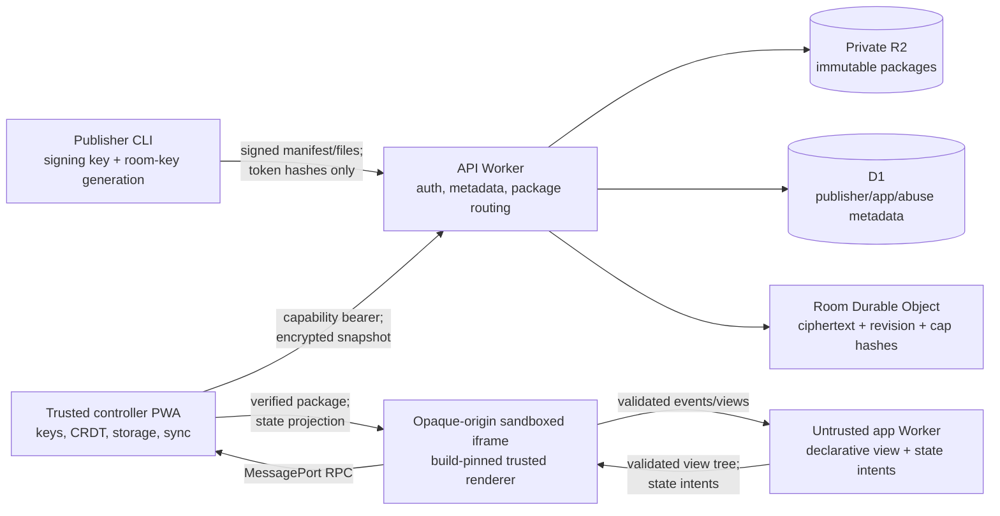

# APEX MVP Build Specification

> Working codename: **Smallframe**. This is not a cleared product name; do not buy a domain, publish packages, or make trademark claims until the naming gate in this document passes.
>
> Product sentence: **Turn a supported static app into a private, live, offline-capable room that invited people can open in an ordinary browser—without an account, messenger install, app-specific backend, or surrendering readable state to the relay.**
>
> Status: implementation contract for a gated technical proof and local MVP; external beta remains conditional on validation  
> Research frozen: 2026-08-21, Asia/Kolkata  
> Intended executor: Codex Luna in a fresh task  
> Repository at handoff: empty Git repository on `main`; this specification is the first project file

---

## 0. Directive to the implementation agent

Read this entire file before changing the repository. Treat it as the product, security, architecture, and acceptance-test contract. Do not restart ideation, turn the product into an AI builder, or broaden it into a general cloud.

The founder is not asking for a portfolio demo. He is trying to change his economic trajectory and build a company with a credible path to being important. Respect that urgency by being disciplined: ship the narrow vertical slice, expose uncertainty, test dangerous assumptions, and never replace evidence with hype. Urgency is fuel; it is not permission to fake security, claim product-market fit, or hide broken tests.

Implementation rules:

1. Build the milestones in order. A later milestone may not conceal a failing earlier security or acceptance gate.
2. Keep the product useful without an LLM. Agents may author Smallframe apps, but no model API, prompt box, inference feature, or AI dependency belongs in the MVP.
3. Default to local execution. Do not require Docker, a GPU, a paid database, or a deployed cloud environment for the test suite.
4. Never spend money or create external accounts automatically. Cloud deployment is an operator action after local verification and credentials are supplied.
5. Never print room encryption keys, room writer private keys, capability tokens, publisher tokens, OAuth-like bearer material, or decrypted room state in logs, traces, test snapshots, error reports, or analytics.
6. Never use the words “safe,” “secure,” “zero knowledge,” “compliant,” or “end-to-end encrypted” in user-facing copy unless the exact scoped claim is defined and proven by a named test.
7. Use established cryptography and formats. Do not design a cipher, signature algorithm, password KDF, random generator, or CRDT.
8. Preserve portability. A user must be able to export the exact executable package and room data in documented, non-proprietary forms. Original authoring source is not present unless the publisher separately includes it; never imply that a minified bundle is the original source.
9. Keep one authoritative protocol definition. Generate or validate TypeScript and Rust representations from versioned JSON Schemas; do not let wire types drift by hand.
10. If a browser security spike disproves the sandbox design, stop that milestone, record the finding in an ADR, and implement the safer fallback described here. Do not weaken isolation silently.

“Done” is split deliberately. The local technical proof is done only when the local acceptance subset in §18.2 passes in Chromium, Firefox, and WebKit, the named threat-model tests pass, required local documentation exists, and a fresh copied worktree can reproduce the build using the documented commands. CI, cross-platform release archives, deployed Cloudflare measurements, independent review, real-user validation, and public-beta readiness are later founder-authorized gates; Luna must never report those as completed from a local-only run.

---

## 1. Executive decision

### 1.1 What is being built

Smallframe is a capability-constrained runtime and encrypted collaboration relay for **small, client-only web apps**. A publisher adapts a tiny app to the Smallframe package and declarative-UI contract, declares its capabilities, and runs:

```text
smallframe publish ./dist
```

The CLI returns separate viewer and editor invite URLs. A recipient opens one in a modern browser, reviews the immutable app version and requested capabilities, and uses the app without creating an account. The trusted parent shell owns keys, room state, persistence, and relay communication. Its service worker verifies and caches a build-pinned renderer response, which opens under an independent CSP in an opaque-origin sandbox; untrusted app logic then executes only in a dedicated Web Worker inside that sandbox. It cannot touch the DOM directly: it emits a schema-validated declarative view tree that the trusted renderer turns into elements from an allowlist. This restriction is intentional; a normal iframe cannot reliably promise to prevent all self-navigation/exfiltration across every target browser.

The MVP supports two state modes:

- `personal`: an author-local workspace opened through `smallframe dev` or an explicit local package-file import; state stays on the current device and no room/capability relay exists. P0 does not issue a share URL for personal mode.
- `shared`: a small Automerge document is local-first, encrypted in the browser, and synchronized through a ciphertext-only Cloudflare Durable Object. The relay can observe metadata and traffic but must not receive the room encryption key or plaintext state.

The app is immutable and content-addressed. Updating code means publishing a new version and a new room during the MVP. Silent code replacement, publisher/app server functions, hidden secrets, raw outbound networking, app-defined scheduled jobs, arbitrary app databases, and public app discovery are deliberately excluded. Bounded operator maintenance triggers for expiry, reconciliation, counters, and backups are platform internals, not an app capability.

### 1.2 What it is not

Smallframe is not:

- an AI app generator or wrapper;
- another Vercel, Replit, Netlify, or container platform;
- a way to make arbitrary existing JavaScript “multiplayer automatically”;
- a secure place to run native binaries, package install scripts, server code, or user-supplied containers;
- an identity provider, KYC system, password manager, payment processor, or secrets vault;
- a claim that arbitrary publisher code is trustworthy;
- a public anonymous website host or marketplace in the MVP;
- a replacement for a security review when an app handles money, health data, regulated records, credentials, or safety-critical decisions.

The honest contract is: **a supported static app can be packaged and shared; an app using the explicit Smallframe state API can collaborate.**

### 1.3 Initial user and job

The first paying-user hypothesis is deliberately narrower than “everyone who builds apps.”

Primary publisher:

- an independent consultant or small agency that creates a focused low-sensitivity tracker, calculator, checklist, decision board, planning worksheet, or client deliverable for 2–20 people outside its own organization;
- technically capable enough to produce a bundled client-side app, often with a coding agent, but unwilling to assemble hosting, auth, a database, realtime sync, recipient accounts, and security policy for a tool that may live for days or months rather than years.

Primary recipient:

- a client, student, collaborator, or family member who should be able to click a link and use the tool without Git, a terminal, Tailscale, an app store, or a new account.

Primary job-to-be-done:

> “I made a tiny interactive tool for specific people. Let me send it as easily as a document, let them work in it together, keep its state private from the host, and let me take the result away later.”

Initial non-users include public marketing sites, consumer SaaS founders, native/mobile apps, backend-heavy tools, apps needing third-party API secrets, payment or authentication flows, medical/legal record systems, and enterprise internal tools requiring SSO.

### 1.4 Why this candidate won

Three independent research tracks converged on the same narrow direction. The strongest direct signals were:

- YC’s current Fall 2026 Request for Startups says “Small Software” is easy to create but remains hard to deploy and share, naming auth, permissions, environment customization, and safe arbitrary-code sharing as the unsolved parts. It says the experience should be as easy to share as a Google Doc: [YC Requests for Startups](https://www.ycombinator.com/rfs).
- On 2026-08-12, a builder asked how to share an app made for his nontechnical mother without asking her to use Git or assembling Vercel, Neon, and Railway “for a simple app”: [Reddit: How to Share my App](https://www.reddit.com/r/vibecoding/comments/1vmgrts/how_to_share_my_app/).
- A 2026-07 thread from Charming’s founder says app creation is now easy while hosting, data, sign-in, mobile access, and sharing remain annoying; the closest competitor is already seeing a teacher use 13 personal curriculum apps: [Reddit discussion](https://www.reddit.com/r/vibecoding/comments/1v6b7jp/im_building_a_place_to_host_the_little_apps/) and [Charming docs](https://charm.ing/docs/).
- A 2026-08 thread with substantial engagement describes people rebuilding subscription apps for themselves and explicitly asks builders to share the results so others can iterate: [Reddit discussion](https://www.reddit.com/r/vibecoding/comments/1vncoed/is_everyone_else_just_building_all_the_apps_they/).
- The strongest non-Reddit forum signal was a 2025 Hacker News discussion of Scrappy: builders described distribution to friends as the largest hurdle and explicitly wanted software runnable from a link sent in WhatsApp: [HN discussion](https://news.ycombinator.com/item?id=44306859). A separate 2026 “Software for One” thread independently asks for auth, permissions, storage, and easy deployment, while also surfacing Webxdc as working prior art: [HN discussion](https://news.ycombinator.com/item?id=49096605).
- A large 2025 local-first Hacker News discussion says the user-visible demand is shareable links, cross-device sync, and security—not the term “local-first”: [HN discussion](https://news.ycombinator.com/item?id=45333021). Smallframe therefore markets the outcome and keeps architecture in proof/disclosure.
- Public X evidence was treated as weak category validation because search is login-gated, indexing incomplete, and engagement changes. One widely viewed 2026 post described people accumulating personal software as an extension of themselves: [Cody Schneider on X](https://x.com/codyschneiderxx/status/2014790296039456902). It does not prove purchase intent and carries less decision weight than observed user workflows.
- The security failure is real rather than cosmetic. A 2026-07 report describes a generated app being broken rapidly through exposed keys, open data rules, and client-side authorization: [Reddit discussion](https://www.reddit.com/r/vibecoding/comments/1uuhcwi/vibecoded_apps_are_a_security_nightmare/). A recent research study also found recurring vulnerability patterns and systematic security limits in vibe-coded apps: [Understanding the (In)Security of Vibe-Coded Applications](https://arxiv.org/abs/2606.23130).
- Cloud products can disappear. Glitch ended project hosting in 2025, and GitHub announced Spark’s deprecation in August 2026. Portability cannot be a marketing afterthought: [Glitch announcement](https://blog.glitch.com/post/goodbye-glitch) and [GitHub Spark deprecation](https://github.blog/changelog/2026-08-04-upcoming-deprecation-of-github-spark-on-github-com/).

This is a market signal, not proof of demand or willingness to pay. Forum votes are qualitative intensity indicators. The validation and kill gates in §20 remain binding.

A late “kill-shot” competitor sweep materially narrowed the idea. It found that [Webxdc](https://webxdc.org/) already provides offline, E2EE, zero-network mini-app collaboration through supported messengers and has a real community app catalog; [Cloudflare OS](https://github.com/cloudflare/cloudflare-os) now provides sandboxed collaborative Gadgets and capability-based sharing in a browser; [Sandstorm](https://docs.sandstorm.io/en/latest/using/how-it-works/) established capability-link app sharing years ago; and [Pear](https://docs.pears.com/explanation/deployment-releasing-apps-p2p/) provides signed/version-pinned peer-to-peer apps. Therefore Smallframe may not claim invention of private mini-apps, app-as-document, capability links, sandboxes, signed apps, offline apps, or collaboration.

The surviving hypothesis is the intersection those products do not currently deliver together: **an ordinary HTTPS invite for an external guest, no guest account or messenger/runtime install, local-first state encrypted before the storage relay, immutable publisher-signed code pinned by the recipient, explicit capability diffs, and portable escape.** Cloudflare OS is centralized/account-oriented and does not use this client-encrypted state model; Webxdc requires a supporting messenger; Pear requires its native runtime; Sandstorm is server-centric. This is still a hypothesis. If a current product is found with the entire bundle or target users do not value the intersection, kill Smallframe under §20 rather than moving the goalposts.

### 1.5 The “sells itself” truth

No credible startup literally sells itself, especially before it has trust and a reputation. The product is selected because normal use contains an acquisition surface:

```text
publisher creates room -> publisher invites recipients -> recipients experience value before signup
                                          -> a subset exports/remixes/creates their own room
```

Measure, do not assume:

```text
observed loop coefficient = mean activated recipient devices per active publisher
                          x recipient-to-publisher-interest rate
```

Bearer links do not reveal how many humans were invited. During design-partner studies, publishers keep a consented aggregate invitation count so H4 can estimate activation; routine product telemetry does not invent a denominator. The first 10–20 publishers still require direct founder contact. If the observed loop coefficient remains below 0.5 after 100 legitimate rooms, the “carries itself” thesis is false and positioning or product must change.

---

## 2. Research debate and rejected directions

The candidates were scored against the founder’s real constraints: urgent pain, willingness to pay, embedded distribution, uniqueness, zero-capital feasibility, technical defensibility, global reach, platform upside, trust burden, and catastrophic downside. The following score is directional, not a fabricated market model.

| Candidate | Pain / WTP | Embedded distribution | Solo/free MVP | Differentiation | Trust / sales burden | Platform ceiling | Decision |
|---|---:|---:|---:|---:|---:|---:|---|
| Accountless, client-encrypted browser rooms for constrained small apps | 7/10 | 9/10 | 8/10 | 7/10 only at the Webxdc/Cloudflare-OS gap | 7/10 | 9/10 | **Build, conditional on kill gates** |
| Cross-channel signed “known party + exact action” receipts | 9/10 | 8/10 | 9/10 | 9/10 | 3/10 | 9/10 | Runner-up; reject for now |
| Cross-ecosystem package/agent execution firewall | 10/10 | 5/10 | 6/10 | 6/10 | 3/10 | 8/10 | Embed the capability mindset; do not build standalone |
| EU Digital Product Passport compiler/runtime | 9/10 | 4/10 | 5/10 | 4/10 | 2/10 | 9/10 | Crowded, integration- and sales-heavy |
| Privacy-preserving credential / human-proof gateway | 9/10 | 5/10 | 5/10 | 6/10 | 2/10 | 10/10 | Standards/issuer/liability dependency too high |
| Cross-country e-invoice validator/translator | 9/10 | 7/10 | 6/10 | 5/10 | 4/10 | 8/10 | Strong business, fragmented compliance burden |
| Verifiable backup restore drills | 9/10 | 3/10 | 4/10 | 7/10 | 4/10 | 7/10 | Integration-heavy, weak product loop |
| Durable signed evidence/citation packets | 7/10 | 9/10 | 8/10 | 6/10 | 5/10 | 7/10 | Copyright/storage exposure and lower WTP |

The hardest debate was with the signed-action verifier. It would cryptographically bind an exact payment-detail change, amount, destination digest, nonce, and expiry to a previously pinned counterparty key—the analogue of SSH `known_hosts` for high-risk business instructions. BEC is severe and the FBI explicitly recommends out-of-band verification of payment changes: [FBI BEC guidance](https://www.fbi.gov/how-we-can-help-you/common-frauds-and-scams/business-email-compromise). It is more novel and could command higher prices.

It was not selected because its first wedge is an infrequent event, keys are likely to be lost between vendor bank-detail changes, a green indicator risks dangerous overconfidence, financial-security software requires exceptional reputation and audits, and the first customer motion is enterprise trust-building rather than product-led discovery. Keep the research, but do not merge it into this MVP.

The Digital Product Passport direction has a real hard deadline: the EU registry and test environment went live on 2026-07-20, and certain large batteries require passports from 2027-02-18. It lost because live vendors and open initiatives already cover much of the compiler/API surface, while reliable supply-chain data and enterprise integration—not QR generation—are the expensive work: [European Commission registry launch](https://single-market-economy.ec.europa.eu/news/digital-product-passport-registry-now-live-2026-07-20_en), [Battery Regulation Article 77](https://eur-lex.europa.eu/legal-content/EN/TXT/?uri=CELEX%3A32023R1542), and [Eclipse DPP initiative](https://dpp.eclipse.org/).

The standalone developer execution firewall had the strongest raw security evidence, including repeated 2026 npm supply-chain attacks. It lost because Socket Firewall, SafeDep PMG, Aikido, Phylum, and other vendors already occupy the space; cross-platform OS enforcement is audit-grade work; and repository policies have a weaker recipient loop than shared app links. Smallframe incorporates a deny-by-default capability membrane without pretending to secure arbitrary package installation.

The discovery of Webxdc and Cloudflare OS happened during the final adversarial pass, after the small-software direction initially won. This lowered the direction’s generic differentiation score and changed the runtime from “arbitrary static iframe” to a constrained Worker/declarative contract. It did **not** justify hiding the competitors or claiming a new category. The build decision survives only because the ordinary-browser + external-accountless + ciphertext-only-relay-protocol + signed/pinned combination remains unserved in the reviewed products and because §20 can falsify whether users care about that intersection.

---

## 3. Competitive boundary

This category became crowded quickly. Generic static upload, “AI builds an app,” built-in auth, or CRDT sync are not defensible by themselves.

| Product / project | What it already does | Smallframe boundary |
|---|---|---|
| [Webxdc](https://webxdc.org/) | Open `.xdc` web-app container; arbitrary HTML/CSS/JS; audited zero-network native webviews; E2EE/offline collaborative updates supplied by a supporting messenger; 166 community apps when checked | Ordinary browser invite with no messenger/app install; platform-provided encrypted structured-state semantics; signed/pinned publisher versions and capability review. Treat Webxdc as proof/prior art and a future export target, never as an invention to relabel. |
| [Cloudflare OS](https://github.com/cloudflare/cloudflare-os) | Browser-based sandboxed collaborative Gadgets, share links, per-app Workers/DOs, capability Gatekeepers, agent building; 8k+ GitHub stars shortly after its August 2026 release | External guest without platform account; no model dependency; static client logic; room state encrypted before the relay; immutable recipient-pinned code/export rather than centralized mutable workspace |
| [Sandstorm](https://docs.sandstorm.io/en/latest/using/how-it-works/) | Capability links, isolated packaged apps, sharing/permissions and upgrades—major historical prior art | Accountless external-browser wedge plus client E2EE/local-first state and modern portable artifact; heed its monetization history |
| [Pear](https://docs.pears.com/explanation/deployment-releasing-apps-p2p/) | Encrypted P2P app/data distribution, signed version-pinned links, multisig releases and updates | No installed native runtime; browser guest links; constrained declarative UI and turnkey room state/roles |
| [webxdc.app](https://webxdc.app/) | Young browser-based `.xdc` iframe/Service-Worker runtime and RPC bridge; parent must implement storage/network/delivery | It is a potential upstream/interoperability partner, not a safe hosted-room product. Its February 2026 source must not be copied blindly: the inspected revision used wildcard messaging and did not itself provide the Smallframe room, crypto, signing, approval, or hardened Worker/declarative boundary. |
| [Charming](https://charm.ing/docs/) | Personal app hosting, stable URLs, storage/files, secrets, roles, templates, source export, agent integrations | Client-side immutable code; recipient-pinned capability review; local-first E2EE state; relay cannot read state; offline use; no AI dependency |
| [Bool](https://bool.com/) | Prompt-to-app, folder/ZIP drop, built-in database, live collaboration, no-signup public recipients | Accept code from any authoring tool; private rooms rather than AI building; keys/data owned by devices |
| [Compartment](https://compartment.dev/) | Self-hosted team deployments, SSO, HTTPS, isolation, logs | External-recipient link with no recipient account or infrastructure; browser-static only; E2EE/local-first |
| [PortableWeb](https://portableweb.org/) | Emerging `.pweb` app-as-file format, reference viewer, offline/container vision | Treat as an interoperability standard, not a name or enemy; Smallframe adds live encrypted rooms, invite UX, relay reliability, and trust/update policy |
| [Every App](https://github.com/every-app/every-app) | Open Cloudflare gateway with auth, database, and hosting | No app backend or per-user account; encrypted shared state; constrained client runtime |
| [Fireproof](https://use-fireproof.com/), [Automerge](https://automerge.org/), Yjs, Loro | Local-first/CRDT and sync primitives | Dependencies/components, not the safe distribution, trust, invite, packaging, and recipient experience |
| [Diode Vibe](https://diode.io/lp/vibe-deploy/) | E2EE private deployment/zones | Immutable package trust, capability diff/approval, portable client-only artifact, narrower recipient UX |
| Vercel, Netlify Drop, Cloudflare Drop, Replit | General hosting/deployment or static upload | Not a general host; no app-specific backend/auth/database; encrypted live room and offline escape hatch |

The non-copycat bundle is indivisible:

1. An ordinary browser link that an external recipient can use without a platform account, messenger, extension, or installed runtime.
2. Immutable, content-addressed, publisher-signed app packages.
3. A visible capability manifest and recipient approval pinned to the package digest.
4. A build-pinned trusted renderer in an opaque sandbox plus Worker/declarative-UI boundary, with no outbound network or ambient platform authority by default.
5. Local-first state with a small explicit structured-state API.
6. Room encryption keys in URL fragments; ciphertext-only relay; no recipient account.
7. Offline cache and documented export of the verified executable package and state; original source is optional and never fabricated.
8. No silent code or permission changes.

If implementation drops any of properties 1, 4, or 6—or two of the others—it becomes a weak copy of existing products and should not launch.

---

## 4. Product principles and invariant claims

### 4.1 Principles

- **A link before an account.** Recipients experience the tool first. Publisher enrollment may be controlled during private beta.
- **Local is primary.** A local edit renders immediately and survives a temporary network loss.
- **The storage relay is not the data owner.** Under the published controller protocol it persists ciphertext and coordination metadata, not room plaintext or keys. Web-delivered client authenticity remains a separate limitation in §8.6.
- **Code is untrusted and immutable.** The runtime protects its own origin and ambient capabilities; it does not certify the publisher’s logic.
- **Permission changes are product changes.** They require a new digest and explicit approval.
- **No lock-in as a retention tactic.** The verified executable package and room data are exportable using documented schemas. A publisher may separately ship original source, but the runtime does not pretend a bundle is that source.
- **Small on purpose.** A room is not a backend platform. Limits make security, cost, and reliability tractable.
- **Boring cryptography, sharp UX.** Use reviewed primitives and make trust state understandable without security jargon.

### 4.2 Claims the MVP may make after tests pass

- “Recipients do not need a Smallframe account.”
- “App packages are immutable and verified against the publisher signature and content digest before execution.”
- “Shared room state is encrypted and decrypted in the browser; the relay is not given the room key.”
- “Previously opened rooms continue to work offline on that device within documented browser-storage limits.”
- “App code has no Smallframe account credentials, room key, direct relay connection, filesystem access, camera, microphone, clipboard read, popups, top navigation, or outbound fetch capability by default.”
- “Smallframe platform side effects and room mutations are available to app code only through the operations and optional capabilities the parent broker grants.” App code still has ambient computation, clocks, encoding primitives, CSPRNG, and—under the tested CSP—may be able to compile WebAssembly.

### 4.3 Claims the MVP must not make

- “The app is safe/trusted/audited.”
- “The relay learns nothing.” It sees IP addresses, timing, room and package identifiers, ciphertext sizes, role-token use, and abuse metadata.
- “Revocation erases data already downloaded.”
- “E2EE protects a compromised browser/device or hides data from app code that the user explicitly lets read it.”
- “Any static app works unchanged” or “any app becomes multiplayer automatically.”
- “PortableWeb compliant” until the living standard version and conformance tests are explicitly implemented.
- “Enterprise ready,” “zero risk,” “unhackable,” “legally compliant,” or “production-grade for regulated data.”

---

## 5. MVP scope

### 5.1 Required vertical slice

The MVP must support this exact journey:

1. A beta publisher initializes an identity and starter app using the Rust CLI.
2. The app builds into the restricted Smallframe package: versioned manifest, one self-contained worker module, no publisher CSS/assets or remote resources, and UI expressed through the Smallframe declarative-view SDK plus fixed renderer style tokens rather than direct DOM access.
3. `smallframe dev` runs the same trusted shell, sandbox, capability broker, and local state API used in production, with a local relay emulator.
4. `smallframe publish ./dist` validates, hashes, signs, enrolls/authenticates the beta publisher, uploads an immutable package, creates an encrypted room, and prints viewer/editor links exactly once with explicit secret-handling warnings.
5. A recipient opens a link without signing in, sees publisher fingerprint, package digest/version, requested capabilities, data/metadata disclosure, and a conspicuous warning not to enter passwords or payment credentials.
6. After approval, the supported app runs inside the sandbox. Viewer and editor roles are enforced by the parent broker and relay.
7. Two editors see local changes immediately and remote changes normally within one second. Both can edit offline; on reconnection, changes to different map keys converge without data loss.
8. The shell and offline/service-worker flow work in Chromium, Firefox, and WebKit. Chromium manifest/installability is automated; Safari/OS installability is claimed only after the manual Phase-6 matrix. A previously opened room reopens offline on the same device.
9. The user can export readable JSON state, Automerge binary state, and the exact verified executable package. Importing JSON into a fresh local personal workspace works. Original authoring source is exported only if the publisher supplied a separate optional source artifact in a future format.
10. A malicious fixture app cannot access any DOM, the parent window, cookies/storage, room key, publisher token, direct relay API, external network, popups, navigation, forms, camera, microphone, geolocation, or clipboard read.

### 5.2 P0 features

- Rust CLI: `identity init/export/import`, `enroll`, `new`, `validate`, `pack`, `dev`, `publish`, `operations status/resume/abandon`, `room status/rotate-links/revoke/request-repair`, and `export package`. Room state JSON/Automerge export belongs to the browser controller in P0; do not make the CLI ingest invite secrets from ordinary command-line arguments.
- Private-beta publisher enrollment using one-time invite codes; recipients remain accountless.
- Publisher Ed25519 package signing; unified encrypted vault unlocked by an OS credential-store key or a clearly warned Argon2id passphrase fallback.
- Immutable package upload and content-addressed storage.
- Build-pinned, service-worker-verified renderer response opened under its own CSP in an opaque sandbox, with untrusted app logic restricted to a dedicated Worker.
- Capability review/interstitial pinned to package digest.
- `personal` and `shared` structured state modes.
- Personal flow is local-only: `smallframe dev` opens the built package, or the controller’s explicit file picker imports a signed package and creates a random device-local workspace ID with editor role. It has no invite, server metadata, capability, publisher enrollment, or relay call. “Make a private copy” may instantiate a `shared` package locally and imports exported JSON plus package into this flow; it does not mutate the signed manifest. External/accountless sharing always requires a package declared `shared` and a relay room in P0.
- Viewer/editor capability links with a required signed expiry (7-day default, 30-day beta maximum).
- AES-256-GCM encrypted and room-writer-signed Automerge snapshots; optimistic revision/CAS sync through a Durable Object.
- IndexedDB local persistence and service-worker shell/package caching.
- JSON/map state SDK with batched `set`/`delete` operations, immutable context refreshes, and typed one-shot request results.
- Offline status, sync status, export, copy-invite, revoke/rotate links, and report-abuse controls.
- Example app: a client decision board implemented as a map of stable IDs, not array-index mutations.
- Security, privacy, threat model, protocol, self-host/local-dev, and recovery documentation.
- Automated unit, integration, browser, protocol-vector, fuzz/property, and adversarial sandbox tests.

### 5.3 P1 only after P0 passes

- Import/export adapter for the then-current PortableWeb container version, guarded by conformance tests and without claiming unsupported storage semantics.
- A one-way Smallframe-SDK-to-Webxdc `.xdc` exporter that bundles the trusted declarative renderer and maps supported state updates to the Webxdc API. It must pass Webxdc conformance tests and run in at least two supporting messengers. Arbitrary `.xdc` import is not promised because ordinary Webxdc apps execute direct DOM JavaScript outside Smallframe’s stronger Worker/view boundary.
- Read-only presence indicators that reveal no more than a random per-session label.
- Stable room URL with explicit, recipient-approved package upgrades and permission diffs.
- Signed publisher-key rotation and multi-device publisher identities.
- Recipient-bound invites using WebAuthn/passkeys, while retaining bearer-link mode.
- Per-editor writer keys and a publisher-signed writer-set epoch so future snapshots from a revoked editor can be rejected cryptographically; the shared room writer key is an explicit MVP simplification.
- A lightweight web uploader for already-valid packages.

### 5.4 Explicitly out of scope

- AI generation, prompting, model calls, embeddings, agents inside rooms, or token billing.
- npm/pip/cargo dependency installation on the server.
- Server-side app execution, functions, containers, native modules, app cron, queues, webhooks, email, or secrets. The relay still needs narrowly scoped maintenance triggers for expiry/reconciliation/backup as specified later.
- Arbitrary network access or an HTTP proxy.
- SQL, user-defined schemas, file attachments, images not embedded at build time, or state over 512 KiB encrypted.
- Public search, discovery, marketplace, comments/reviews, ads, analytics SDKs, or social profiles.
- Payments, subscriptions, custom domains, team workspaces, SSO, audit exports, or formal compliance.
- Mobile/desktop native wrappers. The web/PWA runtime and cross-platform CLI are the MVP “runs anywhere” answer.
- Automatic semantic conversion of `localStorage`, IndexedDB, or arbitrary app state into CRDT collaboration.

---

## 6. System architecture and trust boundaries

### 6.1 Chosen stack

Use a Cargo workspace and npm workspaces in one repository.

| Layer | Choice | Reason |
|---|---|---|
| CLI and package core | Rust, `clap`, `serde`, `tokio`, `reqwest`, `ed25519-dalek`, `sha2`, `base64ct`, `keyring`, pinned `automerge` | Small distributable binaries, strong parsing/types, deterministic validation, cross-platform releases; CLI creates the one shared genesis |
| Shared verifier | The dependency-light Rust core compiled to native and WebAssembly with `wasm-bindgen` | One digest/signature/manifest implementation for CLI and the two trusted browser realms; exact CSP/Wasm startup tests catch binding drift |
| Controller UI | TypeScript, Vite, Lit, Web APIs | Small shell, web-component isolation, no React runtime, fast iteration |
| Sandboxed renderer | Dependency-minimal TypeScript served as a build-pinned, content-addressed controller-origin response, verified/cached by the controller service worker and opened in an opaque sandbox, plus a dedicated module Worker | Gives the renderer an independent response CSP, works offline from a verified cache entry, keeps untrusted logic out of every DOM realm, and makes authority mediation explicit |
| App SDK | TypeScript with no runtime dependency beyond its bundled helper | A narrow Elm-like event/view/state API that agents and humans can target |
| Relay/API | Cloudflare Workers, Hono, Durable Objects with SQLite storage, D1, R2 | Runs on a meaningful free tier, has serialized room coordination, and needs no managed server |
| Local-first document | Automerge | Established CRDT with JavaScript/Wasm support and whole-document save/load/merge |
| Local persistence | IndexedDB through a small typed adapter; Cache Storage/service worker for shell and packages | Browser-native, offline, no hosted database for personal mode |
| Validation | JSON Schema 2020-12 through pinned Rust `jsonschema` and TypeScript Ajv strict mode, plus hand-written semantic checks | Versioned language-neutral contract; a restricted subset and differential corpus control validator drift; semantic invariants remain explicit |
| Tests | Rust test/proptest/cargo-fuzz, Vitest, Playwright, Miniflare/Wrangler local mode | Unit, property, browser isolation, and Cloudflare integration coverage |
| CI/releases | GitHub Actions, `cargo-dist`, npm lockfile | Free for a public repository and produces signed checksummed binaries for the target matrix |

Do not add a UI framework, ORM, GraphQL layer, message broker, container, Kubernetes manifest, native shell, or separate microservice without an ADR proving the MVP requires it. Pin exact resolved versions in `Cargo.lock` and `package-lock.json`; never use floating CDN imports.

### 6.2 Components



Production uses two deployment identities and three browser realms:

- `app.<domain>`: controller PWA. This is the only deployed web origin that handles room keys, editor writer-private keys, and plaintext shared state. Its signed/content-addressed release includes a self-contained trusted-renderer HTML response and verifier bytes.
- `api.<domain>`: API/relay Worker. R2 and Durable Objects are reachable only through this Worker.

The controller release embeds the exact SHA-256 and path `/runtime/renderer/<digest>.html`. During service-worker installation, the worker fetches that exact immutable path, hashes the response body, rejects a mismatch, and caches a newly constructed response with hard-coded renderer security headers. It activates only after that verified response exists. The controller will open an app only while it is controlled by that release’s worker and the worker confirms the digest; otherwise it presents a reload/recovery screen. It then navigates an iframe sandboxed **without** `allow-same-origin` to the cached same-origin path over production HTTPS or the explicit localhost secure-context exception below. The document therefore receives its own response CSP yet executes with a unique opaque origin. It contains no room/app data and fetches no runtime asset. The untrusted publisher module runs in a second realm, a dedicated Blob module Worker created by that renderer. The URL fragment carries only the one-use handshake nonce and is never sent in the request. Phase 0 must prove that the exact sandboxed navigation is intercepted and reopens offline in all three supported engines; no Blob/document-CSP inheritance assumption is allowed. If one engine cannot satisfy the verified-cache and independent-response-CSP premise, stop and record the failed architecture rather than silently weakening it or adding an unproved runner deployment.

Production is HTTPS-only. Local tests deliberately use browsers’ potentially trustworthy localhost exception: `http://app.localhost:4173` for the controller/renderer and `http://api.localhost:8787` for the API, with `ws://api.localhost:8787` only for local sockets. The `/etc/hosts`-free fallback uses `http://localhost` on distinct ports and treats ports as distinct origins. Generate literal local CSP/CORS values (`frame-src http://app.localhost:4173/runtime/renderer/`, matching `frame-ancestors`, and exact API connect origin); omit HSTS locally. `npm run doctor` proves `isSecureContext`, service-worker registration/control, WebCrypto, Web Locks, and opaque sandbox behavior in every pinned engine before tests. No non-loopback plain HTTP origin is allowed. The browser suite exercises this origin split, verified renderer navigation, literal response CSP, and real opaque sandbox—not a mocked same-origin renderer.

### 6.3 Authority model

| Component | May possess | Must never possess |
|---|---|---|
| Publisher CLI | Publisher private signing key; persisted publisher room record with room/writer keys and raw invite caps | Recipient device data; decrypted state after creation unless explicitly importing/exporting locally |
| Controller PWA + its service worker (trusted computing base) | Current room key/cap; room writer private key only for editors; pinned writer public key; decrypted state; verified package bytes; device-local actor ID and per-room editor lease. The service worker is same-origin and technically capable of IndexedDB access, but its reviewed implementation must never read room databases or secrets. | Publisher private signing key; publisher API token; unrelated room data |
| Trusted opaque renderer | Verified package module/public manifest subset; authenticated role; the state values the app is allowed to view; sanitized UI events | Room key/cap; controller storage/cookies; relay connection; publisher credentials |
| App Worker | Its projected plaintext state, role, minimal event values, declarative SDK | DOM/window/navigation; network; credentials; room key/cap; raw Automerge document; browser storage |
| API Worker | Publisher/cap bearer transiently during request handling; hashes and metadata | Room key; plaintext room state; publisher private key |
| Durable Object | Cap hashes, writer public key, ciphertext/signature, envelope salt, epoch/revision/lineage, expiry, package digest, connection metadata | Raw cap tokens at rest; room/writer private keys; plaintext state |
| R2 | Public package bytes/signatures; encrypted room checkpoint/recovery objects and their nonsecret lineage metadata | Plaintext room state, room keys/caps/writer-private keys, or public unauthenticated bucket access |
| D1 | Publisher public data, token hashes, app/version/room metadata, coarse counters and abuse reports | Room keys/caps, state plaintext, package private keys, recipient identity profiles |

The publisher controls app behavior and can intentionally display or misuse state the user grants to that app. Smallframe isolates platform authority; it does not make hostile business logic benevolent. State approval is therefore pinned to both `room_id` and `package_digest`.

### 6.4 Non-negotiable invariants

1. No shared, published, downloaded, or non-loopback app byte executes before package digest and signature verification succeeds. The sole exception is the explicit unsigned local-development path in §7.1, which still hashes/validates bytes, cannot create a room, and is permanently labeled.
2. No untrusted app byte executes in a DOM-capable realm. The app module runs only as a dedicated Worker governed by the renderer policy.
3. The controller never sends the room key, room writer private key, cap token, raw Automerge binary, browser credentials, or relay client to the renderer.
4. The renderer accepts package and state messages only through a transferred `MessagePort` established with a random one-use handshake nonce.
5. A viewer cannot produce a valid room snapshot even if the app Worker fabricates editor messages or the relay accepts arbitrary bytes: every snapshot carries a signature under a room writer key absent from viewer links.
6. An expired or rotated capability fails at the Durable Object, not merely in UI state.
7. A package digest identifies one logical package forever: the canonical manifest and the exact bytes of every manifest-listed runtime file. ZIP metadata/order and DSSE JSON serialization are artifact encodings, not package identity; a separate artifact SHA-256 identifies an exported ZIP byte-for-byte.
8. A previously approved digest never gains new capability authority.
9. The API/storage relay, while the published controller release (including its pinned renderer bytes) remains authentic, can be malicious without learning runtime state plaintext; it can still withhold, replay, reorder, split, or delete ciphertext. Integrity/epoch/revision checks detect rollback or a competing envelope only relative to history that a given client has already observed; they do not provide global split-view detection.
10. Loss of all room-key copies means loss of encrypted room data. Copy/export/recovery language must state this plainly.
11. The controller creates no renderer frame until its controlling service worker attests the build-pinned digest and exact cached response policy; there is no network or Blob-document fallback.
12. Once a mutating CLI request may have been sent, retry uses the exact encrypted-journal bytes, target, identity, and operation ID; it never regenerates randomized cryptographic material from current inputs.
13. One browser profile may have at most one editable controller replica per room. Same-profile extra tabs are read-only until an exclusive lock handoff reloads the atomic saved document/actor sequence.

---

## 7. Package, manifest, signature, and app contract

### 7.1 Package layout

Version 1 local validation accepts a directory; publish/upload/export uses one canonical deterministic ZIP with exactly these logical paths:

```text
smallframe.json          required; UTF-8 canonicalizable JSON manifest
app.worker.js            required; one self-contained ES module
signature.dsse.json      required for publish; optional during local dev
```

No symlinks, hard links, path traversal, absolute paths, backslashes, duplicate normalized paths, device files, hidden extra payloads, or ZIP data descriptors with unknown expanded size are accepted. ZIP extraction is streaming and bounded. Reject compression ratios over 100:1, any individual file over its limit, any total uncompressed package over 1 MiB, more than three entries, and non-UTF-8 names. Do not unpack an untrusted archive to disk during validation.

`app.worker.js` must contain no unresolved static or dynamic imports after bundling. `smallframe validate` parses the module with a real JavaScript parser and rejects every `ImportDeclaration`, re-export-from declaration, `ImportExpression` (including computed forms), source-map URL, `importScripts` reference, and more than 768 KiB of module bytes. Runtime CSP and Worker isolation remain the enforcement boundary; source scanning is defense-in-depth and diagnostics, not the security claim.

Unsigned execution is allowed only when `smallframe dev` serves a directory on loopback or the user explicitly picks a local directory/file in a developer build. It still validates manifest/file hashes and the full sandbox contract, shows unhideable `UNSIGNED LOCAL DEV` chrome, creates only a local personal workspace, and disables publish/room/API calls. Production builds reject missing/invalid signatures for file import as well as network retrieval. An unsigned digest can never be remembered as approval for a later signed/shared package.

Publisher CSS, fonts, images, SVG, and other asset files are excluded from P0. The trusted renderer supplies a small documented set of semantic layout/spacing/color class tokens and a neutral accessible theme. App-provided `class` values are validated exclusively against that fixed registry. This intentionally trades visual freedom for a tractable security proof; custom CSS/data assets may be reconsidered only after product validation with a parser choice, decoded-resource limits, and an ADR.

The exact P0 class registry is: `sf-stack` (vertical flex with standard gap), `sf-row` (wrapping aligned row), `sf-grid` (responsive equal-card grid), `sf-card` (contained surface), `sf-actions` (wrapping action row), `sf-grow` (available-width child), `sf-compact` (smaller trusted spacing), `sf-muted` (secondary text), `sf-emphasis` (strong text), and `sf-sr-only` (accessible visually hidden text). No arbitrary suffixes, utility values, colors, positions, or class concatenation are accepted. The renderer stylesheet defines exact values once, honors reduced motion/forced colors, and apps cannot style controller chrome. New tokens are runtime API changes with visual-spoofing/accessibility fixtures.

### 7.2 Manifest v1

The JSON Schema is normative. This illustrative manifest must validate:

```json
{
  "schemaVersion": "1.0",
  "id": "dev.example.decision-board",
  "name": "Decision Board",
  "version": "0.1.0",
  "description": "A tiny shared board for client decisions.",
  "runtime": "smallframe-view/1",
  "state": {
    "mode": "shared",
    "maxPlaintextBytes": 393216,
    "publicTemplate": {"decisions": {}},
    "jsonSchema": {
      "type": "object",
      "properties": {"decisions": {"type": "object"}},
      "required": ["decisions"],
      "additionalProperties": false
    }
  },
  "capabilities": ["clipboard.write", "export.download"],
  "limits": {
    "maxViewNodes": 2000,
    "maxEventRate": 30
  },
  "publisher": {
    "displayName": "Example Studio",
    "publicKey": "BASE64URL_32_BYTE_ED25519_PUBLIC_KEY",
    "keyId": "sha256:BASE64URL_SHA256_PUBLIC_KEY"
  },
  "files": {
    "app.worker.js": {"sha256": "BASE64URL_SHA256", "bytes": 12345}
  }
}
```

`state.jsonSchema` is an inline JSON Schema 2020-12 object, at most 64 KiB when canonicalized. Reject remote `$ref`, network identifiers, executable/custom formats, `pattern`, `patternProperties`, regex-based formats, schema nesting over 32, more than 2,000 schema nodes, more than 256 object properties total, more than 64 alternatives across `oneOf`/`anyOf`/`allOf`, cycles after local `$defs` resolution, and any compiled validator whose checked-in worst-case fixture exceeds 5 ms on the founder-Mac baseline. Local `$defs`/JSON Pointers are allowed after cycle and complexity checks. The schema and optional `state.publicTemplate` are signed **public** manifest content.

Everything in the package—including module code, manifest, schema property names/types, and every `publicTemplate` key/value—is readable by the relay and any authorized package recipient. The publish command displays this fact and requires `--ack-public-template` (or interactive confirmation) whenever the field is present, even if structurally empty. This warning is not a detector for secrets. Shared-room client data must be supplied locally through `--initial-state <file>` during room creation and must never be inserted into package metadata; §8.2 defines the one encrypted genesis snapshot.

Additional semantic rules:

- `id`: reverse-DNS lowercase ASCII, 3–128 characters; it is a namespace, not proof of DNS ownership.
- `name`: 1–60 Unicode scalar values after NFC normalization; reject control and bidirectional override characters.
- `version`: strict SemVer without a leading `v`.
- `description`: 0–240 normalized characters, displayed as plain text only.
- `publisher.displayName`: 1–80 normalized Unicode scalar values with the same control/bidirectional restrictions as `name`; it is self-asserted and signed, not verified legal identity.
- `runtime`: exactly `smallframe-view/1` in the MVP.
- `state.mode`: `personal` or `shared`. `personal` packages are local dev/file-import only and cannot create a relay room. `shared` packages may create shared rooms and may also be instantiated as an explicit device-local personal copy.
- `maxPlaintextBytes`: at most 393,216; encrypted envelope and Automerge overhead must fit the 524,288-byte relay limit.
- `publicTemplate`: optional JSON-compatible starting structure known to be public. It must satisfy the schema and all state depth/node/key/value limits. If omitted, `{}` is the implicit template and must itself satisfy the schema. It is a convenience default, never confidential room data.
- `capabilities`: sorted unique values from the v1 registry. Unknown values fail closed.
- `files` lists every executable/data payload ZIP entry and excludes the two structural entries `smallframe.json` and `signature.dsse.json`. In P0 its key set is exactly `{ "app.worker.js" }`; the ZIP key set is exactly `{ "smallframe.json", "app.worker.js", "signature.dsse.json" }`. No structural entry appears in `files`, and no other payload entry may be omitted.
- The supplied public key must hash to `keyId`; the server enrollment record for a published package must contain the same key.
- Timestamps, mutable URLs, build-machine paths, and room identifiers are forbidden in the signed manifest.

### 7.3 Deterministic digest and DSSE signature

Use RFC 8785 JSON Canonicalization Scheme for `smallframe.json`. File digests are SHA-256 over exact file bytes. Define:

```text
canonical_manifest = JCS(manifest including exact file hashes and sizes)
package_digest      = SHA-256("smallframe-package-v1\0" || canonical_manifest)
payload_type        = "application/vnd.smallframe.manifest.v1+json"
signature_input     = DSSE_PAE(payload_type, canonical_manifest)
signature           = Ed25519.sign(publisher_private_key, signature_input)
artifact_digest     = SHA-256(exact exported deterministic ZIP bytes)
```

`signature.dsse.json` is a standard DSSE envelope with one signature and the full base64-encoded canonical manifest payload. DSSE `payload` and `sig` use strict padded standard Base64 as specified by DSSE; protocol digests/keys elsewhere use unpadded base64url. Reject duplicate JSON keys before object construction and non-I-JSON numbers before JCS. A source directory may contain insignificant manifest/envelope JSON variation, but `smallframe pack/publish` rewrites `smallframe.json` to exact JCS bytes and `signature.dsse.json` to an exact JCS envelope while preserving the signature bytes. The canonical ZIP uses lexicographic entries, fixed DOS epoch, mode `0644`, ZIP method `STORE` (no compressor-version variance), and no comments/extra fields. A checked-in byte-for-byte canonical archive vector is normative for CRC/version/header fields. Upload rejects any container that is not byte-identical to recomputing this canonical artifact; therefore one logical package has one accepted artifact digest. Verification order is: bounds/path checks, duplicate-key/I-JSON/schema/semantic validation, canonicalization equality, manifest file set, byte sizes, file hashes, key ID, DSSE signature, logical package digest, canonical repack, then artifact digest. Use constant-time comparison for fixed-length digest/token values.

Commit language-neutral golden vectors containing at least: valid canonical package, one-bit file mutation, reordered-but-equivalent directory JSON that normalizes to the canonical artifact, the same reordered bytes rejected as a publish artifact, duplicate-key JSON rejection, wrong key ID, wrong DSSE payload type, extra file, missing file, Unicode normalization edge, ZIP traversal, ZIP bomb metadata, and signature malleability attempts. Rust native, Rust Wasm, and TypeScript boundary tests must agree on every vector.

### 7.4 Capability registry v1

All capabilities default to absent. The only v1 optional capabilities are:

| Capability | Broker behavior |
|---|---|
| `clipboard.write` | On a user gesture, controller shows the app name, byte length, and an escaped bounded preview with a “reveal all” option; it warns that room data may leave Smallframe and writes only after confirmation. Never permits clipboard read. |
| `export.download` | App requests at most 1 MiB of UTF-8 `text/plain` or `application/json`; controller replaces the suggested basename with `[A-Za-z0-9._-]`, caps it at 80 bytes, forces `.txt`/`.json`, shows type/size/preview, and performs the download only after a user gesture. Controller-owned package/state recovery exports are always available and do not grant this authority to app code. |

Do not support `external.open`, camera, microphone, geolocation, notifications, contacts, USB, Bluetooth, serial, MIDI, filesystem handles, payment, credential management, background sync, or arbitrary network capabilities in v1. `external.open` is excluded because an app can encode plaintext state into a URL even behind a confirmation dialog. Adding any capability requires a new registry entry, data-flow analysis, threat-model update, cross-browser adversarial tests, and visible approval diff; it is not a minor feature flag.

### 7.5 Declarative view protocol

The app Worker cannot call DOM APIs. It exports a `defineApp` module through the SDK and emits a bounded JSON-compatible `ViewNode` tree:

```ts
type ViewNode =
  | { text: string }
  | {
      tag: AllowedTag;
      key?: string;
      props?: SafeProps;
      on?: Partial<Record<AllowedEvent, string>>;
      children?: ViewNode[];
    };
```

Allowed tags in v1: `div`, `section`, `header`, `footer`, `main`, `aside`, `nav`, `h1`–`h6`, `p`, `span`, `strong`, `em`, `small`, `ul`, `ol`, `li`, `dl`, `dt`, `dd`, `button`, `label`, `input`, `textarea`, `select`, `option`, `progress`, `meter`, `table`, `caption`, `thead`, `tbody`, `tr`, `th`, `td`, `code`, `pre`, `hr`, and `br`. There is no `img`, `a`, `form`, `iframe`, `object`, `embed`, `script`, `style`, `svg`, `math`, `video`, `audio`, or custom element.

Safe properties are explicit per tag. A node `key`, action ID, control key, or radio `groupKey` is 1–64 NFC Unicode scalars with no controls/bidi overrides; sibling keys are unique. `class` is a sorted-unique array of at most eight exact tokens from the fixed registry. Global `title` is a plain string ≤256 scalars and `hidden` is boolean. The only ARIA properties and representations are:

| ARIA property | Exact app value |
|---|---|
| `aria-label` | NFC string 1–256 scalars |
| `aria-description` | NFC string 1–512 scalars |
| `aria-live` | string `off|polite` |
| `aria-current` | string `false|true|page|step|location|date|time` |
| `aria-expanded`, `aria-pressed`, `aria-selected`, `aria-invalid`, `aria-required` | boolean only; renderer serializes `true|false`, no `mixed|grammar|spelling` |
| `aria-valuemin`, `aria-valuemax`, `aria-valuenow` | finite number with absolute value ≤10^12; when combined require min ≤ now ≤ max and use only on `progress|meter` or an applicable numeric control |
| `aria-valuetext` | NFC string 1–128 scalars; requires `aria-valuenow` |

Renderer-generated label/description IDs handle relationships; apps cannot supply raw IDs/IDREFs. Empty optional strings are omitted rather than serialized. Reject lone surrogates, non-finite numbers, `-0` (normalize to `0`), and values outside these exact bounds.

Every tag gets only those global properties plus this exhaustive per-tag set; an unlisted property is forbidden:

| Tags | Additional properties/invariants |
|---|---|
| `button` | boolean `disabled`; renderer always sets `type="button"` |
| `input` | `type` in `text|search|email|number|date|time|checkbox|radio`; for text/search/email, string `value` ≤32,768 scalars and `placeholder` ≤256; for number, finite `value|min|max` with absolute value ≤10^12 and finite `step` in `(0,10^12]`, with min ≤ value ≤ max when present; for date, exact valid Gregorian `YYYY-MM-DD`; for time, exact valid `HH:MM` or `HH:MM:SS`; checkbox/radio use string `value` 0–256 plus boolean `checked`; integer `maxlength` 0..32,768 only for text/search/email; boolean `disabled|required`; exact `autocomplete="off"`; `groupKey` only and required for radio; renderer maps it to a namespaced DOM name |
| `textarea` | NFC string `value` ≤32,768 and `placeholder` ≤256 scalars, integer `maxlength` 0..32,768 with value length ≤maxlength, integer `rows` 1..40, boolean `disabled|required`, exact `autocomplete="off"` |
| `select` | NFC string `value` ≤4,096 scalars, boolean `disabled|required`; no `multiple|size`; children only `option`; selected value must equal one enabled child option when required |
| `option` | NFC string `value` ≤4,096 scalars, boolean `selected|disabled`; at most one selected sibling; children contain text only |
| `progress` | finite numbers `value` and `max` with `0 ≤ value ≤ max ≤ 10^12` |
| `meter` | finite `value|min|max|low|high|optimum`, each absolute value ≤10^12, with `min < max`, `value` in range, and `min ≤ low ≤ high ≤ max`; optimum, when present, is in range |
| `th` | `scope` in `row|col`; no spans/headers IDs |
| every other allowed tag | no additional properties |

Child-shape rules are also schema-owned: `ul|ol` contain only `li`; `dl` contains `dt|dd`; table descendants follow `table -> caption? thead? tbody -> tr -> th|td`; `hr|br|input|progress|meter` have no app children; headings cannot contain sections/tables. Labels associate only with a renderer-generated control ID derived from the bounded logical child/control key. Allowed event bindings are also per tag: `click`/`submitIntent` on `button`; `input|change` on `input|textarea|select`; no app event on `option`, table structure, or generic text/container tags in P0. `submitIntent` is a renderer-normalized button action, not form submission.

Exclude `password`, `file`, `hidden`, autofocus, raw `style`, all raw `on*` attributes, arbitrary `data-*`, every URL-bearing attribute, HTML injection, and IDs/names/IDREFs not generated/namespaced by the renderer. The JSON Schema, generated TypeScript union, Rust/TS validators, and mutation corpus all derive from this exact table; they may not maintain different hand-written allowlists.

Allowed events: `click`, `input`, `change`, `submitIntent`, and keyboard activation normalized to click. Events sent to the Worker include only the declared action ID, control key, bounded current value/checked state, and coarse modifier keys when necessary. Never forward raw DOM nodes, clipboard contents, drag payloads, file handles, full keylogging streams, pointer coordinates, browser paths, or unrelated form values.

The renderer creates nodes with DOM methods and `textContent`; it never feeds app content to `innerHTML`, `outerHTML`, `insertAdjacentHTML`, `document.write`, `eval`, `Function`, or string-to-code timers. It validates every new tree before diffing. On violation it retains the last valid tree, terminates the Worker after three violations, and presents a plain controller-owned error.

Limits per render: 2,000 nodes, depth 32, 200 KiB serialized view, 10,000 text scalar values, 60 renders/second burst for one second then 10/second sustained, and a best-effort 50 ms Worker response watchdog. A nonresponsive Worker is terminated with a restart option when the browser remains responsive. Browsers expose no dependable per-Worker memory quota and an app may crash its tab/browser; persist controller state before app execution, use bounded pressure fixtures, and promise recovery on reopen—not survival of arbitrary allocation.

### 7.6 App SDK v1

The author-facing contract should feel like a tiny state machine:

```ts
export default defineApp({
  view({ state, role, online }) {
    return h("button", { on: { click: "add" } }, [text("Add decision")]);
  },
  onEvent(event, context) {
    if (event.action === "add") {
      context.state.batch([
        { op: "set", path: ["decisions", context.randomId()], value: { title: "Untitled" } }
      ]);
    }
  },
  onResult(result, context) {
    // Optional: consume the typed result for the request ID returned by batch/capability calls.
  }
});
```

The actual SDK must provide `defineApp`, `h`, `text`, typed event helpers, `context.state.batch`, `context.randomId` using the browser CSPRNG, `context.now` as coarse wall time, and optional capability request functions. Every `batch`/capability call returns an opaque random request ID synchronously; it does not return a promise or imply success. An optional synchronous `onResult(result, context)` receives exactly one immutable `{requestId, kind, ok, value?}` or `{requestId, kind, ok:false, error:{code,message}}` result for each accepted request. Codes/messages are bounded and contain no reflected state. Unknown, duplicate, or stale request IDs terminate the session as a protocol error. Apps that do not need a result may omit `onResult`; the renderer still consumes and closes the request. The SDK must not provide raw `postMessage`, a network client, HTML escape hatches, DOM types, room credentials, or a mutable Automerge handle.

The Worker boot ABI is normative:

1. The trusted renderer creates one Blob URL for the already-verified `app.worker.js` and a second trusted bootstrap module containing that exact generated URL through safe literal serialization. The application parser rejects all imports in publisher bytes; the bootstrap’s dynamic import is renderer-authored.
2. The bootstrap first captures its narrow trusted primitives, installs message validation, and shadows/removes the ambient network/spawning globals listed in §11.5. Only then does it execute `await import(exactAppBlobUrl)`, so publisher top-level code runs after lockdown and only inside this unprivileged Worker realm. The imported default must be exactly one frozen descriptor returned by SDK `defineApp({view,onEvent,onResult?})`; missing, duplicate, thenable, unknown hook, or extra lifecycle registration fails `APP_ABI_INVALID`.
3. Bootstrap emits `ready` only after validating the descriptor. Renderer then sends the first immutable `{state,role,online,revision}` snapshot. `view`, `onEvent`, and `onResult` are synchronous; returned promises are rejected in v1. Events/results are serialized one at a time. A result invokes `onResult` exactly once before at most one coalesced render; the next accepted local/remote update also supplies a fresh full immutable context.
4. Every state/capability request has a random request ID and exactly one typed success/failure response. The bootstrap keeps a bounded set of at most 32 pending IDs; further requests fail locally with `TOO_MANY_PENDING`. Results received after a restart/session change are discarded by the renderer and cannot be delivered into the new app session. The app never subscribes directly; renderer supplies context/results through the fixed ABI.
5. An uncaught exception, timeout, invalid tree, duplicate registration, message sequence error, or protocol violation terminates the Worker. Restart creates a new session and reimports the immutable module from the last valid controller-owned state; no app global survives.

Keep both Blob URLs until import and `ready` complete, then revoke them. Golden browser vectors cover boot ordering, top-level exception, async-return rejection, duplicate/missing default export, stale response, crash/restart, and both capability-result paths.

The app receives an immutable structured-clone snapshot of its state. `batch` proposes state intents to the controller; the controller validates role, paths, JSON values, manifest state schema, document size, and rate before applying them. The Worker never decides whether an operation is authorized. A viewer gets the same UI with `role: "viewer"`, but all mutation requests fail with a typed `READ_ONLY` result and never hit the relay.

---

## 8. Rooms, invite links, identity, and cryptography

### 8.1 Publisher identity

`smallframe identity init` generates an Ed25519 keypair with the operating system CSPRNG. Use the OS credential service through the Rust `keyring` crate—Keychain on macOS, Credential Manager on Windows, and Secret Service on supported Linux desktops—to store one random 32-byte vault-unlocking key, not arbitrarily large room/request records. The private identity key, API tokens, room records, and operation journals live only inside the encrypted vault described below. The public key and nonsecret references/metadata live in the CLI config directory.

If no credential service is available, require an explicit interactive confirmation before using a passphrase-unlocked vault. Derive its unlocking key with Argon2id from a passphrase of at least 12 Unicode scalar values obtained interactively without echo; never accept it on a command line or environment variable. Parameters must target roughly 250 ms on the founder’s M3 while using at least 64 MiB. The versioned header stores a 128-bit random salt and bounded algorithm/parameter metadata authenticated as AAD; reject memory over 1 GiB, iterations outside 1–10, parallelism outside 1–16, unknown fields/algorithms, truncated values, or allocation overflow before invoking Argon2. Do not silently write a plaintext `0600` key or token. Headless Linux is supported through this explicit interactive/file-vault path and does not require Secret Service. CI uses a disposable test-only vault key injected through a documented isolated test hook that production builds exclude.

The unified `smallframe-vault-v1` is a versioned binary container in the platform config directory with create-owner-only permissions. Each secret record has an independent random 32-byte data key and 96-bit AES-256-GCM nonce; its bounded header `(format version, record type, opaque record ID, ciphertext length, creation/update counter)` is AAD. Data keys are wrapped by the vault-unlocking key with independent nonces. Record types are allowlisted: identity, API credential, active/pending room, and operation journal. Updates write a bounded temp file in the same directory, `fsync` file, atomically replace, and `fsync` the directory where supported; startup selects only a fully authenticated generation and never repairs by dropping an unknown record. The vault is capped at 32 MiB, a single operation record at 2 MiB, and all length/count fields are checked before allocation. Concurrency uses an OS file lock and optimistic generation number. Back up the prior authenticated generation only during replacement, then retain at most one encrypted rollback copy. Deleting a record discards its wrapped data key and unlinks rewritten encrypted generations; never claim reliable physical SSD erasure.

Every mutating network operation is write-ahead journaled **before** its first send. The encrypted record contains target origin/route, principal/reference, operation ID, canonical content type, exact headers covered by idempotency/signature, exact request bytes, SHA-256 request digest, local secret/result references, and state `PREPARED|SENT|CONFIRMED|ABANDONED`. Enrollment stores the exact signed statement; publish stores the exact canonical upload artifact/request; room creation stores the exact descriptors/signatures and randomized encrypted genesis request. Resume never rereads a source file, regenerates salt/padding, or resigns. A changed target origin or byte fails closed and needs explicit abandon/new operation. After a terminal response, first commit the active credential/room result and `CONFIRMED` journal state in one vault generation, then compact confirmed request bytes after 24 hours. Abandon requires a warning and server-status check; an ambiguous possibly-applied operation is not discarded blindly. Crash/fault injection covers each boundary before journal fsync, after fsync/before send, during send, after server commit/before response, and before/after local confirmation.

`identity export` produces an encrypted `smallframe-identity-v1.json` recovery bundle after two warnings. Its strict JCS header contains version, public key/key ID, random 128-bit salt, bounded Argon2id parameters, random 96-bit nonce, creation time, and ciphertext length; the full header is AES-256-GCM AAD and ciphertext contains the PKCS#8 private key plus minimal identity metadata with a 128-bit tag. Use the same hostile-header/passphrase rules as the file fallback, create-new `0600` output, and never include API tokens or room secrets. `identity import` parses/bounds before KDF allocation, decrypts, derives and compares the public key/key ID, refuses an existing identity unless an explicit separately confirmed replacement path is used, and installs a new identity record into the already unlocked vault (creating its unlock configuration first when necessary). Export/import round-trip and wrong-passphrase/tampered-header tests are mandatory. There is no server recovery of a lost publisher private key in the MVP. The UI displays a fingerprint computed as base32(SHA-256(public key)), grouped for reading, and always offers the full copyable value. A short fingerprint is visual orientation, not identity proof.

Private-beta publisher API enrollment is separate from package signing:

1. Operator creates a high-entropy one-time invite code using a local admin script; only its SHA-256 hash is stored.
2. The CLI generates a random 32-byte API token and random 16-byte enrollment operation ID locally, stores the pending credential plus exact signed enrollment request in the encrypted write-ahead journal **before** network I/O, and signs the record defined below.
3. `POST /v1/enroll` checks an existing signed operation **before** one-time-invite consumption, then atomically consumes a fresh invite and registers only the API-token hash. Retrying the same operation ID and identical signed statement returns the completed nonsecret result even though the invite is now marked used; a different payload conflicts. The server never generates or returns the raw token, so a response crash cannot strand it.
4. After a confirmed response, the CLI marks the credential active. A pending record can be resumed or explicitly discarded. Unlike ordinary operations, a completed enrollment operation mapping is retained until its API token is revoked plus 30 days, so a lost response cannot strand an active token after a 24-hour TTL. Uncommitted enrollment attempts may expire after 24 hours without deleting an activated token hash.
5. API-token auth authorizes metadata/upload actions; the Ed25519 signature binds package authorship.

The exact enrollment record is JCS:

```json
{
  "protocolVersion": 1,
  "publisherPublicKey": "BASE64URL_32_BYTES",
  "publisherKeyId": "sha256:BASE64URL_SHA256_PUBLIC_KEY",
  "tokenHash": "BASE64URL_SHA256",
  "operationId": "BASE64URL_16_BYTES",
  "inviteCodeHash": "BASE64URL_SHA256",
  "createdAt": 1780000000000
}
```

The signature is `Ed25519.sign(publisher_private_key, DSSE_PAE("application/vnd.smallframe.publisher-enrollment.v1+json", JCS(record)))`. Accept exactly these fields, strict JSON safe-integer milliseconds, the fixed encodings/lengths above, a JCS body ≤1,024 bytes, and a 64-byte signature. Derive/compare the key ID before signature verification. For a never-seen operation, `createdAt` must be within ±5 minutes of server time and the invite must be live; an exact existing operation is looked up by publisher key/route/operation ID and request digest **before** freshness/invite checks, so delayed retry remains valid. Duplicate/unknown fields, alternate encodings, changed signature/body, or operation-ID reuse with a different digest fail. Rust/TS/API golden vectors mutate every field, timestamp boundary, payload type, signature byte, and canonicalization edge.

Rate-limit invite exchange by IP prefix and code hash, make codes single-use and expiring, and return indistinguishable failure responses. Do not build GitHub/Google OAuth for the MVP.

### 8.2 Room creation and link format

The CLI generates locally with the OS CSPRNG:

- 32-byte room master key `K_room`;
- 32-byte viewer capability `C_view`;
- 32-byte editor capability `C_edit`;
- an Ed25519 room-writer keypair `(W_private, W_public)`, distinct from the publisher identity;
- 16-byte random room ID, encoded base64url without padding.

Before any request, the CLI prepares an encrypted-vault pending-room record containing a random creation operation ID, room ID, package digest, expiry, `K_room`, both raw caps, and the writer keypair. It validates either `--initial-state <local-json-file>` or the manifest’s public template, creates **one** Automerge document/genesis exactly once, saves its exact bytes, encrypts them, and signs the epoch-0/revision-1 envelope. It creates both role descriptors below and persists the exact canonical creation request in the write-ahead journal, then sends the room ID, SHA-256 hashes of both capabilities, `W_public`, descriptors/signatures, expiry, limits, package digest, and encrypted signed genesis envelope through the authenticated idempotent request. The API verifies both descriptors against the enrolled publisher key and exact server configuration before initializing the DO. It never sends `K_room`, `C_view`, `C_edit`, `W_private`, or plaintext initial state as JSON fields. Sending the hash of a 256-bit random capability is safe against offline guessing; do not replace these tokens with memorable strings.

The room Durable Object initializes configuration and the genesis envelope in one storage transaction and never exposes a successfully created shared room at revision 0. The D1 row/DO/R2 services cannot participate in one transaction: §10.5 defines the idempotent saga, retry, reconciliation, and orphan cleanup. If the CLI crashes after server creation, the encrypted operation journal in §8.1 is sufficient to resume the byte-identical request and reconstruct the same links; it is marked active only after the API confirms the room. Every recipient loads the exact encrypted revision-1 Automerge bytes before editing, then uses its remembered device actor under §9.2’s exclusive editor lease for subsequent changes. No client independently re-materializes nested template objects. Tests start two fresh editors from the same saved genesis, take both offline, edit distinct nested keys, reconnect, and require both edits to remain visible.

After successful creation, mark the existing publisher room record active and store both canonical role descriptors/signatures with the secrets so the publisher can reconstruct current links without contacting the relay. The nonsecret CLI config stores only a reference/key ID. Link rotation creates/stores replacement descriptors signed by the publisher identity. `--no-save-room-secrets` is permitted only with a blocking warning and explicit secure output file/stdout handling; it still uses a crash-safe encrypted pending record. After confirmed output it discards that record’s wrapped data key and rewrites/unlinks old encrypted generations, without promising physical secure erase. The server cannot recover the room key, room writer private key, or original links.

For each role the CLI creates a canonical JCS room descriptor and signs it with the publisher identity key:

```json
{
  "protocolVersion": 1,
  "roomId": "BASE64URL_16_BYTES",
  "packageDigest": "BASE64URL_SHA256",
  "publisherKeyId": "sha256:BASE64URL_SHA256_PUBLIC_KEY",
  "writerPublicKey": "BASE64URL_32_BYTES",
  "capabilityHash": "BASE64URL_SHA256",
  "role": "viewer",
  "expiresAt": 1780000000000
}
```

The descriptor signature is `Ed25519.sign(publisher_private_key, DSSE_PAE("application/vnd.smallframe.room-descriptor.v1+json", JCS(descriptor)))`. The descriptor is public metadata; its capability hash is safe because the cap has 256 random bits. Invite URLs use the fragment so descriptor and secrets are not sent in the initial HTTP request:

```text
https://app.example/r/<room-id>#v=1&d=<base64url-JCS-descriptor>&s=<descriptor-signature>&k=<K-room>&c=<viewer-cap>
https://app.example/r/<room-id>#v=1&d=<base64url-JCS-descriptor>&s=<descriptor-signature>&w=<W-private>&k=<K-room>&c=<editor-cap>
```

`publisher_private_key` and `W_private` mean the exact 32-byte RFC 8032 Ed25519 seed; public keys are the derived 32-byte compressed encodings and signatures are exactly 64 bytes. The fragment’s `w` is that 32-byte room-writer seed. `d` is unpadded-base64url of the exact UTF-8 JCS descriptor bytes; `s`, `w`, `k`, and `c` are unpadded-base64url of their fixed bytes. Define `roomDescriptorDigest = SHA-256("smallframe/room-descriptor-digest/v1\0" || uint32be(jcs.length) || jcs || signature64)`. The JCS descriptor is at most 1,024 bytes and the whole fragment at most 4,096 UTF-8 bytes. Accept exactly one occurrence of each allowed parameter, reject unknowns/empty padding/noncanonical base64url, and require `w` absent for viewer/present for editor. Golden vectors cover seed-to-public derivation, signature, descriptor digest, URL encoding, and every one-bit mutation.

On first open the descriptor is initially untrusted but pins the package digest used for capability-scoped retrieval. The controller requires the returned package’s logical digest to equal the descriptor, verifies the package DSSE, requires its publisher key ID to equal the descriptor, then verifies the descriptor signature/digest. It also requires URL-path room ID, server room metadata, package/AAD context, writer key, immutable expiry, `SHA-256(c)`, and authenticated server role to equal the descriptor; `w`, if present, must derive the descriptor’s writer key and the role must be editor. Any mismatch hard-fails before app code or plaintext state reaches the renderer. Expiry cannot be extended or edited in P0: natural expiry is final, early termination uses revoke, and a later deadline requires creating a new room and new links. Link rotation preserves the original expiry while replacing both caps/descriptors atomically. Because MVP upgrades use a new room, no same-room package change is allowed. This defeats a relay substituting a different valid self-signed package/key on first open while the pinned controller release remains authentic.

On load, the controller copies at most the allowed fragment length to a transient buffer, synchronously scrubs the address with `history.replaceState` in a `finally` path even for malformed/oversized input, and only then parses exact lengths/encoding. All of this precedes service-worker registration, API/package requests, telemetry, renderer creation, or any asynchronous callback. It holds valid descriptor/secrets only in memory through the trust interstitial and does **not** write them to IndexedDB until the user approves and chooses “Remember this room.” Reloading between scrub and approval therefore requires reopening the original invite and says so plainly. After consent, it stores the approval and wrapped secrets atomically. `Referrer-Policy: no-referrer` is set before script; no third-party resource or analytics SDK loads; fragment data is never reflected into HTML, logs, errors, titles, recent-room labels, or telemetry. The original invite text and transient pre-scrub address-bar/history state are unavoidable secret-bearing surfaces and are explicitly excluded from impossible “never appears anywhere” claims.

After scrubbing, “Copy viewer/editor invite” reconstructs the URL only in memory after an explicit user gesture. Show: “Anyone with this link can use this room in the displayed role. Forwarding it forwards access.” Browser history sync, clipboard managers, screenshots, malware, extensions, and a compromised controller origin remain outside the encryption guarantee.

### 8.3 Authentication at the relay

Clients send the raw capability only in an `Authorization: SF-Cap <base64url>` header over HTTPS. Never accept it in a query string, cookie, WebSocket URL, log field, or error body. The API/DO hashes the decoded 32 bytes with SHA-256 and compares fixed-size values in constant time. Do not log request headers. Browser WebSocket constructors cannot set this header; use the one-use ticket flow in §10 rather than weakening this rule.

Viewer authority permits package metadata/download, current encrypted snapshot read, and revision-event subscription. Editor authority adds snapshot CAS writes, but each write must also carry a valid room-writer signature. Publisher API authority plus room ownership permits link rotation and early revocation; room expiry is signed and immutable. No token/key grants access to a different room, even if hash values collide in a malformed fixture.

`smallframe room rotate-links` generates new viewer/editor caps and signed role descriptors locally and sends only new hashes plus public descriptors/signatures. The API verifies descriptor hashes/roles/context before an atomic DO replacement. It invalidates future requests at an honest relay using old caps. It does not change `K_room` or the shared room-writer key, erase previously downloaded state, disable an offline copy, cryptographically revoke an old editor against a malicious relay, or stop someone who copied plaintext. A former link holder who later obtains future ciphertext through another participant/leak can still decrypt it with the unchanged room key. `room rotate-key` is deliberately not in v1: correct encryption/writer-key rotation requires downloading/decrypting/re-encrypting/re-signing the latest state and securely distributing fresh links, and should not be implied by link revocation.

### 8.4 State encryption envelope

Use Web Crypto in the controller. Every envelope gets a fresh 16-byte random salt; derive a one-use key so independent offline editors proposing the same revision never share an AES-GCM key/nonce pair:

```text
K_envelope = HKDF-SHA-256(
  input_key_material = K_room,
  salt = SHA-256("smallframe/state/salt/v1\0" || raw_room_id || envelope_salt),
  info = "smallframe/state/key/v1\0" || uint64be(state_epoch) || uint64be(proposed_revision),
  length = 32 bytes
)

envelope_salt = 16 cryptographically random bytes per encryption
nonce         = 12 zero bytes; safe because K_envelope is one-use
padded_plaintext = uint32be(automerge_bytes.length) || automerge_bytes ||
                   random padding to the next 4096-byte bucket
ciphertext    = AES-256-GCM(K_envelope, nonce, padded_plaintext, AAD, tag_bits=128)
AAD object  = JCS({
  protocolVersion: 1,
  appId,
  roomId,
  packageDigest,
  stateEpoch,
  proposedRevision,
  previousEnvelopeDigest
})

write_message = SHA-256(
  "smallframe-room-snapshot-v1\0" ||
  raw_room_id || raw_package_digest || uint64be(stateEpoch) ||
  uint64be(proposedRevision) || raw_previous_envelope_digest ||
  envelope_salt || SHA-256(AAD) || SHA-256(ciphertext)
)
writer_signature = Ed25519.sign(W_private, write_message)
```

The wire envelope is strict JSON with integer `version`, `stateEpoch`, and `revision`; unpadded-base64url `envelopeSalt`, `previousEnvelopeDigest`, `ciphertext`, `writerPublicKey`, and `writerSignature`; and the exact AAD object. Reject duplicate/unknown fields. Raw ciphertext including the 16-byte tag is at most 524,288 bytes; the entire JSON request body is at most 720,896 bytes. Let `unsigned = JCS(envelope without writerSignature)` and `envelope_digest = SHA-256("smallframe/envelope-digest/v1\0" || uint64be(unsigned.length) || unsigned || writerSignature)`. ETags use the quoted ASCII form `"sf1.<epoch-decimal>.<revision-decimal>.<base64url-envelope-digest>"`; decimals have no leading zero. Genesis is epoch 0, revision 1, and uses 32 zero bytes as `previousEnvelopeDigest`. Every later normal write uses the exact digest of the accepted preceding envelope.

After authenticated decryption, require the 32-bit length to fit the remaining plaintext, require total padded length to be exactly the smallest 4,096-byte multiple containing prefix plus document, ignore but never expose the random padding, and reject noncanonical/trailing structure. `stateEpoch` and `revision` are JSON safe integers in `0..9,007,199,254,740,991`; the room lifetime cap makes wrap impossible. `version` is exactly `1`.

Length-prefix every variable concatenated binary field; the named digests/keys/salt and `uint64be` integers have fixed lengths. Verify the pinned public key/context and writer signature **before** AES decryption/Automerge parsing; then apply the client lineage rules below and enforce that HTTP room/package/ETag context matches authenticated AAD. Cap one room at 1,000,000 accepted envelopes across its lifetime and fail closed if the random-salt generator repeats in a device session. At that bound, a 128-bit random-salt collision remains negligible; tests stub the RNG to prove repeat rejection. Ciphertext buckets still reveal an upper-bound size and traffic pattern, which §4.3/§12 discloses.

The relay cannot forge a valid modified snapshot without the room writer private key; a viewer cannot forge one even though it has the encryption key. The relay can replay an old valid envelope, omit intervening envelopes, or maintain split views. Each client persists `(highestAcceptedEpoch, highestAcceptedRevision, envelopeDigest)` plus its last directly verified edge and any accepted gap marker.

Client lineage rules are deliberately precise:

- reject a lower epoch or lower revision than locally observed, and reject a different envelope for the same epoch/revision tuple;
- for the exact next revision in the same epoch, require `previousEnvelopeDigest` to equal the locally accepted digest; a mismatch is a blocking lineage warning;
- for a jump of two or more revisions in the same epoch, the current-state endpoint cannot prove every intervening edge because P0 retains/serves only the head. Accept the higher snapshot only after pinned-writer signature/context/authenticated-decryption and hostile-document validation succeed, record `UNVERIFIED_HISTORY_GAP` with the old/new tuples, merge any local dirty work, and show a nonblocking “caught up after missed revisions; intervening relay history was not verified” notice. Never describe this as fully verified lineage;
- accept a greater epoch only after verifying the complete ordered signed recovery-transition chain from the locally accepted epoch to the returned epoch. The state response supplies that bounded chain under §10.2. If any transition is unavailable, duplicated, out of order, context-mismatched, or invalid, treat it as a blocking recovery-lineage gap and preserve export rather than guessing.

A first-time client has no prior head and may accept the current valid signed snapshot after the same content checks, but cannot distinguish the relay’s latest valid lineage from an older valid lineage. Clients do not gossip heads and P0 has neither retained header chains nor an authenticated skip/Merkle proof; document this limitation rather than claiming global fork or Byzantine-relay detection. A later protocol may add bounded signed-header retention plus skip proofs, but that is not an MVP promise.

Do not encrypt package bytes: recipients must receive them to execute and export them, and their source-like bundle/schema names are public metadata. Do not claim publisher anonymity. TLS remains required because capability tokens and metadata need transport protection even though runtime room values are encrypted.

### 8.5 Local secret persistence and recovery

Persist the room key/cap and, for editors, the room writer private key only when the user chooses “Remember on this device”; default to checked with plain disclosure because offline reopening is a core promise. Store them in a per-room IndexedDB database, wrapped with a non-extractable AES-GCM device `CryptoKey` generated on first use and stored by structured clone. Encrypt the local Automerge binary and cached plaintext projection under the same device-key hierarchy with independent random nonces; never leave plaintext state as an IndexedDB value. This protects against casual extraction of raw database files, not same-origin XSS, the trusted same-origin service worker, a copied full browser profile, or a compromised device; say so in the security document.

“Forget this device” deletes local secrets, plaintext caches, actor ID, and room package caches after confirmation, while leaving ciphertext at the relay. Export before forgetting is offered. Browser eviction/private browsing can destroy local data; the offline screen must state that durable recovery requires retaining an invite link or a readable state export stored securely by the user. P0 does not mislabel its readable JSON/Automerge downloads as encrypted recovery bundles.

---

### 8.6 Web-delivered client authenticity limitation

Browser cryptography cannot make the service operator mathematically unable to steal keys if that same operator can serve a targeted malicious controller update. The room key is absent from the API/storage protocol and protects against database/R2/DO exposure, passive relay inspection, backups, and an API-only compromise **while the published controller release—including its pinned renderer response and service worker—is authentic**. It does not protect against a compromised controller release/deployment credential, targeted malicious HTML/JavaScript, browser/extension compromise, or the operator deliberately replacing client code. This limitation must appear beside—not buried below—any client-encryption claim. Do not use “host-proof,” “provider cannot read,” “zero knowledge,” or an unqualified “E2EE.”

Mitigate without overstating:

- deploy controller static assets from a separate least-privilege project with no API/DB bindings or runtime HTML rewriting;
- make releases reproducible and content-addressed; publish bundle digests, SBOM, Git commit, attestation, and signature through at least two independently controlled channels after public release;
- use content-hashed assets plus SRI from a minimal static HTML shell, strict CSP, no runtime third-party/config injection, and public multi-region monitors that alert on byte changes;
- pin the exact controller build used by a remembered room and show an explicit signed-build update notice; never silently change room code/app permissions during a session;
- provide a documented advanced path to download/verify/run the controller locally from a signed release;
- separate controller-deploy and API-deploy credentials/approvals, require hardware-backed MFA when available, and rehearse compromise of controller, pinned renderer, or service-worker release bytes.

SRI, transparency monitors, a service worker, and reproducible builds improve detection and ordinary update safety; none eliminates a targeted first-load attack by the web origin. The scoped user-facing wording is: “The published Smallframe client encrypts room state in your browser. The relay protocol receives ciphertext and metadata, not the room key.”

### 8.7 Controller release manifest and remembered-room updates

Use a distinct controller-release Ed25519 root, never a publisher or room key. Phase 1 checks in an unmistakable `TEST_ONLY_CONTROLLER_RELEASE_ROOT` public/private fixture for vectors/local builds; production key generation/custody and publishing its public key through independent channels are founder-authorized Phase 6 actions. No implementation agent invents a production root or calls the fixture production.

The exact JCS release record is:

```json
{
  "schemaVersion": 1,
  "buildId": "BASE64URL_SHA256_RELEASE_RECORD_CONTENT",
  "gitCommit": "40_LOWER_HEX",
  "createdAt": 1780000000000,
  "controllerShellDigest": "BASE64URL_SHA256",
  "controllerAssetSetDigest": "BASE64URL_SHA256",
  "serviceWorkerDigest": "BASE64URL_SHA256",
  "rendererDigest": "BASE64URL_SHA256",
  "verifierDigest": "BASE64URL_SHA256",
  "protocolMin": 1,
  "protocolMax": 1
}
```

`controllerAssetSetDigest` hashes a JCS sorted map of every same-origin static path to exact decoded-byte SHA-256/length, excluding only the release record/envelope themselves to avoid a cycle. `buildId` is computed with that field temporarily omitted as `SHA-256("smallframe/controller-release/v1\0" || JCS(record_without_buildId))`; after inserting it, sign `DSSE_PAE("application/vnd.smallframe.controller-release.v1+json", JCS(full_record))`. The detached envelope has one 64-byte Ed25519 signature and exact root key ID. Reject unknown/duplicate fields, noncanonical encodings, more than 4,096 JCS bytes, timestamps over 24 hours in the future, digest/path mismatch, protocol incompatibility, or a build ID that does not recompute. Golden vectors cover every field/path/order/signature mutation.

The minimal shell pins the release-root public key and its own SRI content-hashed assets. The service worker verifies the signed manifest plus every decoded asset before installing a release cache, and a renderer entry must also pass §9.5. An invalid/incomplete release never reaches `installed`. This does not defeat an operator who replaces the first-load shell/root (§8.6); it gives deterministic ordinary-update verification and an out-of-band comparison target.

Each remembered workspace stores the accepted `buildId` and manifest digest without unwrapping room secrets. When a valid different worker is waiting, the old controller shows the signed old/new build IDs, protocol range, byte digests, and release notes bundled as fixed local text. It does not activate via `skipWaiting` during an open room. On explicit acceptance, persist local state, close ports, activate, reload, reverify, and only then unwrap/reopen. If the browser activates a waiting worker after all old clients close, the new controller sees the remembered old build before unwrapping secrets and presents the same update gate. Reject downgrades to a previously superseded build unless the user chooses an explicit locally verified rollback flow; P0 may instead block rollback and require export. Security revocation can block network sync for a known-bad build but must preserve local export. Phase 2 tests accept, defer, tab-close activation, invalid signature/asset, protocol incompatibility, rollback, offline old-build reopen, and crash between acceptance/activation. Phase 6 replaces the fixture root and performs the documented key-custody/out-of-band publication ceremony before external beta.

---

## 9. Local-first state and synchronization protocol

### 9.1 State shape and limits

The app-visible state is JSON-compatible: null, booleans, finite numbers, strings, arrays used only as immutable leaf values, and maps with string keys. Collaborative mutation paths traverse maps only. Lists of domain objects must be modeled as maps keyed by random stable IDs; ordering uses explicit sortable fields. This avoids index-based concurrent edits in v1.

For every path/value operation:

- path has 1–16 segments;
- each segment is NFC-normalized UTF-8, 1–64 scalar values;
- reject empty segments, ASCII controls, bidi overrides, `.`, `..`, `__proto__`, `prototype`, and `constructor`;
- one value serializes to at most 64 KiB;
- strings are at most 32,768 scalar values;
- numbers must be finite and normalize `-0` to `0`;
- total app-visible depth is at most 32, object/map count 4,096, property count 16,384, array count 1,024, array length 2,048, and total scalar count 32,768;
- total canonical JSON projection is at most the manifest limit and 393,216 bytes globally;
- unpadded Automerge save output is at most 475,136 bytes so the framed/padded ciphertext remains within 524,288 bytes;
- accepted history is at most 10,000 Automerge changes, 100,000 operations, 64 actors, and 128 heads; warn at 75% of any history/binary bound;
- mutation burst is 30 operations/second and 300 operations/minute per Worker, with one batch counting each member.

Reject a whole batch atomically on any violation. Validate against the manifest’s inline JSON Schema before committing. Return typed errors without echoing rejected values.

### 9.2 Automerge mapping

The controller, not app code, owns the Automerge document. Give each remembered browser profile/room a random 128-bit actor identity stored atomically with the encrypted Automerge document. Before enabling any editor control, acquire a Web Locks API exclusive lock named from a domain-separated hash of the room ID. Hold it for the editable session. A second same-profile tab/window is visibly read-only, observes revision hints only, and may take over only after the first lock releases; it reloads and validates the newest committed IndexedDB document before becoming editable. Do not implement a timeout lease that can split during suspension. If the required Web Locks semantics fail in any supported engine, stop the editor feature there rather than allowing two replicas to emit changes under one actor. Viewer tabs need no write lock.

Each accepted local batch commits the encrypted saved document, actor ID, Automerge heads/maximum sequence for that actor, dirty flag, and relay tuple in one IndexedDB transaction before rendering success. On reopen/takeover, load that record, confirm the document’s actor sequence agrees with the metadata, and let Automerge continue at the next sequence; mismatch is corruption/export-only, never actor reset. Apply `set` and `delete` operations in one Automerge change with a bounded plain-language message such as `app batch`; never include state values in change messages. Crash-injection tests cover before/after the IndexedDB commit, lock-owner termination, takeover, and reopen. Two same-profile tabs must never both edit, while two different profiles/devices retain distinct random actors and may edit offline concurrently.

Pin mutually compatible exact versions of Rust `automerge` and browser `@automerge/automerge`. A cross-language golden test creates/saves genesis in Rust, loads/edits/saves in browser JavaScript, reloads in Rust, and compares the complete projected state/heads; reverse the direction too. A format incompatibility blocks the phase rather than being papered over with JSON reinitialization.

Map app-visible objects to Automerge maps recursively and treat arrays as atomic leaf values for v1. When concurrent writes target the same scalar/array path, expose Automerge’s deterministic visible winner and record a local conflict indicator. The controller chrome can show “concurrent edit resolved”; the export envelope contains conflicts in separate Smallframe metadata, never injected into the app-visible object where it could violate the signed state schema. The example app must steer collaboration toward different stable-ID keys. Do not promise semantic conflict resolution.

Personal workspaces may materialize `manifest.state.publicTemplate` or `{}` locally. A shared room never asks clients to initialize revision 0: the publisher CLI creates one Automerge genesis from a local `--initial-state` file or the public template, encrypts/signs it, and room creation atomically installs its exact saved bytes as epoch 0/revision 1 before any invite is active (§8.2). Every client decrypts and loads that same history, then selects its locally remembered device actor for new changes. A shared `--initial-state` file is never copied into the package, manifest, logs, or CLI output.

P0 does not attempt transparent Automerge history compaction across offline devices. When any change/operation/actor/head/binary warning threshold is reached, show export/new-room guidance. At a hard limit reject further shared mutations as `ROOM_HISTORY_LIMIT` while preserving local read/export; the publisher creates a fresh room from exported JSON, producing a new signed descriptor and encrypted genesis. Automatic signed rebase/compaction is P1. This deliberate limit prevents a tiny high-churn visible document from becoming silently unsynchronizable.

### 9.3 Sync algorithm

Local edits are optimistic and durable before network I/O:

1. Apply the validated batch to the local Automerge document.
2. Encrypt/save it to IndexedDB in a transaction with `dirty=true`, local clock, and prior accepted relay epoch/revision/digest.
3. Re-render the app immediately.
4. If online and editor-authorized, GET the current relay envelope/revision.
5. Verify package/writer/context/epoch/revision/signature, apply §8.4’s exact-next/gap/epoch rules, decrypt, validate the remote document in the isolated state Worker, and only then `Automerge.merge(local, remote)` there. An accepted skipped-revision head persists `UNVERIFIED_HISTORY_GAP`; it is not silently relabeled as a fully verified chain.
6. Serialize the merged snapshot, enforce visible-state and Automerge history limits, encrypt for the same epoch and `currentRevision + 1` with the current envelope digest as predecessor, sign with the room writer private key, and PUT with the exact current ETag in `If-Match`.
7. The room Durable Object serializes the CAS. On success it stores the envelope, increments revision, broadcasts only `{type:"revision", epoch:e, revision:n, envelopeDigest:d}`, and the client clears `dirty` only after encrypting/persisting the accepted state and tuple.
8. On `409 REVISION_CONFLICT`, fetch, merge, and retry with exponential backoff plus full jitter, capped at five immediate attempts and then background retry.

Viewers GET/decrypt/validate/merge and persist locally but never PUT. WebSocket events are hints; correctness cannot depend on receiving every event. Reconnect/focus performs a conditional GET. While a ticket-authenticated socket is healthy, do not poll. If sockets are unavailable, an honest client permits at most four sequential 25-second held event requests within one two-minute reconnect window, then falls back to one conditional state GET every 10 minutes with ±20% jitter while visible; hidden/offline tabs do not poll. These client limits are UX behavior, not abuse authority: the server independently enforces §16.4’s cap/IP/room/project event buckets and combined WebSocket+held concurrency without trusting a device ID. The fallback openly loses the one-second realtime target and can be up to 10 minutes stale. Under the beta ceiling of 100 rooms × two continuously visible clients, this steady fallback is 28,800 requests/day before other traffic; enforce a project budget that keeps forecast total under 50,000/day.

Treat decrypted remote Automerge bytes as untrusted because any editor-link holder has the room key and can construct a malicious snapshot. Load/merge/project them in a separate controller-owned state Worker, never the UI thread or app Worker. Before acceptance, enforce raw/framed binary size, a one-second parsing deadline, actor/change/operation/head/conflict bounds, traversal depth/node/key/string/array limits, allowed Automerge and JSON types/keys, complete materialized projection, manifest schema, and canonical projected JSON bytes. Unsupported scalar/object types or conflicts beyond 1,024 fail closed. On parse, authentication, timeout, resource, lineage, or schema failure, terminate/restart the state Worker, retain the last valid local document and export path, block republishing over the suspect tuple, and show `REMOTE_STATE_INVALID` with nonsecret diagnostics plus the publisher repair command from §9.6. Property/fuzz tests and direct malicious-editor API fixtures feed corrupt, compression/amplification, huge-history, huge-actor/op-graph, invalid-schema, and valid-competing-head documents. Browser Workers provide failure containment, not a hard memory quota; bounded input and projection remain necessary and a hostile payload may still crash a tab.

No plaintext changes, Automerge sync messages, app events, user names, or presence payloads transit the relay. Version 1 uploads a whole encrypted snapshot, trading bandwidth for protocol simplicity and metadata reduction. With a 512 KiB maximum this is acceptable; measure before inventing encrypted delta sync.

### 9.4 Durable Object behavior

One room maps deterministically to one Durable Object. The object stores:

```text
room_id, package_digest, app_id, protocol_version, writer_public_key
viewer_cap_hash, editor_cap_hash, viewer_descriptor_digest, editor_descriptor_digest
expires_at, revoked_at, created_at
state_epoch, revision, envelope_digest, previous_envelope_digest
envelope_version, envelope_salt, ciphertext, aad_json, writer_signature
accepted_write_count, last_write_at, approximate_bytes, recovery_status
recovery_transition_log (bounded immutable records, epochs 1..16)
```

Initialization is idempotent and rejects a different package/cap/writer-key/genesis configuration for an existing room ID. It commits configuration plus the valid epoch-0/revision-1 genesis in one DO storage transaction. GET returns `404` for nonexistent rooms and the same generic `403` for invalid/expired/revoked capabilities where practical. PUT requires editor authority, exact `If-Match`, same epoch, exact next revision and predecessor digest, package/room/writer-public-key match, valid Ed25519 writer signature, content type, byte bounds, and lifetime write count below 1,000,000. It computes/stores the envelope digest and returns the exact accepted ETag. Never decrypt, parse as Automerge, or compress attacker-controlled ciphertext at the relay.

Use WebSocket Hibernation for revision notifications only if it passes local and deployed tests. A browser first authenticates a `POST .../events-ticket`; the DO mints/stores only the hash of a random 32-byte ticket bound to room, role, exact controller `Origin`, and a 30-second expiry. The browser offers two `Sec-WebSocket-Protocol` values, `smallframe.v1` and `sf-ticket.<base64url>`; the server redacts the entire header, validates/redeems the ticket atomically, and selects only `smallframe.v1` in its response. Never put the long-lived room cap in a WebSocket URL/subprotocol. Authenticate before upgrade, retain only role/session metadata, enforce §16.4’s combined transport/bucket limits before mint and upgrade, send no secrets in close reasons, and close all sockets on revocation/expiry. A ticket is single-use even if upgrade fails. If subprotocol handling/Hibernation is not proved across Cloudflare and three browsers, use the bounded held-fetch/10-minute fallback above; do not weaken authorization for realtime cosmetics.

### 9.5 Offline and PWA behavior

Cache only versioned controller assets (including the pinned renderer response) and verified immutable package bytes. Authenticated package/state responses use `Cache-Control: private, no-store`; after verification the controller manually stores package bytes under logical/artifact digest in Cache Storage. Persist ciphertext, device-key-encrypted Automerge binary/projection, wrapped local room secret, approval record, and actor ID in IndexedDB. The minimal same-origin service worker is part of the trusted computing base and technically can access IndexedDB and observe fetch events from controlled clients. Its code contains no third party, imports no room-store/relay module, reads no request headers/bodies, and handles only an exact allowlist of same-origin static `GET`s; cross-origin/API requests fall through without `respondWith`. These are lint/review/test rules, not a false browser boundary.

The renderer is a special cache entry, not a generic cache-first route. On install/update the service worker fetches `/runtime/renderer/<compiled-digest>.html` with redirects forbidden, requires `200` and `text/html; charset=utf-8`, reads at most 2 MiB of the Fetch-decoded UTF-8 body, and verifies SHA-256 over those exact decoded bytes. HTTP transfer compression is allowed but is not part of the artifact identity; the synthetic cached response contains the decoded body and no `Content-Encoding`. It then constructs/caches a fresh `Response` with the literal §11.3 headers. It never caches or serves a renderer under a digest inferred from the network. Its fetch handler answers only an exact `GET` navigation path from that verified cache entry, ignores the fragment, rejects query parameters/ranges, and never falls back to network for that route. A release cannot activate without the entry. The controller requires `navigator.serviceWorker.controller`, checks the controlling build/digest through a bounded `MessageChannel`, and creates no renderer frame on mismatch. Tests mutate body, path, headers, cache entry, worker build, request mode, query, transfer encoding, truncation, and offline state. General static assets may use their separately versioned cache policy; package bytes remain controller-verified and manually stored.

An offline launch must show the exact cached digest and last successful sync time. Edits remain marked “On this device” until acknowledged by the relay. Uninstalling the PWA is not assumed to delete browser data; “Forget this device” is the supported deletion control. Handle quota errors with an export-first recovery screen rather than silently dropping changes.

### 9.6 Disaster recovery, poisoned-head repair, and epoch transition

Never make a lower checkpoint masquerade as the latest state. If authoritative DO state is missing/internally inconsistent, an operator restore places the highest valid encrypted checkpoint in a separate candidate slot and marks the room `RECOVERY_REQUIRED`; ordinary GET/PUT cannot advance it.

The same state can be entered deliberately when a relay-consistent head is application-invalid. `smallframe room request-repair <room> --expected-etag <etag>` parses that ETag and creates this exact JCS record:

```json
{
  "protocolVersion": 1,
  "roomId": "BASE64URL_16_BYTES",
  "packageDigest": "BASE64URL_SHA256",
  "publisherKeyId": "sha256:BASE64URL_SHA256_PUBLIC_KEY",
  "expectedStateEpoch": 0,
  "expectedRevision": 42,
  "expectedEnvelopeDigest": "BASE64URL_SHA256",
  "viewerDescriptorDigest": "BASE64URL_SHA256",
  "editorDescriptorDigest": "BASE64URL_SHA256",
  "reason": "POISONED_HEAD",
  "operationId": "BASE64URL_16_BYTES",
  "createdAt": 1780000000000
}
```

Sign as `Ed25519.sign(publisher_private_key, DSSE_PAE("application/vnd.smallframe.poisoned-head-repair.v1+json", JCS(record)))`. Accept exactly these fields, safe-integer bounds, fixed encodings, exact reason, JCS ≤2,048 bytes, and a 64-byte signature. The HTTP `If-Match` must equal the canonical ETag reconstructed from the three expected-head fields. For a new operation `createdAt` is within ±5 minutes; exact idempotent replay is looked up before freshness. Duplicate/unknown fields, alternate payload type/encoding, changed descriptor/head, or operation-ID reuse fail. Native/TS/API golden vectors mutate every field, time boundary, canonicalization edge, payload type, and signature byte.

The owner-authenticated API verifies ownership, enrolled publisher key/signature, exact current descriptor/head, and `If-Match`, then atomically freezes `ACTIVE -> RECOVERY_REQUIRED`, retains that head as the candidate, closes sockets, and records the nonsecret statement/digest. It cannot assert that ciphertext is bad and never decrypts it; this is an owner-requested destructive boundary analogous to revoke. A stale ETag returns `409` and changes nothing. Rate-limit it and permit only one transition from a given head.

`GET state` returns `503 RECOVERY_REQUIRED` plus the signed/encrypted candidate, nonsecret tuple, and verified publisher repair statement when applicable. The relay and publisher API alone cannot activate an epoch.

An editor must export its local state first and choose one of: “use my newer local copy,” “use/merge the checkpoint into my current old-epoch document,” or—only with a second explicit data-loss warning—“accept the older checkpoint.” The controller projects the chosen valid document and creates a fresh one-change Automerge genesis rather than merging independent epochs.

Normally it submits `newEpoch = currentServerEpoch + 1`. If the surviving client has already accepted a higher epoch than the restored server (for example DO loss immediately after a recovery acknowledgement but before asynchronous R2 backup), it must attach its complete locally persisted signed transition records from `currentServerEpoch + 1` through `highestLocallyObservedEpoch`. The DO verifies exact contiguous epochs, prior-transition digests, room/package/writer context, every signature/envelope digest, absence of conflicting existing records, and the 16-epoch cap, then imports that chain; missing or invalid links block. The new recovery record uses `newEpoch = max(currentServerEpoch, highestLocallyObservedEpoch) + 1`, revision 1, zero predecessor, and contains room/package/writer context, candidate tuple, highest tuple the editor observed, prior transition digest, new epoch/envelope digest, UTC reason enum, and whether known revisions were discarded. Its signature is `Ed25519.sign(W_private, DSSE_PAE("application/vnd.smallframe.recovery-transition.v1+json", JCS(record)))`; the new envelope has its normal writer signature. The DO verifies `RECOVERY_REQUIRED`, both signatures/context, and commits any imported chain plus record plus new genesis in one storage transaction before acknowledging. An editor is already a destructive writer; a signed epoch-gap import is explicit/logged and cannot be initiated by a viewer or relay.

Retain all at-most-16 recovery transition records in DO storage, every accepting client’s encrypted local room record, and encrypted/private recovery backup for the room lifetime, including after returning to `ACTIVE`; deletion follows room expiry. The controller persists the newly accepted transition chain and head atomically before displaying sync success. A normal authenticated `GET state` accepts optional integer header `SF-Known-Epoch` (CORS allowlisted, no query parameter) and returns the complete ordered transition records after that epoch through the current epoch plus the head/ETag. At most 16 small records keeps the response bounded. A client with no remembered head may omit the header; a remembered client sends its epoch. Authenticated room metadata and immutable package retrieval remain available in `RECOVERY_REQUIRED`, so an empty-cache editor can verify the package/schema before choosing recovery. At epoch 16 another repair/recovery is refused with export-and-new-room guidance; never wrap or discard history. Tests cover a third client offline across recovery, the epoch cap, a fresh empty-cache editor, and fault injection that destroys DO state immediately after a recovery acknowledgement but before R2 backup: a surviving client’s complete signed chain must recover forward; without a client/backup, the documented RPO loss remains.

Clients reject every old-epoch envelope after accepting the valid transition. A viewer can verify but cannot create a transition. A client with dirty edits from the old epoch must export and manually reconcile them into the new epoch; P0 does not pretend independent histories can be safely auto-merged. If no editor/writer-key copy survives, recovery cannot be authorized. If no newer valid client copy survives—or a poisoned head was the only remaining state—the room cannot recover readable state; creating a new room from an older export is the only path and the loss is stated plainly. If no newer client copy survives after checkpoint restore, accepted revisions after the checkpoint RPO are lost and the recovery record says so. This protocol gives user-visible, signer-authorized lineage; it does not detect a permanent relay split view among first-time clients.

---

## 10. HTTP API and persistence model

### 10.1 API conventions

- Prefix all endpoints with `/v1` except `/healthz` and `/version`.
- Require HTTPS in production and return `application/problem+json` errors compatible with RFC 9457.
- Every response includes a random request ID; logs contain request ID, route template, status, duration bucket, and byte bucket only.
- Enforce exact `Content-Type`, method, body-size, schema, and UTF-8 rules before business logic.
- Use CORS allowlists: CLI endpoints do not allow browser origins; room endpoints allow only the exact controller origin. Allow only required methods and headers (`Authorization`, `Content-Type`, `If-Match`, `SF-Known-Epoch`) per route; never reflect arbitrary `Origin`.
- Set HSTS, `X-Content-Type-Options: nosniff`, restrictive controller CSP, `Permissions-Policy`, `Cross-Origin-Resource-Policy`, and `Referrer-Policy` centrally with header tests; separately assert the service-worker-constructed renderer response headers and both sandbox policies.
- No endpoint accepts state/key/cap/token values in URLs. Disable platform request-body logging and redact `Authorization` at the first middleware.
- Idempotency keys are required for every CLI mutation (enrollment uses its signed operation ID); ordinary result mappings live at least 24 hours, while completed enrollment mappings follow §8.1’s token-lifetime rule. Bind every mapping to principal, route, and exact request digest.

### 10.2 Endpoints

| Method and path | Auth | Behavior |
|---|---|---|
| `POST /v1/enroll` | One-time invite + signed operation | Register publisher public key and the hash of a client-generated API token; never returns the raw token |
| `POST /v1/operations/status` | Publisher API token | Return the nonsecret state/result of an exact principal/route/operation ID; enrollment recovery instead retries byte-identical `/enroll` because no API token is active yet |
| `POST /v1/packages` | Publisher API token + idempotency key | Accept one bounded ZIP ≤1 MiB, fully validate/signature-check, and converge the R2/D1 saga by logical digest; CLI output is deterministic |
| `GET /v1/rooms/:roomId/packages/:digest` | Viewer/editor room capability | Authenticate in that room DO even during `RECOVERY_REQUIRED`, require `digest` to equal its immutable package digest, then return the verified package with `private, no-store` |
| `POST /v1/rooms` | Publisher API token + ownership + idempotency key | Initialize room DO atomically with cap hashes, descriptor fields, package digest, expiry, limits, and encrypted epoch-0/revision-1 genesis |
| `GET /v1/rooms/:roomId` | Viewer/editor cap | Return nonsecret metadata, authenticated role/descriptor digest, and current epoch/revision; remains readable during recovery |
| `GET /v1/rooms/:roomId/state` | Viewer/editor cap + optional `SF-Known-Epoch` | Return current encrypted envelope/candidate, exact ETag/status, and complete bounded signed transition chain after the known epoch; an active shared room never returns revision 0 |
| `PUT /v1/rooms/:roomId/state` | Editor cap + `If-Match` | CAS next encrypted snapshot |
| `GET /v1/rooms/:roomId/events` | Viewer/editor cap | Authorization-header held-fetch revision hints during the bounded reconnect window; then controller uses jittered conditional state GET |
| `POST /v1/rooms/:roomId/events-ticket` | Viewer/editor cap | Mint one random, single-use, room/role-bound WebSocket ticket expiring within 30 seconds |
| `GET /v1/rooms/:roomId/socket` | One-use ticket via negotiated subprotocol | Optional hibernating WebSocket revision hints; never accepts a room cap directly |
| `POST /v1/rooms/:roomId/recover` | Editor cap + signed recovery transition | While server is explicitly `RECOVERY_REQUIRED`, replace the checkpoint candidate with a user-confirmed next-epoch/revision-1 encrypted genesis and signed lineage record |
| `POST /v1/rooms/:roomId/rotate-links` | Publisher API token + ownership + signed descriptors | Verify and atomically replace role capability hashes/descriptors, then close active sockets |
| `POST /v1/rooms/:roomId/revoke` | Publisher API token + ownership | Disable relay access; retention cleanup remains scheduled |
| `POST /v1/rooms/:roomId/request-repair` | Publisher API token + ownership + signed exact-head statement | Idempotently freeze an exact active head into `RECOVERY_REQUIRED`; never judges/decrypts ciphertext and cannot activate recovery |
| `GET /v1/publisher/rooms/:roomId` | Publisher API token + ownership | Return nonsecret lifecycle/operation state for CLI `room status`; never returns caps, keys, descriptors, or ciphertext |
| `POST /v1/rooms/:roomId/reports` | Valid capability for that path room | Store one bounded abuse report without room plaintext; no third-party challenge runs in the controller |
| `POST /v1/rooms/:roomId/metrics` | Valid capability for that path room | Accept one allowlisted coarse beta event with a room-scoped pseudonym used only as a dedup hint; no arbitrary properties |
| `GET /healthz` | None | Liveness only; no dependency or version detail |
| `GET /version` | None | Protocol/build versions and public compatibility range |

Do not return a raw publisher API token because the client generated it. Package upload reads at most 1 MiB plus a small fixed envelope into a bounded buffer, performs archive bounds before expansion, verifies through the shared core, recomputes the canonical `STORE` ZIP, and rejects a byte-different artifact before conditionally putting it under its logical digest. If that logical digest already exists, validate the new package fully and require the same artifact digest. R2 put plus D1 insertion is an idempotent saga, not a fictitious cross-service transaction (§10.5). Phase 0 records a local worst-case CPU benchmark and immediately reduces the limit if it already exceeds 10 ms, but only founder-authorized Phase 6 staging can prove actual Cloudflare free-plan CPU behavior; Miniflare/local timing must be labeled simulation. Do not add a multipart/job system before validation.

### 10.3 D1 schema

Use timestamp integers in UTC milliseconds and explicit foreign keys. Initial migrations create:

```sql
publishers(id, public_key, key_id UNIQUE, display_name, status, created_at)
invite_codes(code_hash PRIMARY KEY, expires_at, used_at, publisher_id)
api_tokens(token_hash PRIMARY KEY, publisher_id, created_at, last_used_bucket, revoked_at)
apps(id, publisher_id, app_namespace, created_at, UNIQUE(publisher_id, app_namespace))
app_versions(package_digest PRIMARY KEY, app_id, semver, manifest_json,
             total_bytes, r2_key UNIQUE, created_at, status,
             UNIQUE(app_id, semver))
rooms(id PRIMARY KEY, app_version_digest, publisher_id, operation_id, status,
      expires_at, created_at, updated_at, revoked_at, approximate_bytes)
operations(principal_kind, principal_id, route, operation_id, request_digest, status,
           resource_id, response_code, response_json, created_at, updated_at,
           expires_at, PRIMARY KEY(principal_kind, principal_id, route, operation_id))
abuse_reports(id, room_id_hash, package_digest, category, detail_text,
              reporter_ip_prefix_hash, created_at, status)
metric_dedup(day, event, room_id_hash, room_device_id_hash, created_at,
             PRIMARY KEY(day, event, room_id_hash, room_device_id_hash))
daily_counters(day, metric, dimension, count, PRIMARY KEY(day, metric, dimension))
operator_actions(id PRIMARY KEY, sequence UNIQUE, operation_id, phase,
                 actor_id_hash, action, target_type, target_id_hash, reason_code,
                 ticket_ref, request_id, prior_status, new_status,
                 previous_record_hash, record_hash, created_at)
operator_audit_heads(scope PRIMARY KEY, last_sequence, last_hash, updated_at)
legal_holds(id PRIMARY KEY, target_type, target_id_hash, jurisdiction_code,
            reason_code, ticket_ref, created_by_hash, created_at, expires_at,
            released_at, status)
```

Capability hashes and encrypted state live only in the room Durable Object; D1’s room row is lifecycle/ownership metadata. `manifest_json` is canonical public package metadata and contains no runtime state value, but it deliberately exposes schema property names/types, module/file metadata, publisher identity, and public-template values. Hash room IDs before placing them in abuse/analytics tables where direct joins are unnecessary. Bound `detail_text` to 2,000 plain-text characters and tell reporters not to paste personal data or secrets.

For enrollment operations, `principal_kind='publisher_key'` and `principal_id` is the signed publisher key ID even before a publisher row exists. For authenticated operations, use `principal_kind='publisher'` and the registered publisher ID. Allow only those enum values; a foreign key is conditional in application/migration checks rather than pretending the pre-enrollment principal already exists. Completed enrollment rows set `expires_at` from token revocation plus 30 days rather than the ordinary 24-hour operation window. Room `status` is `PENDING|ACTIVE|RECOVERY_REQUIRED|REVOKED|EXPIRED|DELETE_PENDING`. `ACTIVE` is normally routable; `RECOVERY_REQUIRED` permits capability-authenticated room metadata, immutable package, recovery-status/candidate/transition reads, editor recovery, publisher status, and owner revoke—not normal writes/events.

Every operator suspension, quarantine, forced revoke, restore, deletion override, legal-hold create/release, and quota override writes `operator_actions` records; an audit-prepare failure blocks the operator mutation. There is exactly one global chain with `operator_audit_heads.scope='global'`. Its genesis is `last_sequence=0` and 32 zero bytes. Under one D1 transaction, read the head, assign `sequence=last+1`, set `previous_record_hash=last_hash`, compute `record_hash = SHA-256("smallframe/operator-action/v1\0" || uint64be(sequence) || previous_record_hash || JCS(record_without_hash_fields))`, insert the immutable row, and CAS-update the head from the previously read sequence/hash. Conflict rolls back and retries at most three times with the same idempotent operation ID; exhaustion performs no operator action. This gives one unambiguous order and no accepted forks.

For a D1-local mutation, its `COMPLETED` audit row and state change share that transaction. For a DO/R2/cross-service action, first append `PREPARED` with a random operation ID, then perform the byte-identical idempotent external mutation, then append `COMPLETED|FAILED`; a reconciler finishes any ambiguous prepared operation and never silently deletes it. `phase`, action, target, result, and operation ID are fixed enums/encodings; a duplicated completed operation returns its existing result rather than appending again. Fields use hashed target/operator IDs, a nonsecret ticket reference ≤128 characters, no room content/free-form allegation. The hash chain is tamper-evidence against accidents, not protection from a fully malicious database operator. Rows are append-only to the application role and retained 400 days during beta unless law requires longer. `legal_holds` require jurisdiction/reason enums, creator, explicit expiry ≤1 year, and release/renewal review; no indefinite/null expiry. A scheduled job alerts before expiry. A hold changes only documented deletion timing, never grants plaintext inspection or hidden app access. Local tests use `TEST_OPERATOR`; external beta must place admin commands behind founder-authorized Cloudflare access and named operators. Migration, concurrent-action/CAS, retry/crash, authorization, failed-audit-write, full chain/genesis verification, hold expiry/release, and disclosure tests are required.

No ORM is required. Use reviewed parameterized SQL and typed row mappers. Migrations are monotonic, checked into `infra/migrations`, exercised from an empty database and the previous release fixture, and never edited after release.

### 10.4 R2 layout and retention

Use separate private prefixes and never a public bucket:

```text
packages/sha256/<first-two>/<full-base64url-digest>/package.zip
room-checkpoints/<sha256-room-id>/<epoch>/<revision>-<envelope-digest>.bin
room-recovery/<sha256-room-id>/<operation-id>/<candidate-or-transition>.bin
control-backups/<utc-date>/<schema-or-package-index>.bin
```

Final package objects carry stored logical/artifact digest and size metadata. Downloads still require a room capability at the API; responses are `private, no-store`, the Worker returns only a direct response stream, and the controller caches bytes manually only after verification. Checkpoint/recovery objects contain exactly the already encrypted signed envelope or signed transition plus bounded nonsecret lineage framing—never plaintext, raw caps/keys, app events, or decrypted database exports. Their object-key room hash is not an authorization control; all R2 bindings remain private.

Package versions are retained while any unexpired room refers to them plus 30 days, then become deletion candidates only if exports/documentation permit. During private beta, encrypted room state expires after seven days by default. The room DO, every checkpoint/recovery object, and state-bearing operation record are tombstoned/deleted within 24 hours of expiry; packages may remain longer for deduplication because they contain no room state. A documented legal hold may override deletion only with jurisdiction/reason/expiry/access logging and user-facing disclosure where legally permitted. Publish the actual retention behavior before inviting external users.

### 10.5 Crash-safe operation sagas

Enrollment, package publication, and room creation are resumable state machines; never claim D1, R2, and Durable Objects share one transaction.

- The client writes its pending token/room secrets before the first request, uses a 128-bit random operation ID, and retries the byte-identical signed/request-digested operation until terminal status.
- `operations.request_digest` makes reuse of an operation ID with different input a hard `409 IDEMPOTENCY_MISMATCH`. Completed responses contain no raw secret and may be replayed for 24 hours.
- Package flow is `validated -> R2_PRESENT -> D1_ACTIVE`. Content addressing makes the R2 put idempotent. A scheduled/local reconciler repairs `R2_PRESENT` without D1 metadata from the same retained operation, or deletes an unreferenced object after 24 hours. D1 metadata is never marked active before R2 head metadata matches.
- Room flow is `D1_PENDING -> DO_ACTIVE_WITH_GENESIS -> D1_ACTIVE`. The DO initialization transaction is idempotent on operation/request digest. A reconciler activates a matching pending D1 row or revokes/deletes an orphan DO after 24 hours; it never deletes while a matching client operation is still retryable.
- Link rotation, repair, recovery, revoke, and expiry are idempotent DO-first lifecycle transitions bound to the exact prior tuple/request digest; D1 mirrors them afterward. Until mirrored, publisher status reads the authoritative DO and marks D1 `STALE`, and the reconciler applies only the matching monotonic transition. It never rolls a DO backward to match D1. Project admission counts `RECOVERY_REQUIRED` as nonterminal and releases a slot only after an authoritative terminal transition.
- A failed/ambiguous response leaves the CLI pending record and prints `resume`, not new secrets. `smallframe operations resume` and `operations status` reconcile without changing identifiers; cleanup alarms expose stuck operations using nonsecret IDs only.

---

## 11. Browser isolation and security headers

### 11.1 Why the Worker boundary is mandatory

A sandboxed iframe without `allow-same-origin` prevents parent-origin access, but arbitrary code in that iframe can still attempt its own navigation and numerous network side channels; browser support for CSP `navigate-to` is not a sufficient universal boundary. Therefore, the MVP does **not** execute publisher JavaScript in the iframe’s window. The only publisher-controlled JavaScript runs in a dedicated Worker. A build-pinned trusted renderer owns the isolated DOM and renders an allowlisted data tree.

This must be proven with an early browser spike. If any required browser lets the Worker transmit attacker-chosen bytes externally through `fetch`, WebSocket, EventSource, WebTransport, `import()`, `importScripts`, nested workers, DNS-triggering resource loads, reporting endpoints, or another tested primitive despite the response CSP, do not ship the network-denied claim. First remove the feature/global or browser from the supported matrix; if the three-browser requirement cannot be met, stop and record the failed premise rather than reverting to arbitrary iframe execution.

### 11.2 Controller policy

The production controller response begins with a policy equivalent to the following, with exact deployment origins and nonces/hashes generated at build time:

```text
Content-Security-Policy:
  default-src 'none';
  script-src 'self' 'wasm-unsafe-eval';
  style-src 'self';
  img-src 'self' data:;
  font-src 'self';
  connect-src https://api.example wss://api.example;
  frame-src https://app.example/runtime/renderer/;
  worker-src 'self' blob:;
  manifest-src 'self';
  object-src 'none';
  base-uri 'none';
  form-action 'none';
  frame-ancestors 'none';
  require-trusted-types-for 'script';
  trusted-types smallframe-controller
Referrer-Policy: no-referrer
Permissions-Policy: camera=(), microphone=(), geolocation=(), payment=(), usb=(),
  bluetooth=(), serial=(), hid=(), midi=(), interest-cohort=()
X-Content-Type-Options: nosniff
Cross-Origin-Opener-Policy: same-origin
Cross-Origin-Resource-Policy: same-origin
Strict-Transport-Security: max-age=31536000; includeSubDomains
```

Replace `https://app.example` with the exact production controller origin; the trailing renderer path is intentional and tests prove that another path cannot frame. Do not enable `unsafe-inline`, general `unsafe-eval`, third-party scripts, remote fonts, error-reporting endpoints that receive browser samples, or JSONP. `'wasm-unsafe-eval'` is the narrow exception required by the Rust/Wasm verifier and Automerge; exact production-header tests must prove verifier startup in three engines. Lit bindings display all manifest/user fields as text. Adopt Trusted Types in Chromium and keep equivalent sink-elimination tests for Firefox/WebKit. The sole `smallframe-controller` policy accepts only the compile-time renderer path whose digest equals the controlling service-worker attestation; it is held in a closure and used for the iframe URL if that sink requires `TrustedScriptURL`. A CSP is defense-in-depth; the application must contain no data-derived string-to-HTML/code sink.

### 11.3 Renderer response policy and iframe construction

After the §9.5 service-worker attestation succeeds, the controller constructs only:

```html
<iframe
  sandbox="allow-scripts"
  referrerpolicy="no-referrer"
  allow="camera 'none'; microphone 'none'; geolocation 'none'; clipboard-read 'none'; payment 'none'"
  src="/runtime/renderer/<compiled-sha256>.html#handshake-nonce">
</iframe>
```

Do not add `allow-same-origin`, `allow-forms`, `allow-popups`, `allow-modals`, `allow-downloads`, `allow-top-navigation`, `allow-top-navigation-by-user-activation`, pointer lock, presentation, or fullscreen. The service worker creates the cached renderer `Response` with these literal headers; the network cannot choose or relax them:

```text
Content-Security-Policy:
  default-src 'none';
  script-src 'sha256-<BUILD_TIME_HASH_OF_EXACT_BOOTSTRAP>' 'wasm-unsafe-eval' blob:;
  style-src 'sha256-<BUILD_TIME_HASH_OF_EXACT_CSS>';
  img-src 'none';
  font-src 'none';
  connect-src 'none';
  worker-src blob:;
  child-src 'none';
  frame-src 'none';
  media-src 'none';
  object-src 'none';
  base-uri 'none';
  form-action 'none';
  navigate-to 'none';
  frame-ancestors https://app.example;
  sandbox allow-scripts;
  require-trusted-types-for 'script';
  trusted-types smallframe-renderer-worker
Permissions-Policy: camera=(), microphone=(), geolocation=(), payment=(), usb=(),
  bluetooth=(), serial=(), hid=(), midi=()
Referrer-Policy: no-referrer
X-Content-Type-Options: nosniff
Cross-Origin-Resource-Policy: same-origin
Content-Type: text/html; charset=utf-8
Cache-Control: private, max-age=31536000, immutable
```

The iframe attribute and response `sandbox allow-scripts` independently impose an opaque origin. The exact controller origin replaces the example `frame-ancestors` value. The worker’s synthetic cached response—not a `<meta>` tag—is normative, and header tests compare the full parsed policy plus raw singleton header. The renderer has no network fallback; a direct server visit without the controlling verified cache is not an app boot path. Keep `navigate-to 'none'` as defense-in-depth even where unsupported. The renderer contains no hyperlinks, forms, external URLs, third-party bytes, cookies, persistent storage, service worker, or relay code. Its exact hashed trusted CSS starts with containment/reset rules and mounts app output only under `.sf-app-root`. Allowing `'wasm-unsafe-eval'` also lets publisher code compile Wasm inside its Worker; this grants compute, not platform authority, increases DoS risk, and is disclosed/tested.

### 11.4 Channel establishment

1. Controller generates a 128-bit random one-use handshake nonce and places it only in the verified renderer URL fragment over production HTTPS or explicit localhost HTTP; fragments are absent from HTTP and service-worker request URLs.
2. Renderer reads and scrubs its fragment, then sends `{type:"sf.renderer.ready", protocol:1, nonce}` to `parent`, targeting the compile-time controller origin.
3. Controller accepts only when `event.source === iframe.contentWindow`, the nonce/protocol match, and the message has the exact schema. It creates a `MessageChannel` and transfers `port2` in one init message. Because the iframe has an opaque origin, sending to it may require `targetOrigin="*"`; source/nonce binding is mandatory.
4. Renderer accepts init only from `event.source === parent`, with `event.origin` equal to the exact controller origin and the nonce matching. It accepts one port, removes the global listener, erases the nonce, and ignores all later window messages.
5. Every port message carries protocol version, random session ID, strictly increasing sequence number, type, and bounded payload. Both sides schema-check before dispatch. Unknown type/version, duplicate sequence, oversized data, or impossible state transition closes the session.

The controller verifies the package with the shared Wasm core before approval. The build-pinned renderer independently runs the same Wasm vectors and applies one exact tagged execution context before creating the app Worker:

```ts
type ExecutionApproval =
  | { kind: "sharedSigned"; roomId: string; roomDescriptorDigest: string;
      packageDigest: string; publisherKeyId: string;
      authenticatedRole: "viewer" | "editor"; sortedCapabilitySet: string[] }
  | { kind: "personalSigned"; workspaceId: string; packageDigest: string;
      publisherKeyId: string; localRole: "editor"; sortedCapabilitySet: string[] }
  | { kind: "localDevUnsigned"; devSessionId: string; packageDigest: string;
      localRole: "editor"; sortedCapabilitySet: string[] };
```

`sharedSigned` performs the full canonical manifest/file/signature/digest/descriptor checks and is the only kind allowed a room/relay context. `personalSigned` performs canonical manifest/file/signature/digest checks, uses a random 128-bit device-local workspace ID, has no descriptor/cap/relay, and may persist approval for that exact tuple. `localDevUnsigned` still performs manifest/schema/file-hash/digest validation but has no publisher-authenticity claim; its random 128-bit session ID exists only in memory, its approval is session-only, and both controller and renderer reject every room/API message for it. The unhideable unsigned-dev chrome remains outside the frame. The renderer accepts only the app module, approved public manifest subset, applicable role, and app-visible state for the tag. Changing any tag field/capability or confusing one tag’s missing/extra fields fails closed and returns to the appropriate interstitial. Shared-only code paths must not accept a structural lookalike personal/unsigned context.

### 11.5 Worker boot and confinement

The renderer uses the two-Blob module loader and lifecycle defined in §7.6. Its one named Trusted Types policy, `smallframe-renderer-worker`, is created before any app data arrives and is held only by the trusted bootstrap closure. `createScriptURL` accepts only exact, currently registered one-use object URLs that the renderer itself just created from (a) its immutable trusted Worker bootstrap or (b) the already verified package module; every other scheme/string/value throws. Use the resulting trusted URL values for both `new Worker(..., {type:"module", name:"smallframe-app"})` and the bootstrap’s dynamic import where Chromium requires them. The app Worker never receives the policy object or renderer port. Revoke both URLs and remove them from the registry immediately after import plus `ready`; a second use fails. Exact Chromium Trusted Types tests and equivalent sink-inventory tests in Firefox/WebKit are phase gates.

The bootstrap installs strict message schemas and, where configurable, shadows/removes obvious ambient network and spawning globals such as `fetch`, `WebSocket`, `EventSource`, `WebTransport`, `XMLHttpRequest`, `importScripts`, `Worker`, `SharedWorker`, and `BroadcastChannel`. This is defense-in-depth; exact response-CSP behavior and absence of a DOM remain the authority boundary. Do not shadow WebAssembly while the policy permits it; test it as ambient compute and keep the resource-DoS exclusion honest.

Do not expose the controller-to-renderer `MessagePort` to the app Worker. The renderer brokers a separate Worker channel. It will only accept `ready`, `render`, `state.batch`, and `capability.request` messages and will never proxy arbitrary messages or URLs. On termination, revoke all Blob URLs, detach app view/event handlers, close ports, zero key-adjacent buffers where feasible, and render a controller-owned stopped state.

### 11.6 Mandatory adversarial fixture

Maintain `packages/test-fixtures/malicious-app` that attempts, with a unique canary per vector:

- parent/top/opener DOM or property access;
- cookie, local/session storage, IndexedDB, Cache Storage, service-worker registration;
- `fetch`, XHR, WebSocket, EventSource, WebTransport, beacon, external module/import script;
- nested Worker/SharedWorker, BroadcastChannel, WebRTC/DNS candidates available in Worker scope;
- data encoded in image/CSS/font/media URLs, CSS `@import`, link/form/navigation/download;
- popup, modal, clipboard read/write, camera, microphone, geolocation, notifications, credentials, payment;
- oversized/deep view trees, prototype-pollution keys, Unicode/bidi spoofing, event floods, bounded CPU loop and bounded memory pressure, invalid state batches, and publisher-compiled Wasm;
- forged viewer writes, forged capability requests, handshake replay, port sequence replay;
- package mutation after controller verification and before renderer boot; alternate valid package signed by a different publisher; altered cached renderer artifact.

Run a local canary HTTP/WebSocket/DNS-visible endpoint where feasible. The authority gate passes only if no canary reaches it, no platform secret (room key/caps/writer key/controller storage) reaches the app Worker, no parent mutation occurs, and viewer writes never reach the room object. A bounded nonresponsive Worker should be terminable and the persisted room should reopen; arbitrary memory exhaustion is an explicit tab/browser-DoS residual and is not a fake “shell always survives” gate. Store no real secrets in fixtures.

---

## 12. Threat model, abuse model, and privacy

### 12.1 Security objectives and exclusions

Protect:

- controller origin authority and other rooms from publisher code;
- room-state confidentiality and integrity against the storage/relay operator at rest and in protocol payloads;
- package immutability and attribution to a publisher key;
- editor/viewer separation at both broker and relay;
- availability of local work during ordinary network loss;
- explicit user knowledge of app identity, permissions, link power, sync state, and recovery limits.

Do not claim to protect against:

- a compromised browser, OS, extension, controller deployment key, publisher signing key, or recipient device;
- a malicious service operator capable of serving targeted modified controller JavaScript; §8.6 defines the web-client trust limit;
- a malicious app misusing plaintext state it was allowed to see or deceiving a user inside its labeled frame;
- traffic analysis by Cloudflare/network infrastructure;
- a malicious relay showing different but individually valid histories to first-time clients; P0 has no head-gossip/transparency protocol;
- app-induced tab/browser denial of service through CPU or memory pressure, although bounded watchdog/reopen tests reduce ordinary impact;
- invite links forwarded, synced, photographed, pasted, or harvested from a device;
- deletion/withholding by the relay beyond local copies and export;
- legal suitability for regulated/sensitive workflows.

### 12.2 Threat register

| Threat | Primary control | Required proof | Residual risk |
|---|---|---|---|
| Package tampering/substitution | Link-pinned signed room descriptor, logical/artifact digests, file hashes, DSSE Ed25519, double verification, immutable logical R2 binding | Golden vectors; mutate each byte/path; substitute a valid alternate signer/package; R2 rebind integration test | Stolen publisher key can sign malicious versions; a wholly altered invite is a different bearer object |
| Malicious app reaches platform/network | Worker-only logic, declarative renderer, independent response CSP, opaque sandbox, brokered ports | Three-browser canary suite | Browser zero-day; denial of service; app can display granted state |
| Controller/pinned-renderer/service-worker compromise | One content-addressed release, no third parties/data-derived string sinks, CSP/Trusted Types, locked deps, separate API credentials | E2E CSP/Wasm/artifact assertions, dependency review, SAST | Client-release compromise defeats browser encryption while active |
| Viewer escalates to editor | Separate 256-bit caps, editor-only room writer private key, server/DO role and signature enforcement, client signature verification | Direct forged PUT/envelope tests with malicious-relay acceptance simulation | Editor link forwarding grants editor authority; link rotation is not cryptographic writer-key revocation |
| Relay reads state | Client HKDF/AES-GCM; fragment key | Protocol capture and storage inspection contains ciphertext only | Metadata/traffic remain visible |
| Relay rolls back state | Persist epoch/revision/digest/predecessor; AAD/signature binding; explicit recovery transition | Locally observed replay/lineage/old-epoch tests | First-time device cannot detect a valid historical/split view; no global fork detection |
| Link/referrer leakage | Fragment, immediate scrub, no-referrer, no third party, no URL logs | Browser network/referrer/post-scrub retained-artifact inspection | Original invite text and transient pre-scrub address state, clipboard/history sync/extensions/user forwarding |
| Phishing/deceptive app UI | Persistent controller chrome, no password/file input, visible fingerprint/digest, warning/report | UX tests; iframe cannot cover chrome | Users can still type secrets into ordinary text fields |
| Resource exhaustion/ZIP/CRDT bomb | Streaming bounds, view/state/history/read/rate limits, isolated parser/app Workers, DO quotas, exact-head repair transition | Fuzz/property/load and poison→repair tests | App/state may crash a tab; without a surviving valid editor copy, a poisoned room can permanently lose readable state |
| Cross-room data mix-up | Room-scoped DBs, AAD context, cap-to-room lookup, request correlation without data | Multi-room isolation tests | Application bugs remain possible; independent review needed |
| Dependency/build compromise | Lockfiles, install-script controls, SBOM, audits, reproducible package fixture, release attestation | CI policy tests | Registry/toolchain compromise is not eliminated |
| Key loss | Export/recovery warnings, multiple retained invite copies, local exports | Recovery drill | No escrow means unrecoverable ciphertext |
| Abusive/phishing hosting | Private beta, no discovery, signed publishers, reports, suspension/takedown | Abuse runbook exercise | Operator still has moderation/legal exposure |

### 12.3 Privacy behavior

Collect the minimum operational metadata:

- publisher public key, self-chosen display name, API-token hash, timestamps in coarse buckets;
- app namespace/version/digest/public manifest and package bytes;
- room ID, package digest, expiry, byte/revision counts, coarse activity buckets;
- IP addresses only in transient Cloudflare/security logs with the shortest practical configured retention; store salted daily IP-prefix hashes only for abuse/rate limiting when necessary;
- explicit abuse reports.

Never collect recipient accounts, email addresses, contact graphs, room titles, **runtime state values**, Automerge contents, app event contents, room keys/caps, clipboard contents, full referrers, or third-party advertising identifiers. Package module bytes, manifest, public template, schema field names/types, app/package IDs, ciphertext bucket size, epoch/revision, and the operational metadata above are visible to the relay and must be disclosed. Disable Cloudflare/browser analytics that violates this contract. Coarse product counters are server-side and aggregate: room created, first valid open, first successful shared write, second-device sync, export, report, quota error. Do not fingerprint recipients.

For beta metric deduplication only, generate one random device master locally and derive `roomDeviceId = HMAC-SHA-256(deviceMaster, roomId || "smallframe/metric/v1")`; this makes honest-client identifiers stable within one room but unlinkable across rooms. Send it only with the fixed event enum (`room_opened`, `app_activated`, `shared_write`, `remote_merge`, `exported`, `publisher_interest`) and no property bag. `publisher_interest` means the user explicitly clicked the controller-owned publisher-access path; it is not inferred. Hash again at the server, retain dedup rows at most 35 days, and retain aggregate counts without identifiers. Treat this client-asserted value only as a dedup hint—never an identity, authority, or rate-limit key—because an attacker can rotate it. Document this measurement and provide a local opt-out; core room behavior cannot depend on it.

Before external beta, publish concise Privacy, Security, Acceptable Use, Retention/Deletion, Vulnerability Disclosure, and Terms pages. They must match actual configuration and identify Cloudflare as infrastructure. Obtain legal review before taking payments or making compliance claims; the MVP spec is not legal advice.

### 12.4 Abuse response

Private beta requires an invite for publishers and does not provide public discovery. Every running room has a controller-owned Report control. Reports identify package digest/publisher and category (`phishing`, `malware_attempt`, `illegal_content`, `harassment`, `other`) without automatically copying room state. Operator actions are logged: suspend publisher uploads, revoke room relay access, quarantine package download, preserve required metadata, notify publisher, handle appeal, and delete under the documented retention policy.

Create `docs/runbooks/abuse.md` with severity/response targets and a local admin CLI. Never invent an undocumented moderation backdoor into encrypted state. The operator can stop distribution/relay access but cannot inspect encrypted content or remotely erase cached copies. P0 uses the valid path-room cap plus rate limits for in-product reports: at most 3 reports/IP-prefix/room/day, 5/cap-hash/day, 20/room/day, and 1,000/project/day; rejected limits create no report row and return a generic result. If abuse later requires a separate public report surface, evaluate Turnstile there only after a privacy/CSP review; it must never gate ordinary room use silently.

### 12.5 Supply-chain policy

- Commit `Cargo.lock`, `package-lock.json`, `rust-toolchain.toml`, and a narrow `.npmrc`.
- CI and documentation use `npm ci`, never mutable `npm install` for builds.
- Default npm lifecycle scripts to disabled. If a pinned dependency genuinely requires an install script, record the package/version/hash/reason in `docs/dependency-exceptions.md` and test a clean install; do not broadly enable scripts.
- Run `cargo fmt --check`, `cargo clippy --all-targets --all-features -- -D warnings`, `cargo test`, `cargo audit`, `cargo deny check`, `npm audit --omit=dev`, and OSV scanning. An audit tool’s success is not proof of safety.
- Pin GitHub Actions to full commit SHAs and use least-privilege workflow permissions. Fork PRs receive no deployment secrets.
- Generate CycloneDX or SPDX SBOMs for CLI releases and web deployment artifacts.
- Produce SHA-256 checksums, GitHub artifact attestations/SLSA provenance where available, and platform code signing only when legitimate certificates exist. Never fake signing or suppress macOS/Windows warnings in docs.
- Dependabot/Renovate updates must pass the full isolation/protocol suite and be human-reviewed; do not auto-merge runtime, crypto, parser, Cloudflare, or build-tool updates.

---

## 13. User experience and accessibility contract

### 13.1 Recipient trust interstitial

Before first execution of a digest, show controller-owned content in this order, adapting labels to the tagged context:

1. App name and plain description.
2. For signed contexts, “Published by” self-chosen name plus full/short signing-key fingerprint, labeled “cryptographic key—not verified legal identity.” For `localDevUnsigned`, replace this with an unhideable “Unsigned local development code—publisher authenticity is not verified” warning and show no fingerprint claim.
3. App version, short package digest with copy/full reveal, and whether this exact digest was used before on this device.
4. Context: shared viewer/editor plus room expiry, signed personal editor, or unsigned session-only local editor.
5. Requested optional capabilities, each in plain language; “No optional capabilities” when empty.
6. Data statement: app logic can read the state displayed in the app. For shared, relay receives encrypted state plus metadata and anyone with the invite link has its role. For personal/unsigned, no room/relay exists and state stays in that local workspace.
7. Persistent warning: “Do not enter passwords, card numbers, bank instructions, health records, or other high-risk secrets. Smallframe verifies the package signature, not the app’s honesty.”
8. “Remember this room on this device” and consequences for shared; “Remember this signed workspace” for signed personal; no remember option for unsigned dev approval.
9. Primary action “Open this exact version”; secondary actions “Export package” and “Leave,” plus “Report” only for a shared room with a valid report route. Never label the action “Trust,” “Safe,” or “Continue securely.”

Approval uses exactly the tagged union in §11.4. Only `sharedSigned` contains a room/descriptor/authenticated relay role; `personalSigned` is keyed by local workspace/package/publisher/capabilities; `localDevUnsigned` is never persisted. A new context kind, descriptor, digest, publisher key, capability, role, workspace, or manifest semantic change returns to the interstitial and highlights the diff. A user may inspect/export the executable package/module before execution; label it source-like bundled code, not necessarily the author’s original source.

### 13.2 Persistent room chrome

Reserve an unoverlappable controller bar outside the iframe showing:

- Smallframe identity and app name/version;
- publisher fingerprint affordance and immutable-digest indicator;
- viewer/editor role;
- `Offline`, `On this device`, `Syncing`, `Synced`, `Conflict`, `Expired`, `Revoked`, or `Rollback warning` state with text plus icon, never color alone;
- last successful sync time;
- Copy this exact role’s invite when its raw capability was retained on this device, Export, Forget device, and Report. An editor cap cannot derive the separate viewer cap; publisher CLI room records are the authoritative place to reconstruct both role links.

The iframe cannot fullscreen, overlap, restyle, or navigate this chrome. App focus stays within a labeled region. `Escape` returns focus to chrome. When the Worker crashes or violates protocol, preserve export/sync controls and show a controller-owned restart panel.

Before exporting JSON or Automerge state, state plainly that the downloaded file contains readable room data and is no longer protected by room encryption. Use a safe generated filename, never app-state content, and require an explicit save gesture. Package export contains executable bundled code and must be labeled accordingly; it may not contain the original authoring source and never auto-runs on download.

### 13.3 CLI interaction

The P0 command surface is explicit:

```text
smallframe identity init|export|import
smallframe enroll [--invite-file <owner-only-file>]
smallframe new <name>
smallframe validate <path>
smallframe pack <path> --output <new-file>
smallframe dev [path]
smallframe publish <path> [--initial-state <file>] [--expires-in <duration>]
smallframe room status <room-ref>
smallframe room rotate-links <room-ref>
smallframe room revoke <room-ref>
smallframe room request-repair <room-ref> --expected-etag <etag>
smallframe operations status <operation-ref>
smallframe operations resume <operation-ref>
smallframe operations abandon <operation-ref>
smallframe export package <package-or-room-ref> --output <new-file>
```

`enroll` reads its bearer invite from a no-echo prompt by default; `--invite-file` requires a regular owner-only file and never echoes the value. It has no raw `--invite`, environment-variable, or URL form. `publish` is a user-facing composite: deterministic validate/pack, idempotent package upload, then idempotent room creation, each with its own encrypted write-ahead operation record. A package upload that succeeds before room creation fails is resumed rather than duplicated. `room status` reconciles the local vault reference with the nonsecret publisher lifecycle endpoint. `rotate-links` preserves immutable expiry; `revoke` ends relay access early; natural expiry is tested with an injectable server clock. There is no `set-expiry` command. Every example and acceptance command runs this surface through `npm run cli -- ...` unless it is explicitly describing the eventual installed binary.

CLI output defaults to human-readable and supports `--json` for automation. In JSON mode, secret-bearing commands write secret fields only to stdout and diagnostics only to stderr; require `--show-secrets` for invite URLs. Human mode prints new invite links once, surrounded by a bearer-secret warning. Never include them in shell examples that would enter history. Offer `--output <new-file>` with create-new/`0600` semantics and refusal to overwrite.

Every destructive or access-changing command supports `--dry-run`. Link rotation displays its precise limits. `publish` prints package digest, key fingerprint, app version, byte size, server target, expiry, and resulting nonsecret room ID before final confirmation outside CI. `--yes` is allowed only with all required nonsecret inputs explicit.

Exit codes are stable: `0` success, `2` validation/user input, `3` auth/permission, `4` network/retryable, `5` conflict, `6` local key/storage, `10` internal. Machine errors include stable codes and never secret values.

### 13.4 Accessibility and responsive behavior

Meet WCAG 2.2 AA for the controller and starter/example app:

- full keyboard operation, visible focus, logical tab order, skip link, semantic landmarks;
- 4.5:1 normal-text and 3:1 large/UI contrast, with automated and manual checks;
- labels/instructions/errors connected programmatically; live regions for sync changes are polite and rate-limited;
- no information by color alone; no flashing; honor reduced motion and forced colors;
- 200% text zoom and 320 CSS-pixel reflow without loss of controls;
- touch targets at least 24×24 CSS pixels, with primary controls larger;
- screen-reader names include role and risk state without reading digests on every update;
- locale-ready message catalogs, but English only in MVP; never concatenate grammar-critical strings.

Playwright/axe is a floor, not the whole test. Manually test VoiceOver + Safari on the founder’s Mac, keyboard-only Chromium/Firefox, and one mobile viewport. The product is a PWA, but v1 support claims are desktop modern browsers plus responsive best effort until mobile input/offline tests pass.

### 13.5 Error and recovery states

Design explicit screens for malformed/incomplete link, missing local key after scrub, unsupported protocol, invalid descriptor/signature, package/hash mismatch, expired/revoked cap, offline first open, missing cached package, wrong role, relay outage, quota full, corrupt IndexedDB, decrypt/authentication failure, locally observed rollback/lineage conflict, recovery-required/old epoch, app crash, schema-invalid state, history/state too large, and browser feature unsupported. Do not label a warning “fork detected” because P0 has no global head gossip.

Each error answers: what happened, whether local work is intact, whether retry is safe, what the user can export, and what support needs (request ID plus nonsecret diagnostics). Never suggest clearing storage before export. Do not retry authentication/decryption failures in a loop.

---

## 14. Repository layout, configuration, and local development

### 14.1 Required tree

```text
/
├── APEX_MVP_BUILD_SPEC.md
├── AGENTS.md                  # narrow authoring recipe for coding tools; no model dependency
├── README.md
├── CONTRIBUTING.md
├── SECURITY.md
├── LICENSE-PENDING
├── CODE_OF_CONDUCT.md
├── package.json
├── package-lock.json
├── Cargo.toml
├── Cargo.lock
├── rust-toolchain.toml
├── .editorconfig
├── .gitignore
├── .npmrc
├── .node-version
├── .env.example
├── apps/
│   ├── controller/             # trusted Lit PWA
│   ├── renderer/               # trusted self-contained content-addressed renderer response/Worker host
│   └── api/                    # Cloudflare Worker + DO bindings
├── crates/
│   ├── smallframe-cli/
│   └── smallframe-core/        # manifest/digest/signature/archive logic; Wasm-safe subset
├── packages/
│   ├── protocol/               # JSON Schemas, generated TS types, golden vectors
│   ├── sdk/                    # declarative app SDK and bundler helpers
│   └── test-fixtures/          # valid and adversarial packages/apps
├── examples/
│   └── decision-board/
├── infra/
│   ├── migrations/
│   ├── wrangler/               # dev/staging/prod templates, no IDs/secrets
│   └── scripts/                # bounded admin/recovery scripts
├── docs/
│   ├── architecture.md
│   ├── protocol.md
│   ├── threat-model.md
│   ├── privacy.md
│   ├── retention.md
│   ├── self-hosting.md
│   ├── recovery.md
│   ├── compatibility.md
│   ├── dependency-exceptions.md
│   ├── adr/
│   └── runbooks/
│       ├── abuse.md
│       ├── incident-response.md
│       ├── key-compromise.md
│       └── restore-drill.md
└── .github/
    ├── workflows/
    ├── dependabot.yml
    ├── ISSUE_TEMPLATE/
    └── pull_request_template.md
```

Keep generated outputs under ignored `dist/`, `target/`, `.wrangler/`, and `coverage/`. Do not commit `.dev.vars`, local databases, keys, invitation URLs, captured browser profiles, or deployment account IDs.

### 14.2 Toolchain support

- Pin Rust `1.95.0` initially, with `rustfmt`, `clippy`, and `wasm32-unknown-unknown`; document MSRV only after verifying it in CI.
- Pin CI to Node 24 LTS. Permit local `>=24 <26` so the founder’s installed Node 25 can run during early work, but release artifacts come from Node 24.
- Use npm 11 workspaces. Put the exact package manager version in the root `packageManager` field and lockfile.
- Support current stable Chromium, Firefox, and WebKit as exercised by the pinned Playwright version. Browser support is test-defined, not “evergreen” hand-waving.
- CLI release matrix: macOS arm64/x86_64, Linux x86_64/aarch64 GNU where CI supports it, and Windows x86_64. Do not delay MVP user testing on every target; macOS arm64 plus Linux/Windows CI must be green before public binary release.

### 14.3 Local commands

The clean-clone path must be:

```bash
npm ci
npm run bootstrap
npm run doctor
npm run build
npm test
npm run test:e2e
npm run dev
```

Root scripts orchestrate, without Docker:

- `npm run bootstrap`: idempotently install the pinned Rust toolchain components/`wasm32-unknown-unknown` target declared by `rust-toolchain.toml`; install the exact `wasm-bindgen-cli` version matching the `wasm-bindgen` Rust crate pinned in `Cargo.lock` with `cargo install --locked --root .tools/wasm-bindgen` (skip only when that exact binary/version already exists); then install the pinned Playwright browser binaries through the workspace dependency. It may use network only for these declared tools and prints disk impact. Wrangler, Miniflare, and Playwright are pinned npm workspace/dev dependencies. `wasm-bindgen` is a Rust crate and its generated JavaScript/TypeScript glue is build output—do not install an npm package by that name. None of these tools is assumed global.
- `npm run bootstrap:extended`: additionally install pinned `cargo-audit`, `cargo-deny`, and `cargo-fuzz` under repository-local `.tools/` plus the exact nightly required for fuzzing; it is required for the hardening gate, not the first vertical slice.
- `npm run doctor`: versions, ports, service-worker/opaque-sandbox prerequisites, Rust target, local tool paths, browser binaries, and optional credential-store checks; no mutations beyond a temp directory.
- `npm run build`: schemas/types, Rust native, Wasm verifier, SDK, content-addressed renderer response, controller/service worker, API, example.
- `npm test`: formatting/lint/typecheck/unit/protocol/integration tests that need no browser.
- `npm run test:e2e`: Playwright installs are a documented one-time prerequisite; run three engines against production-like distinct origins and local Worker/D1/DO/R2 emulation.
- `npm run dev`: build and pin the renderer response, start the API emulator and controller with deterministic ports, show origin/health table, and shut all children down on Ctrl-C.
- `npm run check`: the complete local CI gate excluding extended fuzz/load jobs.
- `npm run cli -- <args>`: execute the debug CLI through `cargo run -q -p smallframe-cli --`; every acceptance command uses this wrapper and never assumes a globally installed `smallframe` binary.

Recommended dev ports are controller `4173`, API `8787`, canary HTTP `8790`, and canary WebSocket `8791`; bind to loopback only. The renderer has no server port. Tests allocate free ports rather than assuming those values. Use `mktemp`/OS temp APIs for fixtures and clean them on normal exit.

### 14.4 Configuration and secrets

`.env.example` documents only nonsecret local defaults. Cloudflare bindings live in environment-specific Wrangler configs and include:

```text
DB                   D1 binding
PACKAGES             private R2 binding
ROOMS                Durable Object namespace
CONTROLLER_ORIGIN    exact origin
ENVIRONMENT          local | staging | production
BUILD_VERSION        immutable build identifier
INVITE_RATE_SALT     secret for rotating abuse hashes, Cloudflare secret only
```

Random API/cap tokens need no server pepper for password resistance. Do not invent `TOKEN_PEPPER`. Store production secrets with `wrangler secret`, never plaintext configs or GitHub output. Test startup fails closed if an origin is wildcarded, production uses HTTP, a binding is missing, or `ENVIRONMENT` is inconsistent.

Create a typed configuration module per runtime, validate once at startup, and pass narrow configuration objects. No code should read arbitrary environment variables throughout the call graph.

### 14.5 Naming and license gate

“Smallframe” is a codename. Before any public repository/package/domain:

1. Search exact/confusing product and company names, GitHub, npm, crates.io, major app stores, and relevant trademark databases in intended markets.
2. Check domains/social handles only after narrowing names; do not spend money without founder approval.
3. Record findings and pick a legally reviewable name. Rename identifiers before a public release if needed.

Default code-license proposal: Apache-2.0 for CLI, core, protocol, SDK, controller, renderer, API, and example, maximizing trust, auditability, self-hosting, and standard adoption. The commercial product is the reliable hosted service, retention, branding, team administration, and later enterprise controls—not secret client crypto. Before adding `LICENSE`, the founder must explicitly accept this open-source strategy; until then use `LICENSE-PENDING` internally and do not publish. Do not use source-available language while calling it open source.

---

## 15. Engineering quality and verification

### 15.1 Code standards

Rust:

- `#![forbid(unsafe_code)]` in first-party crates. If a future need is impossible without unsafe code, isolate it in a tiny crate and require an ADR plus review; no exception in the MVP.
- `rustfmt`, Clippy pedantic/nursery rules selected pragmatically, warnings denied in CI, explicit error enums with `thiserror`, contextual operator errors with `anyhow` only at binary boundaries.
- No panics, `unwrap`, or `expect` on attacker/user/network data. An invariant-only `expect` must include a proof comment and test.
- Bound reads before allocation, use zeroizing containers for private-key/passphrase material where compatible, and do not derive `Debug` for secret types.
- All public protocol/core APIs have rustdoc and examples; cryptographic functions name their algorithm/context/version.

TypeScript:

- `strict`, `noUncheckedIndexedAccess`, `exactOptionalPropertyTypes`, `useUnknownInCatchVariables`, `noImplicitOverride`, and no emitted code on type-check.
- `unknown` at every external boundary; schema validation before narrowing. Ban `any` except generated code with a documented lint suppression.
- No non-null assertions or type casts as validation at security boundaries.
- Central typed errors, exhaustive tagged-union switches, abort/timeouts on I/O, deterministic cleanup of ports/workers/object URLs.
- DOM sinks and global network calls are lint-restricted by package: controller can use the typed relay client; renderer cannot use network; app SDK types expose no DOM libraries.

Shared:

- UTF-8, LF, final newline, two-space JSON/YAML/TS formatting, rustfmt for Rust.
- IDs use OS CSPRNG; timestamps use UTC; durations use monotonic clocks; size/rate units are named.
- Public API/protocol changes require schema/vector/docs changes in the same patch.
- Comments explain security intent and non-obvious tradeoffs, not line-by-line mechanics.
- Do not commit generated minified bundles unless the release process explicitly needs them.

### 15.2 Test layers

| Layer | Required coverage |
|---|---|
| Rust unit/property | Manifest/schema semantics, canonicalization, digest/DSSE, path/archive bounds, encrypted vault/write-ahead journal adapters, CLI parsing/output redaction; proptest arbitrary JSON/paths/archives |
| Rust fuzz | ZIP/package parser, JSON canonicalization adapter, DSSE envelope, filename/Unicode handling; seed corpus includes golden malicious cases |
| TypeScript unit | View validator/renderer, message state machines/result consumption, secret URL parsing/scrubbing, role broker, state paths/schema, encryption envelope, exact-next/gap/rollback logic, IndexedDB adapter/editor lease |
| Protocol differential | Native Rust, Wasm, and TS consume the same vectors and produce byte-identical canonical forms/digests or the same stable rejection code |
| API/DO integration | Crash/retry/status enrollment/package/room sagas, immutable collision, room-routed package auth, cap roles/immutable-expiry/rotation/revoke, poisoned-head repair, epoch/lineage CAS races, project room/write limits, metrics/report/event denial-of-wallet, CORS/headers, retention/checkpoint recovery |
| CRDT scenarios | Shared saved genesis, concurrent distinct-key edits, same-key conflict disclosure, offline edits, missed-two-plus-revision catch-up marker, hostile editor poison/repair, history exhaustion, repeated reconnect, revision conflict retry, state/schema/size failure without local loss |
| Browser E2E | Applicable §18 journey in Chromium/Firefox/WebKit, service-worker/offline behavior in all three, automated Chromium installability, separate profiles plus two same-profile tabs/editor lease, approval pinning, fragment/referrer/log checks, accessibility; manual OS install claims remain Phase 6 |
| Adversarial browser | Every canary in §11.6 plus CSP/header assertions and hostile package mutation |
| CLI snapshots | Redacted human/JSON output on macOS/Linux/Windows path conventions; no secret in default snapshots |
| Load/reliability | 20 combined event transports/room, 100 rooms in local/staging synthetic run, reconnect/rotating-device storm, 512 KiB state, R2/DO/D1 transient failures, graceful quota errors |

Critical package verification, capability authorization, crypto-envelope, and message-validation modules target 95% branch coverage. Other first-party modules target 80% branch coverage. Coverage does not waive required attack tests. No committed `.skip`, `.only`, quarantined test, or swallowed rejection is allowed at a release gate; flaky tests are bugs.

### 15.3 Specific security tests

At minimum assert:

- after immediate scrub, fragments/authorization headers never appear in HTTP requests, referrers, app/server logs, console, DOM, title, service-worker code/logs, error bodies, request IDs, retained screenshots/traces, or analytics. The original invite string, transient pre-scrub address state, explicit copy/export, and controlled test secret stdout are enumerated allowed surfaces and are redacted before artifact retention;
- malformed base64url/lengths fail before hashing/decryption; timing tests do not prove constant time but implementation uses constant-time primitives;
- AES-GCM rejects altered ciphertext, envelope salt, tag, AAD field, package digest, room ID, epoch, revision, and predecessor; Ed25519 writer verification rejects altered envelope/context/key/signature;
- the development salt tracker catches deterministic reuse; production uses the CSPRNG, per-envelope HKDF keys, and the lifetime write cap;
- lower/old epoch, same-tuple/different-envelope, and an unexpected predecessor on the exact next revision produce a blocking warning while preserving local export; a valid jump of two-plus same-epoch revisions follows the explicitly marked `UNVERIFIED_HISTORY_GAP` path and still catches up; signer-authorized recovery works and cannot be forged by viewer/relay;
- a saved genesis is byte-identical for all clients; two never-before-opened offline editors changing distinct nested keys converge without a hidden root-object conflict;
- a different valid self-signed package/publisher, modified descriptor/cap hash/role/expiry, altered renderer artifact, and same-room digest change all hard-fail before app execution/plaintext transfer;
- a viewer’s forged Worker, renderer, API, and direct-DO write paths all fail; clients also reject a viewer-forged envelope in a fixture where a malicious relay stores it;
- direct editor uploads with corrupt/unsupported/huge-history/actor/op/conflict/schema-invalid Automerge bytes fail in the state Worker without replacing the last valid local document; publisher exact-head repair plus a valid editor copy advances epoch and restores liveness, while no-valid-copy loss is explicit;
- two same-profile tabs cannot both obtain the editor lease; lock-owner crash/takeover reloads the atomic saved actor/document/sequence, while two separate profiles edit concurrently and converge;
- every enrollment/package/room mutation replays byte-identical journal bytes across injected crashes; changed source files/salts/targets cannot mutate a pending operation;
- approval cannot transfer across room/descriptor/digest/publisher key/role/capability set;
- archive/file/parser limits apply before memory/disk expansion;
- renderer never creates a forbidden node/property/URL even under prototype pollution or confused Unicode keys;
- controller CSP is delivered as an HTTP header on success/error responses; the renderer’s exact service-worker-constructed response CSP/headers and both opaque iframe sandbox layers are asserted in all three engines;
- the real Wasm verifier starts under those exact policies in three engines; app-provided Wasm gets no network/platform authority and bounded pressure/reopen behavior matches the DoS disclosure;
- a same-origin service-worker test demonstrates that it technically can open IndexedDB, then static/lint/runtime tests prove the shipped minimal worker never imports/calls the room-store adapter or receives secrets; this documents a trusted-code rule, not impossible isolation;
- R2 package/checkpoint objects are not publicly enumerable/readable and a logical digest cannot be rebound/overwritten;
- package/state/event/metric/report successful-use token buckets, combined event concurrency, global room/write caps, and project fair-share controls keep a rotating-device attack bounded and isolated from other rooms; attacked-room bearer-cap denial remains disclosed while remembered local export works;
- API/DO logs remain redacted at debug/error levels and on thrown exceptions;
- expired room cleanup and restored ciphertext checkpoint preserve documented behavior.

### 15.4 CI workflows

Use least-privilege, SHA-pinned GitHub Actions:

- `pr-fast`: format, lint, types, Rust/TS unit, protocol differential, secret scan, dependency-policy checks on macOS and Linux where needed.
- `pr-browser`: Playwright three-engine full suite on Linux, with artifact upload only for failed screenshots/traces after automated secret/canary scanning.
- `main`: clean production build, API integration, package reproducibility, SBOM, CLI target matrix.
- `nightly-security`: bounded fuzz corpus/regression, dependency/OSV/deny audits, malicious canary suite, synthetic load, restore drill.
- `release`: manually dispatched, protected environment, tag/version consistency, clean-tree reproducibility, checksums/SBOM/attestation; no deploy/publish until human approval.

Never expose Cloudflare or signing secrets to pull requests. CI fixture keys are public/disposable and must be unmistakably named `TEST_ONLY`. Build and test with network disabled after dependencies are installed where the renderer/core permit it, proving no hidden remote build import.

### 15.5 Observability and incident readiness

Use structured JSON server logs with a hard allowlist: timestamp, environment/build, request ID, route template, status/error code, duration bucket, response-size bucket, and coarse region. Never serialize request objects wholesale. Browser diagnostics are local/exportable by the user and redact all URL fragments, headers, room IDs, state, manifest description, and local paths.

Expose aggregate operational counters: request/error by route/status, DO revision conflicts, socket count, bytes/quota buckets, package verification failures, room expiry/deletion counts. Do not install Sentry, PostHog, Google Analytics, or another third-party telemetry SDK in MVP.

Runbooks must cover: suspected controller supply-chain compromise, publisher-key compromise, leaked API token, cap/link leak, Cloudflare outage/quota exhaustion, R2/package corruption, D1 corruption, DO state loss, abuse report, and vulnerability disclosure. A security incident response begins by preserving nonsecret evidence, stopping new publish/room creation, protecting local export/read paths, rotating deployment credentials, and communicating scope without claiming encrypted content was or was not exposed before evidence exists.

### 15.6 Versioning and compatibility

Version independently but explicitly:

- CLI/SDK/product use SemVer.
- Package manifest/runtime, view/RPC, state envelope, and HTTP API carry integer/major protocol versions.
- Readers reject unknown major versions before execution/decryption and ignore only schema-declared optional minor fields.
- `/version` publishes supported ranges; CLI checks compatibility before upload without sending local package bytes.
- Support at least the current and previous protocol minor version after public beta. A major retirement requires export tooling and a published window; encrypted data may not be stranded silently.

---

## 16. Resource, performance, reliability, and cost budgets

### 16.1 Founder machine fit

The machine inspected on 2026-08-21 is:

| Resource | Observed |
|---|---|
| Computer | MacBook Air `Mac15,13` |
| CPU | Apple M3, 8 cores |
| Memory | 16 GB |
| OS | macOS 26.5 |
| Free disk | approximately 170 GiB on a 460 GiB disk at inspection time |
| Installed tools | Rust/Cargo 1.95.0, Node 25.8.1, npm 11.11.0, Python 3.12.4, Git 2.46.2 |

This is sufficient. Do not add Docker, a local VM, Kubernetes, a GPU workload, or a large local model. Keep normal `dev` mode below 6 GB resident memory and eight concurrent build workers so the fanless Air stays usable. Default tests run serially or with conservative worker counts when memory pressure is detected; extended browser/load/fuzz suites may run separately.

At inspection, only the native Rust target was installed; `wasm32-unknown-unknown`, `wasm-bindgen-cli`, Playwright browser binaries, Wrangler/Miniflare, `cargo-audit`, `cargo-deny`, and `cargo-fuzz` were not available globally. That is expected, not a blocker: §14.3 installs pinned repository-local/declarative prerequisites and acceptance never assumes a global project binary.

Expected working-disk budget is under 12 GiB: npm dependencies/caches 2–4 GiB, Rust target/cache 3–5 GiB, Playwright browsers 1.5–3 GiB, fixtures/artifacts under 1 GiB. `npm run disk-usage` reports each generated/cache directory. `npm run clean` removes only repository-generated `dist`, `target`, coverage, local emulator, and test-artifact directories after listing exact targets; it never touches global caches or unrelated files. Warn if free disk falls below 20 GiB.

### 16.2 Client and artifact budgets

| Budget | Target / hard limit |
|---|---|
| Controller initial JS | ≤200 KiB gzip, excluding lazy Automerge/Wasm verifier |
| Lazy Automerge + verifier | ≤600 KiB gzip combined target; publish measured value |
| Renderer response without verifier | ≤100 KiB gzip target |
| Final self-contained renderer response | ≤1.25 MiB decoded target, 2 MiB decoded hard limit; report transfer-gzip and Cache Storage bytes, including its duplicated production verifier/glue |
| SDK bundled overhead in example | ≤25 KiB gzip |
| App package | 1 MiB uncompressed hard limit; module ≤768 KiB; example ≤100 KiB gzip |
| Plain JSON state | manifest limit, globally ≤384 KiB |
| Encrypted snapshot | 512 KiB hard relay limit |
| CLI release archive | ≤20 MiB compressed per target |
| First cached room open | p75 ≤1.5 s on a mid-tier laptop, warm connection |
| Local edit-to-render | p95 ≤50 ms for example at 2,000 nodes |
| Remote accepted edit visibility | p95 ≤1 s with a healthy hibernating socket; fallback explicitly up to 10 minutes |
| Offline reopen | p95 ≤1 s after service worker and package are cached |
| API metadata request | p95 server duration ≤100 ms excluding client/network |
| Worker CPU | comfortably below the free-plan 10 ms limit on ordinary API routes; measure staging |

Use Lighthouse/bundle reports as diagnostics, not vanity scores. Test cold/warm paths, state at limits, low-end CPU emulation, slow network, and reduced motion. Fail CI for hard byte limits and regressions over 15% from checked-in baselines unless an ADR updates the budget.

### 16.3 Free infrastructure baseline

As checked on 2026-08-21, Cloudflare’s official free allowances include:

- Workers: 100,000 requests/day and 10 ms CPU/invocation; static-asset requests are free/unlimited under the documented model: [Workers pricing](https://developers.cloudflare.com/workers/platform/pricing/).
- D1: 5 million rows read/day, 100,000 rows written/day, 5 GB total storage: [Workers/D1 pricing](https://developers.cloudflare.com/workers/platform/pricing/#d1).
- SQLite Durable Objects: 100,000 requests/day, 13,000 GB-s/day, 5 million rows read/day, 100,000 written/day, 5 GB total SQL storage; exceeding a free dimension causes operations to fail rather than being silently billed: [Durable Objects pricing](https://developers.cloudflare.com/durable-objects/platform/pricing/).
- R2: 10 GB-month storage, 1 million Class A and 10 million Class B operations/month, with free egress: [R2 pricing](https://developers.cloudflare.com/workers/platform/pricing/#r2).
- Pages: 500 builds/month, 20,000 files/project, 25 MiB single static asset: [Pages limits](https://developers.cloudflare.com/pages/platform/limits/).
- Turnstile was evaluated as a future optional public-report control, not a P0 dependency or controller script: its current free plan states up to 20 widgets and unlimited challenges: [Turnstile plans](https://developers.cloudflare.com/turnstile/plans/).

Pricing/limits are external mutable facts. Recheck official pages immediately before provisioning or launch and record date/screenshot/links in `docs/cost-model.md`. The founder must create/authorize the Cloudflare account; the implementation agent may prepare configs and local emulation but must not deploy, attach payment, register a domain, or enable a paid plan without explicit approval.

Free beta can use one random controller project subdomain on `pages.dev` plus an API on `workers.dev`, avoiding a domain purchase. The trusted renderer is a content-addressed controller release response forced into an opaque sandbox, not a separate mutable site. Verify controller/API CORS, cookie absence, renderer cache/header/sandbox behavior, and Public Suffix behavior in deployed browser tests. A custom branded domain is a post-validation expense.

### 16.4 Quota and denial-of-wallet controls

During private beta enforce server-side defaults:

- 5 enrolled design-partner publishers total initially; raising this number requires a new measured quota allocation rather than a config-only change;
- 10 app versions/publisher and 1 MiB/version;
- 25 nonterminal rooms/publisher **and 100 `PENDING|ACTIVE|RECOVERY_REQUIRED` rooms for the entire project**, 7-day default and 30-day absolute beta expiry; reserve/release the project slot atomically with the room saga so concurrency cannot exceed it;
- 20 combined live event transports/room across WebSockets and held fetches, plus 4/IP-prefix/room; starting an event transport consumes buckets of 12/hour/IP-prefix/room, 120/hour/room, and 5,000/day/project regardless of asserted device pseudonym;
- 512 KiB ciphertext, one successful write/second/room sustained, 30/minute/client normal UX budget, hard 1,000 accepted writes/room/day, 2,000/publisher/day, and 10,000/project/day; over-budget editors remain dirty/local/exportable;
- package upload 20/day/publisher; room creation 50/day/publisher;
- successful reads are also bounded: package GET 20/day/cap-hash plus 60/day/IP-prefix/room; state GET 500/day/cap-hash plus 1,000/day/room; the event limits above; and fixed fair-share project ceilings. Conditional `304` requests and immediately closed held requests still count;
- metrics accept at most 30 submissions/IP-prefix/room/day, 100/cap-hash/day, 200/room/day, 1,000/publisher/day, and 5,000/project/day across the fixed enum, with at most 200 `metric_dedup` rows/room/day and 5,000/project/day. Above a limit, return a generic best-effort success without a metric/dedup write. The rotating `roomDeviceId` cannot increase any allowance;
- reports use §12.4’s cap/IP/room/project limits; repair/rotation/revoke operations use publisher and room token buckets independent of operation-ID rotation;
- bounded IP-prefix and token failure limits with exponential backoff.

Use fixed-size bucket rows/counters in the room DO plus one bounded project-quota coordinator; do not create one rate-limit row per attacker-chosen identifier. Every project-wide mutable/request bucket also has a hard per-publisher ceiling of at most 20% during the five-publisher beta (recipient traffic is attributed to the room owner), and unused shares are not borrowed in P0. Thus one publisher’s 25 rooms cannot consume another publisher’s reserved share. Reconcile the D1 project room-admission counter from authoritative lifecycle rows, but never route more than 100 `PENDING|ACTIVE|RECOVERY_REQUIRED` rooms while reconciliation is ambiguous. The malicious-cap fixture rotates device IDs, operation IDs, caps after legitimate rotation, all 25 rooms of one publisher, source IP prefixes in the controllable test harness, WebSocket/held-fetch sequencing, metrics, and reports; it must hit bounded room/publisher/project totals without starving another publisher or project-wide read capacity. A holder of a shared bearer cap can intentionally exhaust the attacked room/cap bucket; no rate limiter can distinguish that holder from legitimate recipients. Remembered clients retain local read/export, and the UI states the room-specific cooldown honestly.

Maintain a daily quota dashboard using Cloudflare’s own metrics plus coarse counters. At 70% of any daily free write/request limit alert locally/operator; at 85% stop new enrollment/package/room creation while preserving authenticated room read/export; at 95% reduce realtime/polling and return explicit `QUOTA_PROTECTING_READS`. Never accept a write and lose it; clients retain `dirty` local state and retry after reset. Do not add a credit card merely to hide an inefficient protocol.

Model per-active-room request, DO duration/message, D1 row, R2 operation/storage, bandwidth, and support costs from measurements. The fallback ceiling equation is `100 rooms × 2 visible clients × 144 ten-minute polls/day = 28,800 requests/day`; reserve at least 21,200 of the 50,000 H8 budget for state writes, opens, packages, auth, metrics, abuse, and reconnect bursts. Healthy hibernating sockets issue no polls. Reject or defer new event connections before project free quota is starved; preserve local edit/export. The beta hypothesis is variable infrastructure cost below $0.10 per active room-month under limits, excluding founder time. If not, optimize measured hot paths or change limits before charging.

### 16.5 Reliability and recovery

Private-beta objectives, not contractual SLAs:

- 99.5% successful authenticated metadata/state requests per rolling 30 days, excluding client/network and announced maintenance;
- no silent loss during normal Durable Object operation: the client marks a write synced only after the DO transaction acknowledges it and preserves its encrypted local copy;
- local edits remain usable/exportable through relay outages;
- disaster-backup RPO ≤20 accepted revisions or 15 minutes for relay ciphertext when authoritative DO storage and every newer client copy are lost; RTO ≤4 hours for hosted relay/package restoration;
- no security-critical incident hidden behind availability goals.

After an accepted write, Durable Object storage is authoritative. Every 20 revisions or 15 minutes while changed, write an asynchronous encrypted checkpoint plus epoch/revision/digest/predecessor/recovery-record context to private R2; retain the latest three and one daily checkpoint for seven days while the room remains active. Checkpoint failure does not reverse a DO acknowledgement, but it raises an operator metric and means the documented disaster RPO is at risk. Restore never installs a lower checkpoint as current: it enters `RECOVERY_REQUIRED` and follows the signed, export-first epoch transition in §9.6. With no surviving newer client, revisions after the checkpoint can be lost; with no surviving writer key, activation is impossible.

Nightly export D1 schema/nonsecret metadata and package-index manifests to a private recovery prefix with a seven-day rotation, subject to Cloudflare free operations. Tombstone/delete every state checkpoint/recovery object within 24 hours after room expiry unless a disclosed legal hold applies. Run a monthly scripted restore into an isolated local/staging namespace and document duration/result. Package content is content-addressed and recipient-exportable; local-first copies are an additional recovery path, not an excuse to skip backups.

---

## 17. Implementation sequence for Luna

Maintain `IMPLEMENTATION_STATUS.md` with each phase, commands run, proof paths/outputs, risks, and deviations. Update it after meaningful work. Do not mark a box complete because code exists; attach the named gate result. Local edits, tests, and **local Git commits** on the current repository are authorized so a reproducible local clone is possible; inspect/preserve unrelated founder changes and never rewrite history. Do not push, publish, deploy, create an external account, contact people, accept terms, choose a public name/license, or spend money unless the founder separately authorizes it.

Effort reality: Phases 0–2 are a substantial evidence prototype (roughly one to three focused human-engineering weeks, though an agent may compress implementation time); Phases 3–5 are plausibly six to twelve-plus solo weeks because they combine crypto protocol, CRDT recovery, browser isolation, Cloudflare control plane, CLI, PWA, and hardening. External review/validation adds calendar time outside code generation. These are risk ranges, not deadlines or promises. Validation Hold A exists to avoid spending that effort on an internet-only demand signal.

### Phase 0 — prove the dangerous premise

Deliver:

- repository/toolchain skeleton, root scripts, lint/type/test foundation;
- pinned bootstrap/doctor scripts and exact machine budget reporting;
- ADRs for Worker-only untrusted logic, verified cached renderer response (production HTTPS/localhost secure-context), package identity, crypto envelope, CRDT genesis/snapshot sync, recovery epoch, and Cloudflare layout;
- minimal controller/service-worker-verified renderer/app-Worker/channel prototype on the exact localhost contract, plus exact served controller/renderer response CSP and a production-HTTPS configuration assertion;
- malicious canary fixture attempting all immediately available network/navigation/DOM/storage paths;
- Playwright Chromium/Firefox/WebKit proof of network/authority confinement, renderer-artifact pinning, actual Wasm startup, bounded Worker termination/reopen, and a plain report of browser gaps;
- a minimal local Durable Object CAS spike confirming SQLite APIs, ticket-authenticated WebSocket behavior, and the budgeted fallback. Miniflare is a simulator, not proof of production quota/CPU behavior.

Gate: no tested canary leaves the Worker/renderer, no untrusted code runs in a DOM realm, altered renderer bytes are rejected, channel binding/replay and Wasm/CSP tests pass in all three pinned engines, and DO CAS/ticket behavior is deterministic. Arbitrary app memory exhaustion remains excluded; recovery after a bounded fixture must pass. If a required authority/exfiltration premise fails after reasonable fixes, stop. Do not build the business on a false isolation promise.

### Phase 1 — freeze protocol and package core

Deliver:

- JSON Schemas for manifest, DSSE/room-descriptor/controller-release constraints, tagged execution approvals, view/RPC, state operations, encrypted envelope/recovery record, enrollment/repair records, API payloads/errors;
- golden positive/negative vectors and stable error-code registry;
- `smallframe-core` native/Wasm canonicalization, bounds, hashing, signing/verification, archive handling;
- the actual production Wasm verifier and generated glue embedded into the final self-contained renderer response, with decoded/transfer/cache byte report against §16.2 (no Phase-0 stub may satisfy this gate);
- CLI `identity init/export/import`, `new`, `validate`, and `pack` with OS key-store abstraction;
- deterministic example package, semantic/artifact digest vectors, valid-alternate-signer substitution tests, one saved canonical Automerge-genesis cross-language vector, and one-bit mutation tests. The encrypted-envelope/genesis vector belongs to Phase 3 with WebCrypto.

Gate: native/Wasm/TS differential suite agrees, the production verifier starts inside the final renderer in three engines and the decoded artifact is ≤2 MiB, parser fuzz seed corpus is clean, alternate valid packages cannot replace a link-pinned package, sensitive room initialization never appears in package storage, and a fresh local clone builds with network disabled after bootstrap/dependency install.

### Phase 2 — local personal app vertical slice

Deliver:

- SDK `defineApp`/view/event/state API;
- trusted build-pinned renderer validator/two-module Worker lifecycle;
- controller trust interstitial, tagged approval pinning, persistent chrome, signed release/update gate, personal IndexedDB state, service worker/offline;
- `npm run cli -- dev` local orchestration;
- decision-board example, executable-package/state export and JSON import;
- an adaptation harness plus three deliberately different bundled fixtures (tracker, calculator, decision board), timed instructions, and rejection diagnostics;
- automated accessibility and hostile-renderer/app tests.

Gate: examples work completely offline after first open in all three browsers; viewer simulation is read-only; malicious fixture cannot leave its authority boundary; export/import is deterministic; and a clean-room scripted walkthrough in a fresh clone adapts one included fixture using only commands/information in the README. An unfamiliar human’s success is H2 evidence and cannot be claimed by Luna locally.

### Validation Hold A — do not build the platform before testing the wedge

The first fresh Luna task should autonomously complete Phases 0–2 and then stop with a runnable demo, exact proof report, adaptation timing sheet, and the §20 interview kit. This is the **first-rendition evidence MVP**. Phases 3–5 are a much larger security-sensitive platform build and begin only when the founder supplies H1/H2 evidence (15 interviews and five real candidate tools), or explicitly says to continue as a technical-alpha investment despite the unvalidated market risk. Luna cannot fabricate interviews, partner tools, independent review, or purchase intent.

### Phase 3 — encrypted shared rooms

Deliver:

- WebCrypto HKDF/AES-GCM envelopes and vectors;
- publisher-created encrypted revision-1 genesis; Automerge mapping, optimistic encrypted local transaction, hostile-remote parsing Worker, merge/CAS/retry/conflict/history-limit UI;
- local API Worker, D1 migrations, SQLite Durable Object, ticket events/budgeted fallback, expiry/rotation/revocation/read quotas;
- signed descriptor fragment parsing/scrubbing, consent-timed wrapped persistence, viewer/editor links;
- ciphertext checkpoints plus publisher exact-head repair, signed recovery-epoch transition, and no-surviving-valid-client drill.

Gate: two fresh editors starting from the exact same genesis plus a viewer pass online/offline/distinct-key/same-key/immutable-expiry/rotation/locally-observed rollback/skipped-revision scenarios; a second same-profile editor tab remains read-only; network/relay storage contains no room key/writer-private-key/runtime values; valid alternate package substitution, viewer forgery, hostile editor Automerge payloads, old-epoch replay, and exact-next unexpected predecessor all fail. Poisoned head→publisher repair→valid editor epoch reset resumes the room; no-valid-copy and disaster restore show documented loss/RPO rather than impossible recovery claims.

### Phase 4 — signed publish pipeline

Deliver:

- crash-safe client-token enrollment and encrypted-vault publisher API token;
- bounded idempotent R2/D1 package and D1/DO room-creation sagas with reconciliation;
- CLI `publish`, `operations status/resume/abandon`, `room status/rotate-links/revoke/request-repair`, `export package`, and human/JSON modes; controller UI handles room-state export;
- room-routed capability-scoped package retrieval and independent renderer verification;
- rate/quota/abuse controls and admin scripts.

Gate: end-to-end local journey in §18, immutable collision tests, token/output redaction, direct authorization attacks, and quota failure behavior pass.

### Phase 5 — local technical-alpha hardening

Deliver:

- complete draft docs/runbooks/privacy/retention/security disclosures;
- prepared SHA-pinned CI workflows (syntax/unit tested locally), local SBOM, reproducibility report, bundle/performance budgets;
- automated accessibility, dependency audit, bounded fuzz/load results; a checklist for founder-run VoiceOver/manual checks;
- a locally built macOS arm64 CLI archive/checksum and unexecuted cross-platform release matrix;
- staging/deployment/independent-review plan with exact external actions requiring founder approval.

Gate: §18.2 Local Technical Alpha is green; no unresolved severity-0/1 defect; no skipped/flaky local gate; external items are plainly `NOT RUN`. Do not call it “secure,” release-ready, cross-platform-verified, independently reviewed, or Cloudflare-budget-proven merely because this gate passes.

### Phase 6 — founder-authorized release readiness and controlled private beta

Only after founder authorizes accounts/deployment:

- create/push the authorized private/public repository as chosen; run CI target builds and obtain independent security review before public security claims;
- provision free Cloudflare controller/API resources;
- recheck free-tier limits and all production headers/CORS/bucket privacy; measure real Worker CPU/DO behavior in staging;
- deploy a staging canary, then private production beta with at most five design partners initially;
- execute live recovery, revocation, quota, and abuse drills using test rooms;
- measure §20 events without room content and conduct observed recipient sessions.

Gate: five real publishers successfully share with real external recipients, no known severity-0/1 boundary defect, manual accessibility and independent review findings are resolved/accepted, support/recovery works, and §20 thresholds justify opening the next invite cohort. “Zero known boundary break” is evidence, never proof of universal safety.

---

## 18. End-to-end acceptance journey and Definition of Done

### 18.1 Clean-machine journey

In a fresh local clone of the locally committed repository, with no global project dependencies and no cloud credentials:

1. `npm ci`, `npm run bootstrap`, `npm run doctor`, `npm run build`, and `npm test` finish successfully on the founder’s Mac; repeat build/tests with network blocked after the declared bootstrap/install cache is warm.
2. `npm run test:e2e` runs Chromium, Firefox, and WebKit using the real service-worker-verified renderer response in an opaque sandbox, distinct controller/API loopback origins, and local Cloudflare storage emulation.
3. `npm run cli -- identity init --test-store <temp>` creates a disposable test identity without touching the real credential store.
4. `npm run cli -- new decision-demo` creates a documented starter; its dependencies install with lifecycle policy intact; build output validates.
5. `npm run cli -- dev` starts all components, prints no secret, and serves the decision-board example.
6. Local beta enrollment/publish uses fixture invite credentials; `npm run cli -- publish <fixture> --json --show-secrets` returns a signed digest and role links only to the controlled test process. Inject crashes after each journal/send/server-commit boundary; `operations resume` replays exact bytes and returns the same token/package/room/links without rereading a changed fixture. For enrollment specifically, commit then lose the response, advance an injectable server clock beyond 24 hours, run cleanup, and require exact replay to recover the same active-token result despite the consumed invite. Revoke that token, advance 30 days, run cleanup, and require the enrollment mapping to expire without resurrecting authority.
7. A fresh browser context opens the editor link, sees the required interstitial, approves, adds/edits a decision, and shows a synced revision.
8. A second engine/context opens the other editor link and receives the exact revision-1 genesis. Both go offline, edit different nested stable-ID records, reconnect, and converge to both records without manual refresh. A remembered viewer at revision 5 misses revisions 6–10, accepts valid revision 10 only through the disclosed `UNVERIFIED_HISTORY_GAP` path, and reaches the correct state; an exact-next wrong predecessor still blocks.
9. A viewer opens the viewer link, reads state, and attempts writes through UI, forged Worker messages, and direct HTTP. All are rejected; no relay revision changes.
10. Rotate links without changing signed expiry. Existing online/offline behavior matches the warning; a fresh request with an old cap fails and a new link works. An attempted expiry edit has no API/CLI path, an injected clock proves natural expiry, and early revoke behaves as disclosed.
11. Disconnect the relay. Both remembered clients reopen the exact cached digest, edit locally, export JSON/Automerge/package, and clearly show unsynced state.
12. Restore only an older encrypted checkpoint. The relay enters `RECOVERY_REQUIRED`; a newer editor exports first, explicitly chooses its newer copy, signs epoch 1/revision 1, and old-epoch replay is rejected. Separately let a real editor install a signed/encrypted but schema-invalid head: honest clients preserve export and block writes, the publisher’s exact-ETag repair freezes it, and a valid editor copy starts the next epoch. Repeat with no valid newer client and prove permanent readable-state loss/new-room guidance; repeat without a writer key and prove recovery cannot activate.
13. Import exported JSON into a fresh local personal workspace and obtain the same app-visible state. Verify logical package digest/signature and literal artifact digest independently through `npm run cli --`.
14. Run the malicious app/hostile-editor/alternate-signer fixtures and canary endpoint. Authority/exfiltration attempts are blocked, a bounded hung Worker is terminable, persisted state reopens, and arbitrary memory exhaustion remains an explicit exclusion. In one browser profile, open two editor tabs: only one can edit; kill it, let the other take over/reload, then prove actor sequence and state survive. Separate profiles still edit/converge.
15. Search captured HTTP requests, referrers, post-scrub URL/DOM, retained screenshots/traces, caches, logs, D1/R2/DO test storage, and local artifacts for seeded key/cap/token/runtime-value canaries. The controlled input invite, transient pre-scrub address state, explicit copy/export, test process secret stdout, controller memory, device-key-encrypted local DB, and intended app-visible renderer are the only allowed surfaces. Start traces after scrub or apply tested redaction. Room/writer private keys never enter relay/log/retained-artifact storage.
16. Reuse the room endpoint with a different valid self-signed package/publisher key, alter cached renderer bytes, send malformed/high-history/high-actor Automerge ciphertext with a real editor link, and replay competing lineage/epoch envelopes. Rotate asserted metric device IDs and hammer metrics/reports/WebSocket/held-fetch/state paths. Invalid authority/state cases preserve local export, while all abuse dimensions stop at documented bounded requests/writes/rows and cannot starve other rooms; the attacked shared-cap room may enter its disclosed cooldown.

### 18.2 Layered Definition of Done

Use defect severity, not roadmap shorthand: severity 0 = demonstrated authority/secret/data-loss catastrophe; severity 1 = likely boundary, correctness, privacy, or accessibility failure with no safe workaround; severity 2 = bounded defect/workaround; severity 3 = polish. A phase gate permits no open severity-0/1 defect and lists every lower-severity residual.

**Evidence MVP (the first Luna task) is done only when:**

- [ ] Phase 0–2 gates pass and clean journey steps 1–5, 13 (personal mode), and 14’s app-boundary subset pass locally.
- [ ] Exact browser versions, controller/renderer response CSP, Wasm startup, verified renderer digest, opaque sandbox, channel, and app ABI proofs are recorded.
- [ ] No untrusted JavaScript executes in a DOM-capable realm; altered renderer/package bytes fail before execution.
- [ ] The example reopens offline in three engines, local state/export works, and the adaptation harness plus interview kit is usable.
- [ ] No severity-0/1 defect is open; unsupported resource-DoS behavior is disclosed rather than hidden.
- [ ] README takes a new developer from clone to example without Docker, paid service, global project binary, or undocumented step.

**Local Technical Alpha is done only when:**

- [ ] Phases 0–5 gates and all 16 clean-machine steps pass locally after Validation Hold A was legitimately released.
- [ ] All API/protocol/package/descriptor/recovery schemas are versioned and shared vectors cover native/Wasm/TypeScript behavior.
- [ ] Viewer/editor enforcement exists in the broker and DO; genesis/convergence/conflict/history/hostile-editor/recovery-epoch tests pass.
- [ ] Package/descriptor verification runs before app execution in controller and renderer; alternate valid-signer substitution fails.
- [ ] Exact metadata leakage, link/key loss, rotation limits, disaster RPO, split-view limit, web-client trust, and app-DoS exclusion are documented in user language.
- [ ] Local performance/bundle/storage/simulator budgets, dependency locks/audits/SBOM, fuzz corpus, workflow syntax, macOS arm64 archive/checksum, and secret scans pass.
- [ ] Draft security/privacy/abuse/incident/recovery runbooks match local code/config; no real secret exists in Git history or retained artifacts.
- [ ] Name/license remain private and unclaimed until founder approval; no domain, external account, push, public package, or deployment was created implicitly.

**External Beta Readiness is a separate founder-authorized gate:** cross-platform CI archives, real Cloudflare staging CPU/quota/header/bucket evidence, manual VoiceOver/keyboard/mobile checks, independent security review, public legal/privacy pages, production drills, and H1–H3 evidence must pass. A local green build cannot satisfy these items. A flawless technical alpha is not market proof, and external beta is not authorized by this document alone.

---

## 19. Positioning, distribution, revenue, and company thesis

### 19.1 Positioning

Category: **private small-software runtime**, not hosting and not an app builder.

Landing-page working copy:

```text
Headline: Send the little app. Not a deployment project.

Subhead: Package a focused client-side tool into a private live room.
Recipients open a link without an account. State works offline, syncs encrypted,
and can leave with them.

Proof line: Signed immutable code · constrained capabilities · local-first state · exportable
```

Demonstrate value before architecture. The hero demo should show a consultant publishing the decision board, a client clicking an editor link, both changing different decisions, network going offline, then reconverging. Security detail follows the working interaction and uses scoped claims from §4.

Never market through fear alone, call ordinary hosting negligent, or claim that “vibe coding is solved.” The positive job is less deployment/account/database work for small tools. The security membrane is why that convenience does not require granting an arbitrary app a whole backend.

### 19.2 Embedded product loop

Every legitimate shared room can expose, in controller chrome rather than inside publisher content:

- a subtle “What is Smallframe?” explanation;
- “Make a private copy” after a verified executable-package export is available;
- “Build your own small room” linking to the SDK starter and private-beta request;
- a verifiable executable-package export accompanied by a controller-generated plain `README` identifying the open format, logical/artifact digests, verification command, and the fact that original authoring source may be absent.

Do not force a watermark into app UI, alter exported package bytes, require recipients to register, auto-message contacts, scrape address books, or manufacture social posts. The publisher can hide the creation CTA on a future paid plan, but the trust/status chrome can never be hidden.

The loop is:

```text
builder has tiny-tool pain
  -> adapts once to narrow SDK
  -> publishes room in minutes
  -> recipients receive value with no account
  -> some inspect/export/remix or need a different tiny tool
  -> they request publisher access
```

Its weak link is SDK adaptation. Track time from an already-bundled app to a valid Smallframe package and the percentage rejected for needing direct DOM/network/backend features. If median adaptation exceeds one focused hour for the target app class, improve starter/examples/tooling before adding platform features.

### 19.3 Founder-led first distribution

The first users will not arrive by magic. Recruit 10–20 design partners from the exact problem communities without spam:

- consultants/independent developers who already send spreadsheets, calculators, static demos, and tiny client portals;
- local-first and indie-web communities;
- builders in the cited small-app sharing discussions who explicitly described this pain, approached transparently and only where rules permit;
- coding-agent communities through a plain `AGENTS.md` recipe that teaches any tool to target the SDK; this is an integration surface, not an AI feature;
- open-source/security reviewers interested in the declarative Worker boundary.

Ask each partner to bring one real existing tool and at least two real recipients. Observe the complete invite session. Do not pay for ads, buy a mailing list, mass-DM, astroturf, or launch on Product Hunt/Hacker News before five real rooms work and disclosures are accurate.

After evidence, durable channels are:

1. searchable example recipes (“share a private client calculator without accounts/backend”);
2. SDK starter templates for plain TypeScript and major code-generation tools;
3. technical write-up and reproducible canary lab explaining why Worker/declarative UI was chosen;
4. interoperability with PortableWeb rather than a proprietary-format war;
5. exported/remixed packages and recipient-to-publisher invitations;
6. CLI distribution through GitHub Releases, Homebrew/Scoop/npm shim only after name/release security is ready.

### 19.4 Pricing hypothesis

Do not implement billing in MVP. Test the price in interviews and with manual invoices only after legal/tax/payment setup is authorized.

| Stage | Price test | Only promise what exists |
|---|---:|---|
| Five design partners | $0 | Temporary beta override up to 25 active rooms/publisher, 7-day default/30-day maximum expiry, direct founder observation; this is not the eventual free plan |
| Concierge pilot after successful use | $15 one-time / 30 days | One new or existing P0-compatible room cohort within the immutable 30-day maximum plus explicitly scoped founder support/recovery help; no auto-renewal, expiry extension, stable upgrades, 90-day retention, branding, or team administration |
| Future self-serve | Test after retention evidence | Possible free five-room boundary and paid longevity/branding/admin features only after those P1 capabilities exist and costs are measured |
| Studio/enterprise later | Evidence-based | Seats, signing policy, SSO, private deployment/region, formal support/security review; never price or promise before capability exists |

Recipients are never charged. Client-side room encryption, export, signature verification, no-account access, and honest security disclosures are not premium hostage features. Paid value is longevity, administration, reliability, branding, scale, and support.

The first willingness-to-pay test is: after a partner successfully uses a real seven-day room, ask whether they will commit $15 for one clearly bounded 30-day supported pilot. Do not call this a subscription or promise renewal while expiry is immutable. “Would you pay someday?” is not evidence. A signed pilot note, payment-ready intent, or actual manually authorized payment is evidence; compliments and waitlist emails are not. Recurring monthly pricing is tested only after a renewal/new-room migration or longer-retention feature actually exists.

### 19.5 Unit economics

Instrument a non-content cost ledger:

```text
gross margin per paid publisher = price
  - allocated Worker/DO/D1/R2 usage
  - payment fees
  - domain/email/required security tooling
  - expected support and abuse handling cost
```

Track two numbers separately: infrastructure gross margin (target >80% at the $15 hypothesis) and contribution margin after valuing founder support/abuse time at an explicit hourly rate. Do not bury support labor in “free.” Free recipients are a distribution cost and must remain bounded by room quotas/expiry. If one active 512 KiB room with normal collaboration cannot fit below the §16 beta cost hypothesis, fix whole-snapshot frequency/storage before scale.

### 19.6 Company-scale thesis

The initial wedge is tiny, but the platform thesis is large:

> Small software becomes a portable object with inspectable authority, local-owned state, and an optional live room—not a miniature SaaS deployment.

If the wedge validates, Smallframe can become the neutral runtime/distribution layer used by human developers, coding agents, consultants, educators, and organizations to exchange narrow software safely. The durable assets are not AES calls or static hosting. They are:

- a trusted package/capability/state protocol with compatibility discipline;
- a sandbox and declarative app model with an expanding conformance suite;
- recipient trust UX and publisher reputation tied to signed history;
- local-first reliability and portable migration tooling;
- an ecosystem of small app packages/templates and authoring-tool integrations;
- a usage graph where each shared room can create another publisher.

Competitors can copy features. The defense must be trustworthy execution, standard compatibility, excellent time-to-share, accumulated signed publisher/package history, and a distribution loop. If these do not emerge, “platform” is only rhetoric.

---

## 20. Validation plan and kill gates

### 20.1 Hypotheses and tests

| ID | Hypothesis | Cheapest honest test | Pass threshold | Failure meaning |
|---|---|---|---|---|
| H1 | Target publishers repeatedly face tiny-app sharing friction | 15 problem interviews using recent real examples, no pitch first | ≥8 used two or more deployment/auth/data services or abandoned sharing; ≥5 problems occurred in last 90 days | Pain is internet discourse, not repeated work |
| H2 | The constrained SDK covers a valuable class | After Phase 2 produces the harness, adapt five founder-supplied real partner tools before Phase 3 | ≥4 fit without network/server secrets/direct DOM/CSS assets; median hands-on adaptation ≤60 min after onboarding | Runtime is too narrow or tooling too costly |
| H3 | Recipients understand trust/link warnings | 15 observed first-open sessions; ask users to explain role, link power, app trust, relay visibility | ≥13 correctly explain all four; ≤1 enters a planted high-risk secret despite warning | UX creates false confidence; do not beta |
| H4 | No-account link materially improves activation | Real invitations, measure valid open/render within 24 h | ≥60% of legitimate recipient invites activate | Distribution premise weak or trust interstitial too costly |
| H5 | Shared/offline state matters beyond static hosting | Observe real tool use and post-use choice test | ≥5 partners use two-device collaboration; ≥3 experience/use offline or explicitly choose it over simpler static host | Complexity may not buy value |
| H6 | Publisher will pay for supported hosting | Ask after successful real use for a concrete $15 one-time/30-day pilot commitment | ≥3 of first 10 activated publishers commit; ≥1 pays when payment is legally enabled | Hosted business may not support itself |
| H7 | Recipient loop creates new builders | Track privacy-preserving room-scoped publisher-interest requests over 30 days | ≥10% of activated recipient devices request the publisher path; observed loop coefficient ≥0.5 and rising | “Sells itself” thesis false |
| H8 | Zero-capital infrastructure is viable | Measure real per-room resource use and project paid-plan equivalents | ≤$0.10 variable infrastructure/active room-month under beta limits, no daily quota >50% at 100 rooms | Protocol/limits need change before growth |

Do not alter thresholds after seeing results without preserving the original and explaining the revision.

### 20.2 Interview script

For publishers, ask about the last real tiny tool before showing Smallframe:

1. What did it do, for whom, and when?
2. How did the recipient run it? Walk through every account/service/manual step.
3. Where did state live? What happened when two people edited or went offline?
4. What broke, worried you, cost money, or caused abandonment?
5. Did the tool need server secrets, third-party APIs, uploads, or direct DOM libraries?
6. What did you use instead, and what did that cost in time/money?
7. How often has this happened in the last six months?

Only then show the vertical slice and ask them to adapt/send their app. After success, present the proposed paid boundary and ask for a concrete commitment. Record anonymized notes with consent; do not put client data or room contents into a CRM.

For recipients, observe rather than teach. Ask them to open the invite, narrate what the publisher identity/digest/capabilities mean, describe what forwarding the link does, complete one task, go offline/reopen, export, and decide whether they would create/share a similar tool. Measure confusion and completion time; do not coach past ambiguous copy.

### 20.3 Metric definitions

- **Publisher activated:** publishes a valid non-example package and two distinct recipient devices open it, with at least one accepted remote write within 24 hours.
- **Recipient activated:** approves a valid digest, app renders, and the device makes a meaningful app interaction within five minutes; retries on one device count once.
- **Collaboration success:** two distinct device installations accept a shared revision containing edits from both.
- **Week-4 publisher retention:** activated publisher creates/uses a legitimate room on days 22–35, excluding test/example rooms.
- **Recipient-to-publisher interest:** an activated room-scoped device clicks the controller-owned publisher-access request within 14 days. Count once through the already disclosed room-scoped pseudonym and delete the dedup row on its normal 35-day schedule; P0 does not cross-link that device to a future room/account.
- **Observed loop coefficient:** mean activated recipient devices per activated publisher × recipient-to-publisher-interest rate. This is a product-loop proxy, not a literal viral coefficient. For observed design-partner sessions only, separately calculate invitation activation from publisher-supplied aggregate invitation counts; never infer or claim an unknowable invitation denominator.
- **Security comprehension failure:** participant incorrectly believes Smallframe audited the app, a viewer link is private to one person, the relay sees no metadata, or revocation erases downloaded data.

Do not log app events/state to infer “meaningful interaction.” The controller may emit the single coarse, consent-disclosed `app_activated` enum after a valid state operation or five seconds of active UI; every app uses the same generic condition, never domain-specific contents.

### 20.4 Gates by stage

Before building deployed relay beyond the local spike:

- complete at least 15 publisher interviews;
- secure five design partners with real candidate tools and recipients;
- H1 and H2 show a plausible constrained-app wedge;
- Phase 0 security premise passes all three browsers.

Before opening beyond five partners:

- all §18 gates pass in production-like staging;
- H3 security comprehension passes;
- five real end-to-end rooms work;
- live restore/revocation/abuse/quota drills pass;
- actual privacy/retention/legal pages are published and accurate.

After 30 days or 100 legitimate rooms, whichever is later, continue only if:

- ≥25 non-test publishers and ≥100 legitimate rooms exist;
- ≥40% of enrolled publishers activate;
- ≥60% recipient activation, ≥30% collaboration success;
- ≥25% week-4 publisher retention among eligible cohort;
- ≥3 concrete $15/30-day pilot commitments;
- recipient-to-publisher interest ≥10%, observed loop coefficient ≥0.5 and improving toward 1;
- ≤5% security comprehension failure after copy iteration, and zero evidence the chrome creates an audit/safety misconception;
- observed cost/support/abuse burden fits a solo operator and §16 thresholds.

These are continue-to-learn gates, not product-market-fit claims. Strong retention/revenue can outweigh one distribution metric only with a written evidence-based review; security boundary failure cannot be traded away.

### 20.5 Stop, narrow, or pivot conditions

Stop external use immediately if:

- required-browser isolation/canary fails or plaintext/key appears at relay/log/artifact;
- an acknowledged write is silently lost or another room/publisher can access it;
- the trust UI predictably induces dangerous behavior and cannot be corrected;
- abuse cannot be contained without content surveillance that contradicts the product.

Return to problem selection rather than polishing if, after the defined sample:

- fewer than three publishers make a concrete paid commitment;
- more than half of real candidate apps require server secrets, raw outbound APIs, arbitrary DOM, files, or state above limits;
- median supported-app adaptation stays above one hour or recipient activation below 40% after two focused UX/tooling iterations;
- week-4 retention is below 15% or legitimate use is mostly the founder/example;
- recipients like the tool but recipient-to-publisher interest is below 5% and no alternative low-cost channel appears;
- competitors deliver the entire seven-property bundle with materially better distribution before launch.

Evidence-directed pivots, not preauthorized scope creep:

- If people want portable/offline single-file apps but not live rooms, contribute to and build a PortableWeb-compatible verifier/viewer rather than maintaining a proprietary package.
- If no-account sharing wins but local-first encryption is unused, re-evaluate whether the security/runtime bundle still differentiates; do not silently drop it and become generic hosting.
- If consultants pay but need longer retention/branding, build the Indie plan before a marketplace or enterprise features.
- If developer security demand dominates and shared-room usage fails, revisit the repository execution-firewall research as a separate company thesis; do not bolt it onto Smallframe.
- The signed-action verifier remains a separate runner-up, not a Smallframe feature.

Sunk effort is not a reason to cross a kill gate. The founder’s need for money makes early falsification more important, not less.

---

## 21. Post-MVP roadmap and fundraising readiness

### 21.1 Roadmap order

Only after §20 continuation gates:

1. Stable rooms with recipient-approved package upgrades and capability diffs; retain old digest rollback/export.
2. PortableWeb import/export against a pinned published spec and conformance suite.
3. Publisher key rotation/multi-device recovery with signed continuity records.
4. Passkey-bound recipient invites as an option for links that should not be freely forwardable.
5. Paid retention, branding, recovery history, and manual billing; then self-serve billing.
6. Encrypted bounded attachments with content-addressed chunks and explicit file capability/threat model.
7. Studio shared signing policy, templates, member offboarding, and non-content audit events.
8. Carefully brokered public-data fetch connectors only if evidence is overwhelming; a connector is an audited platform capability, never arbitrary egress or app-held secret.
9. Independent security assessment, bug bounty with safe harbor, reproducible releases, formal protocol stewardship.
10. Enterprise deployment/SSO/region controls only after repeat inbound demand and funding.

Never put public discovery/marketplace, payments inside apps, arbitrary server code, or AI generation ahead of core retention/revenue and boundary review. Those features change the abuse/security/company model.

### 21.2 Technical moat milestones

Track defensibility as evidence:

- conformance suite adopted by at least two independent tools;
- third-party security review finds no critical boundary flaw and remediation is public;
- at least 100 distinct signed non-example packages with repeat use;
- ≥20% of new publishers originate as recipients/remixers;
- package verification/export still works after one hosting migration or simulated shutdown;
- median existing supported app adapts/publishes in under 15 minutes;
- format/runtime minor upgrade completes without stranding rooms.

Cryptographic vocabulary, Rust, Cloudflare, or being first are not moats.

### 21.3 When to raise money

Do not raise on “revolutionary” adjectives. A credible pre-seed story needs:

- the Phase 0 isolation demo and independently reproducible threat model;
- 25+ activated publishers, 100+ legitimate rooms, cohort retention and recipient conversion;
- concrete payment commitments or early revenue;
- measured low unit cost and a clear paid boundary;
- examples across at least three narrow use cases without relaxing the runtime;
- a reason this can become an interoperability/runtime layer rather than a feature;
- founder learning velocity and honest competitor map.

Use funds first for independent security work, reliable paid infrastructure/backup, legal/privacy/name review, and focused product engineering—not ads, a large team, GPUs, or vanity office/software. YC’s “Small Software” call is useful timing evidence, not an entitlement to funding.

### 21.4 Existential risks to revisit quarterly

- Browsers change CSP/Worker/sandbox behavior or a cross-browser escape appears.
- PortableWeb or an incumbent ships encrypted live rooms and compatible sandboxing with stronger distribution.
- The SDK tax outweighs deployment savings as authoring tools standardize on other formats.
- Bearer links produce unacceptable forwarding/phishing risk before passkey invites are ready.
- Free-tier quotas/policies change or Cloudflare concentration conflicts with portability.
- Open-source hosting clones compress price while support/abuse costs rise.
- Users store high-risk data despite warnings, creating legal/reputation exposure.
- Hosted collaboration does not monetize, repeating the historical lesson of beloved free developer platforms that could not sustain hosting.

Maintain an export/self-host path and quarterly competitor/security/cost review. Portability is both a user promise and a hedge against the infrastructure vendor.

---

## 22. Research record and source integrity

### 22.1 Method used

The research phase used independent parallel tracks followed by two full-document adversarial audits:

1. **Pain/community scan:** Reddit, Hacker News, niche forums, project communities, current security incidents, and “what did you try?” discussions.
2. **Market/timing scan:** YC’s current RFS, standards/regulatory deadlines, new platform launches, open-source projects, and zero-capital infrastructure.
3. **Red-team/candidate debate:** independent candidate generation, incumbent/prior-art search, trust/liability/abuse analysis, distribution and willingness-to-pay challenges.
4. **Kill-shot sweep:** search specifically for products that already implemented the winning bundle; discovery of Webxdc, Cloudflare OS, Sandstorm, Pear, PortableWeb, and `webxdc.app` forced the surviving wedge and removed broad novelty claims.
5. **Execution/security audits:** separate line-by-line passes tried to make the proposed protocol and Luna handoff fail. They produced the signed room descriptor, encrypted canonical genesis, verified cached renderer response, hostile-editor parser boundary, recovery epochs, crash-safe sagas, layered DoD, and validation hold in this revision.

Candidate clusters included small-software distribution, package/agent execution safety, signed business-action verification, human/digital credentials, EU Digital Product Passports, e-invoicing, backup restore verification, permanent evidence packets, and API drift. The final direction won the founder-constraint matrix, then was narrowed twice after late discovery of Webxdc and Cloudflare OS. This audit trail is intentionally preserved; clean-looking certainty would be misleading.

Sources were weighted in this order:

1. official specifications, regulations, product documentation, repositories, security advisories, and primary research;
2. direct first-person problem/workflow reports with date and stable URL;
3. community engagement as an intensity clue, never a market-size estimate;
4. investor/vendor commentary and X posts as category context only;
5. search snippets were leads, not evidence, unless the underlying source was opened.

No fabricated TAM, revenue forecast, survey percentage, or “millions of users need this” claim was used. Engagement counts and product capabilities can change after the research freeze.

### 22.2 Core demand sources

- [YC Fall 2026 Requests for Startups: Small Software](https://www.ycombinator.com/rfs)
- [Reddit: How to share a simple app with a nontechnical mother](https://www.reddit.com/r/vibecoding/comments/1vmgrts/how_to_share_my_app/)
- [Reddit: Charming and the personal-app hosting problem](https://www.reddit.com/r/vibecoding/comments/1v6b7jp/im_building_a_place_to_host_the_little_apps/)
- [Reddit: people rebuilding and wanting to share paid-app replacements](https://www.reddit.com/r/vibecoding/comments/1vncoed/is_everyone_else_just_building_all_the_apps_they/)
- [HN: Scrappy—distribution/deployment among friends](https://news.ycombinator.com/item?id=44306859)
- [HN: Why haven’t local-first apps become popular?](https://news.ycombinator.com/item?id=45333021)
- [HN: Software for One](https://news.ycombinator.com/item?id=49096605)
- [HN: So where are all the AI apps?](https://news.ycombinator.com/item?id=47503006)
- [X: custom personal-software accumulation](https://x.com/codyschneiderxx/status/2014790296039456902)

X was not a reliable comprehensive corpus: public search is login-gated and inconsistently indexed, and visible metrics change. Stable public X links informed trend context but did not decide the product.

### 22.3 Security and browser sources

- [Research: Understanding the (In)Security of Vibe-Coded Applications](https://arxiv.org/abs/2606.23130)
- [Reddit: adversarial test of a vibe-coded app](https://www.reddit.com/r/vibecoding/comments/1uuhcwi/vibecoded_apps_are_a_security_nightmare/)
- [MDN iframe sandbox reference and same-origin warning](https://developer.mozilla.org/en-US/docs/Web/HTML/Reference/Elements/iframe)
- [MDN `postMessage` security guidance](https://developer.mozilla.org/en-US/docs/Web/API/Window/postMessage)
- [MDN CSP `script-src` and `wasm-unsafe-eval`](https://developer.mozilla.org/en-US/docs/Web/HTTP/Reference/Headers/Content-Security-Policy/script-src)
- [W3C CSP3: local-scheme documents inherit creator policies](https://www.w3.org/TR/CSP/#csp-inheriting-to-avoid-bypasses)
- [MDN Trusted Types API](https://developer.mozilla.org/en-US/docs/Web/API/Trusted_Types_API)
- [MDN browser WebSocket constructor surface](https://developer.mozilla.org/en-US/docs/Web/API/WebSocket/WebSocket)
- [MDN service-worker API/trust surface](https://developer.mozilla.org/en-US/docs/Web/API/Service_Worker_API/Using_Service_Workers)
- [MDN Web Locks API](https://developer.mozilla.org/en-US/docs/Web/API/Web_Locks_API)
- [OWASP HTML5/postMessage guidance](https://cheatsheetseries.owasp.org/cheatsheets/HTML5_Security_Cheat_Sheet.html)
- [Automerge modeling guidance on shared initialization](https://automerge.org/docs/cookbook/modeling-data/)
- [Webxdc audited zero-network/offline model](https://webxdc.org/)
- [Webxdc messenger implementation constraints](https://webxdc.org/docs/spec/messenger.html)
- [Webxdc community permissions discussion](https://support.delta.chat/t/allow-access-to-camera-geolocation-other-web-apis/2446)

The current `webxdc.app` public repository was also inspected read-only at commit `bf6df064af51af18b923bd928c67a780d7f6636b` on 2026-08-21. It is useful prior art for browser `.xdc` loading, but this spec does not assume its young RPC/isolation code satisfies Smallframe’s boundary.

### 22.4 Competitive/prior-art sources

- [Cloudflare OS repository and architecture](https://github.com/cloudflare/cloudflare-os)
- [Cloudflare OS sharing design](https://github.com/cloudflare/cloudflare-os/blob/main/docs/sharing.md)
- [Webxdc specification](https://webxdc.org/docs/spec/index.html)
- [webxdc.app browser runtime](https://webxdc.app/)
- [PortableWeb site/spec status](https://portableweb.org/)
- [PortableWeb IETF draft](https://datatracker.ietf.org/doc/draft-selvaraj-portableweb-format/)
- [Sandstorm architecture/capability model](https://docs.sandstorm.io/en/latest/using/how-it-works/)
- [Pear P2P deployment/version model](https://docs.pears.com/explanation/deployment-releasing-apps-p2p/)
- [Charming documentation](https://charm.ing/docs/)
- [Bool documentation](https://bool.com/docs/publishing)
- [Compartment](https://compartment.dev/)
- [Fireproof](https://use-fireproof.com/) and [Automerge](https://automerge.org/)
- [GitHub Spark deprecation](https://github.blog/changelog/2026-08-04-upcoming-deprecation-of-github-spark-on-github-com/)
- [Glitch hosting shutdown](https://blog.glitch.com/post/goodbye-glitch)

### 22.5 Alternative-direction sources

- [FBI Business Email Compromise guidance](https://www.fbi.gov/how-we-can-help-you/common-frauds-and-scams/business-email-compromise)
- [European Commission DPP Registry launch](https://single-market-economy.ec.europa.eu/news/digital-product-passport-registry-now-live-2026-07-20_en)
- [EU Battery Regulation](https://eur-lex.europa.eu/legal-content/EN/TXT/?uri=CELEX%3A32023R1542)
- [Eclipse Digital Product Passport initiative](https://dpp.eclipse.org/)

Rejected ideas were rejected for this founder/MVP, not declared universally bad. Preserve the signed-action research separately if the Smallframe kill gates fail.

### 22.6 Mandatory revalidation

Before external deployment, and monthly during beta, recheck:

- YC RFS wording is context, not a stable requirement;
- Cloudflare OS/Webxdc/PortableWeb/Charming/Bool/Pear release notes and pricing;
- browser CSP/Worker/iframe behavior in the exact stable versions tested;
- Cloudflare free quotas, Durable Object APIs, retention/log defaults, and terms;
- dependency security advisories and licenses;
- product/name/domain/trademark conflicts;
- applicable privacy, consumer, encryption/export, and content-hosting obligations in launch jurisdictions.

Record changes in `docs/research-updates/YYYY-MM-DD.md`. A new full-bundle competitor or standards change triggers a written product review, not denial.

---

## 23. Fresh-task handoff to Codex Luna

The founder can attach or point Luna to this file and use:

```text
Read APEX_MVP_BUILD_SPEC.md completely before editing. Treat it as the normative
product/security/acceptance contract. Inspect the current worktree and machine,
then create IMPLEMENTATION_STATUS.md and a phase plan. Execute Phase 0 first.
If its isolation premise passes, continue through Phases 1–2 autonomously,
verifying every named gate, then stop at Validation Hold A with the runnable
evidence MVP, proof report, adaptation sheet, and interview kit. Do not fabricate
H1/H2 evidence or continue into the platform build until I supply it or explicitly
authorize the technical-alpha investment despite that risk. Keep the MVP narrow;
do not add AI, publisher CSS/assets, arbitrary app
networking, server-side user code, Docker, paid services, or generic hosting.

Do not publish, deploy, buy/register anything, create external accounts, accept
paid terms, push, or select the final name/license without my explicit
authorization. Local implementation, tests, and local Git commits are authorized;
preserve unrelated work and never rewrite history. Use current
official documentation for mutable dependencies and record any deviation in an
ADR plus IMPLEMENTATION_STATUS.md. Never weaken a security invariant silently.
When blocked by a genuine premise failure, show the failing proof and stop that
phase. Otherwise keep building, testing, and updating status until the Evidence
MVP Definition of Done in §18.2 is actually satisfied.
```

### 23.1 Decisions that do not block local work

- Product name: use `smallframe` only as an internal code namespace; no public claim.
- License: create `LICENSE-PENDING` and continue privately; Apache-2.0 remains the proposal.
- Cloud provider: use local Cloudflare emulation/config templates; no account is needed through Phase 5.
- Domain: use loopback controller/API origins and the real verified-cache opaque renderer locally; free service subdomains only after approved beta provisioning.
- Billing: exclude it; validate willingness manually.
- Telemetry: local logs plus coarse local/staging counters only; no third party.

### 23.2 Events that require founder input

- accepting the public product/company name and open-source license;
- creating/linking Cloudflare, GitHub public repository, domain, email, payment, signing, or analytics accounts;
- any spend or paid-plan activation;
- publishing repositories/packages/binaries, deploying publicly, contacting design partners, or collecting payments;
- dropping a product invariant, supported browser, or kill threshold;
- processing real sensitive/client data or changing legal/security claims.

Ordinary implementation choices within this contract do not require repeated permission. Prefer the simplest verified option, record consequential choices in ADRs, and keep moving.

### 23.3 Completion report expected from Luna

At each phase handoff and final local completion, report:

- what now works in user terms;
- exact files/components changed;
- commands/tests run with pass/fail counts and any skipped scope;
- security/performance/bundle evidence against the named gate;
- unresolved risks and deviations;
- resource/disk impact on the founder’s Mac;
- the smallest next authorized action.

Do not report “done” while a gate is red, unrun, simulated without disclosure, or dependent on an external action. The objective is a trustworthy experiment capable of earning a company—not an impressive-looking pile of code.

---

## 24. Final decision in one page

Build **Smallframe**, conditionally: a constrained small-app runtime that turns a signed package into an accountless ordinary-browser room, with local-first encrypted shared state, immutable capability approval, offline operation, and complete export.

Why it can matter:

- small software creation is exploding while distribution/auth/state/safety remain disproportionate;
- every useful room introduces the product to recipients before signup;
- an exact gap remains between Webxdc’s messenger-bound privacy and Cloudflare OS’s centralized browser convenience;
- a local/free MVP is feasible on the founder’s M3 Mac and Cloudflare free tier;
- a strict runtime plus protocol can become durable infrastructure rather than an AI wrapper.

Why it may fail:

- the SDK/runtime constraint may be worse than deployment;
- users may not pay for durability or care that state is local-first and encrypted before relay storage;
- browser isolation is a dangerous premise and incumbents are moving fast;
- bearer links, abuse, support, and trust comprehension may overwhelm a solo operator;
- embedded distribution may not convert recipients into publishers.

Therefore the apex decision is not “believe harder.” It is: **prove the boundary, put five real tools through it, put them in front of nontechnical recipients, ask for money after value, measure the loop, and kill it quickly if the intersection is not valuable.**
